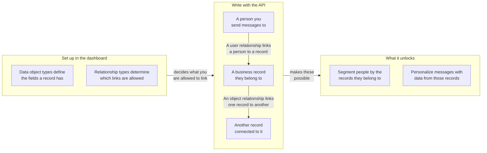

## Base URL and authentication

Use your workspace REST endpoint and send `Authorization: Bearer YOUR_REST_API_KEY`. This section explains where Data Objects endpoints are hosted and how requests are authenticated.

- For endpoint hosts, refer to [Braze API overview](https://www.braze.com/docs/api/basics#endpoints).
- All request and response payloads are JSON.
- Requests are scoped to the workspace that owns the API key.
- If the key has an IP allowlist, non-allowlisted IP addresses return `403`.

## API key permissions

This section maps each endpoint to its required permission so you can scope API keys safely.

| Permission | Endpoint group |
|---|---|
| `data_objects.read` | Type and object reads, and object relationship reads |
| `data_objects.create` | Object create |
| `data_objects.update` | Object replace and update |
| `data_objects.delete` | Object delete |
| `data_objects.user_relationships.read` | User relationship reads |
| `data_objects.user_relationships.create` | User relationship create |
| `data_objects.user_relationships.update` | User relationship replace and update |
| `data_objects.user_relationships.delete` | User relationship delete |
| `data_objects.object_relationships.create` | Object relationship create |
| `data_objects.object_relationships.update` | Object relationship replace and update |
| `data_objects.object_relationships.delete` | Object relationship delete |
{: .reset-td-br-1 .reset-td-br-2 aria-label="Data Objects permission groups" }

**Note:**


Object relationship reads use `data_objects.read`. There is no `data_objects.object_relationships.read` permission.


## Rate limits

This section explains default request quotas and response headers for both read and write traffic.

| Bucket | Default limit |
|---|---|
| Data Objects reads | 50 requests per minute |
| Data Objects writes | 50 requests per minute |
{: .reset-td-br-1 .reset-td-br-2 aria-label="Data Objects default rate limits" }

Every response includes `X-RateLimit-Limit`, `X-RateLimit-Remaining`, and `X-RateLimit-Reset`.

For throttled requests, Braze returns `429` and an error payload with `id` and `message`.

```json
{
  "errors": [
    {
      "id": "rate-limit-exceeded",
      "message": "You have exceeded your limit of 50 requests per minute."
    }
  ]
}
```

## Core concepts

This section defines the key identifiers used across all Data Objects endpoints.

- `type_name`: The data object type machine name, unique within a workspace.
- `external_id`: Your object identifier, unique within a type.
- `braze_id`: The Braze user ID used on user-relationship endpoints.
- `attributes`: Field-name-keyed object or relationship data validated against the configured schema.

## How relationships work

This section explains relationship types, relationship edges, and `anchor` behavior before you use the endpoint reference pages.

### Relationship model at a glance

Use this diagram to see how types, records, and relationships fit together, and what linking them lets you do in Braze. You define the types in the dashboard, then write the records and the links between them through these endpoints.



### Types and edges are separate

- Relationship types define which links are valid and are managed in the dashboard.
- Relationship edges are the actual links between records and are created, updated, and deleted through these API endpoints.
- Before writing relationships, list valid `rel_kind` values with:
  - `GET /data_objects/types/{type_name}/user_relationship_types`
  - `GET /data_objects/types/{type_name}/object_relationship_types`

### Why object relationships require `related_type_name`

- `rel_kind` is not globally unique across all object type pairs. For example, `rel_kind` can be `subaccount` for one pair of object types and `partner_account` for another.
- Object relationship writes therefore require both `rel_kind` and `related_type_name` to identify the intended relationship type along with the other type of object in the association.
- If the `related_type_name` does not match the relationship type for that `rel_kind`, the request returns `400`.

### `anchor` controls relationship direction

Object relationships are directional. The URL object is interpreted based on `anchor`.

| `anchor` | URL object role | Related object key in responses |
|---|---|---|
| `source` (default) | From side (outgoing edge) | `to_data_object` |
| `target` | To side (incoming edge) | `from_data_object` |
{: .reset-td-br-1 .reset-td-br-2 .reset-td-br-3 aria-label="Anchor behavior for object relationships" }

Creating the same edge from the opposite anchor perspective still targets one underlying relationship. A second create call for the same edge returns `409` (`duplicate-object-relationship`).

### Path asymmetry for user relationships

User relationship reads and writes intentionally use different endpoint paths:

- Read: `GET /data_objects/objects/{type_name}/{external_id}/user_relationships`
- Write: `POST|PUT|PATCH|DELETE /data_objects/objects/{type_name}/{external_id}/users`

### Relationship attributes are separate from object attributes

- Relationship endpoints return edge-level attributes in the top-level `attributes` field.
- Object attributes stay nested under `to_data_object` or `from_data_object`.
- `PUT` replaces relationship `attributes`, and `PATCH` merges relationship `attributes`.

### Worked example

This example shows a common account workflow:

1. Create `account/acct-123`.
2. Create `account/acct-456` as a child account.
3. Link a user to `acct-123` with `rel_kind: account_user`.
4. Link `acct-123` to `acct-456` with `rel_kind: subaccount`.

To read back the links:

- `GET /data_objects/objects/account/acct-123/user_relationships` for linked users
- `GET /data_objects/objects/account/acct-123/object_relationships` for outgoing object links
- `GET /data_objects/objects/account/acct-456/object_relationships?anchor=target` for incoming object links

**Note:**


The `DELETE` endpoints for object relationships and user relationships require a JSON request body.


## Pagination and data freshness

This section covers list pagination behavior and expected data visibility timing after writes.

- List endpoints support `limit` and `offset`.
- `limit` defaults to `100` and is clamped to `1` through `250`.
- `offset` defaults to `0`, and negative values are floored to `0`.
- Writes are immediately visible to reads and Liquid personalization.
- Segment membership based on data objects can lag by up to one hour because calculated filters refresh hourly.

## Error behavior

This section summarizes status and error response patterns used across the Data Objects endpoints.

- `404`, `409`, `422`, and `429` return an `errors` array with `id` and `message`.
- `400`, `401`, and `403` return a single `error` string.
- Contract-based `422` limits vary by company.
