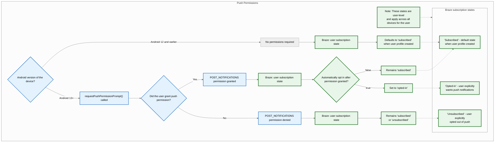
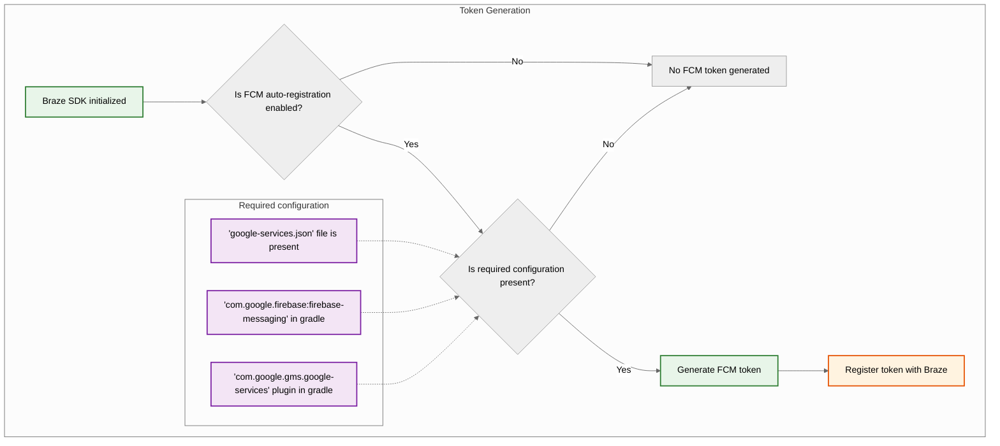
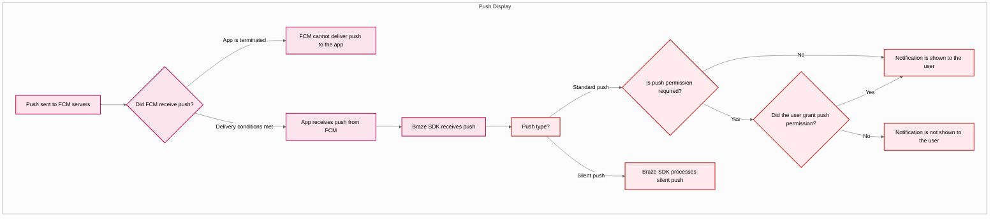

# Push notifications

> [Push notifications](https://www.braze.com/docs/user_guide/channels/push/) allow you to send out notifications from your app when important events occur. You might send a push notification when you have new instant messages to deliver, breaking news alerts to send, or the latest episode of your user's favorite TV show ready for them to download for offline viewing. They are also more efficient than background fetch, as your application only launches when necessary.

**Note:**


If **Redirect to web URL** with **Open web URL inside app** isn't selected, but the link still opens inside the app, the app may be handling the URL (for example, with universal links on iOS or App Links on Android). To open the link in the browser instead, confirm your app delegates the URL to the system browser when the user taps the notification, or adjust your app's URL handling so that the click action matches the Braze dashboard setting. See your platform's push documentation for how click actions and URL handling are configured.


**Note:**


This guide uses code samples from the Braze Web SDK 4.0.0+. To upgrade to the latest Web SDK version, see [SDK Upgrade Guide](https://github.com/braze-inc/braze-web-sdk/blob/master/UPGRADE_GUIDE.md).


## Prerequisites

Before you can use this feature, you'll need to [integrate the Web Braze SDK](https://www.braze.com/docs/developer_guide/sdk_integration/?sdktab=web).

## Push protocols

Web push notifications are implemented using the [W3C push standard](http://www.w3.org/TR/push-api/), which most major browsers support. For more information on specific push protocol standards and browser support, you can review resources from [Apple](https://developer.apple.com/notifications/safari-push-notifications/) [Mozilla](https://developer.mozilla.org/en-us/docs/web/api/push_api#browser_compatibility) and [Microsoft](https://developer.microsoft.com/en-us/microsoft-edge/status/pushapi/).

## Setting up push notifications

### Step 1: Configure your service worker

In your project's `service-worker.js` file, add the following snippet and set the [`manageServiceWorkerExternally`](https://js.appboycdn.com/web-sdk/latest/doc/modules/braze.html#initialize) initialization option to `true` when initializing the Web SDK.

<script src="/docs/assets/js/embed.js?target=https://github.com/braze-inc/braze-web-sdk/blob/master/sample-builds/cdn/service-worker.js&style=github&showBorder=on&showLineNumbers=on&showFileMeta=on&showCopy=on"></script>

**Important:**


Your web server must return a `Content-Type: application/javascript` when serving your service worker file. Additionally, if your service worker file is not `service-worker.js` named, you'll need to use the `serviceWorkerLocation` [initialization option](https://js.appboycdn.com/web-sdk/latest/doc/modules/braze.html#initializationoptions).


### Step 2: Register the browser

To immediately request push permissions from a user so their browser can receive push notifications, call `braze.requestPushPermission()`. To test if push is supported in their browser first, call `braze.isPushSupported()`.

You can also [send a soft push prompt](https://www.braze.com/docs/developer_guide/push_notifications/soft_push_prompts/?sdktab=web) to the user before requesting push permission to show your own push-related UI.

**Important:**


On macOS, both **Google Chrome** and **Google Chrome Helper (Alerts)** must be enabled by the end-user in **System Settings > Notifications** before push notifications can be displayed&#8212;even if permissions are granted.


### Step 3: Disable `skipWaiting` (optional)

The Braze service worker file will automatically call `skipWaiting` upon install. If you'd like to disable this functionality, add the following code to your service worker file, after importing Braze:

<script src="/docs/assets/js/embed.js?target=https%3A%2F%2Fgithub.com%2Fbraze-inc%2Fbraze-web-sdk%2Fblob%2Fmaster%2Fsnippets%2Fservice-worker-skip-waiting.js&style=github&showBorder=on&showLineNumbers=on&showFileMeta=on&showCopy=on"></script>

## Unsubscribing a user

To unsubscribe a user, call `braze.unregisterPush()`.

**Important:**


Recent versions of Safari and Firefox require that you call this method from a short-lived event handler (such as from a button-click handler or soft push prompt). This is consistent with [Chrome's user experience best practices](https://docs.google.com/document/d/1WNPIS_2F0eyDm5SS2E6LZ_75tk6XtBSnR1xNjWJ_DPE) for push registration.


## Alternate domains

To integrate web push, your domain must be [secure](https://w3c.github.io/webappsec-secure-contexts/), which generally means `https`, `localhost`, and other exceptions as defined in the [W3C push standard](https://www.w3.org/TR/service-workers/#security-considerations). You'll also need to be able to register a Service Worker at the root of your domain, or at least be able to control the HTTP headers for that file. This article covers how to integrate Braze Web Push on an alternate domain.

### Use cases

If you can't meet all of the criteria outlined in the [W3C push standard](https://www.w3.org/TR/service-workers/#security-considerations), you can use this method to add a push prompt dialog to your website instead. This can be helpful if you want to let your users opt-in from an `http` website or a browser extension popup that's preventing your push prompt from displaying.

### Considerations

Keep in mind, like many workarounds on the web, browsers continually evolve, and this method may not be viable in the future. Before continuing, ensure that:

- You own a separate secure domain (`https://`) and permissions to register a Service Worker on that domain.
- Users are logged in to your website which ensures push tokens are match to the correct profile.

**Important:**


You cannot use this method to implement push notifications for Shopify. Shopify will automatically remove the headers need to deliver push this way.


### Setting up an alternate push domain

To make the following example clear, we'll use use `http://insecure.com` and `https://secure.com` as our two domains with the goal of getting visitors to register for push on `http://insecure.com`. This example could also be applied to a `chrome-extension://` scheme for a browser extension's popup page.

#### Step 1: Initiate prompting flow

On `insecure.com`, open a new window to your secure domain using a URL parameter to pass the currently logged-in user's Braze external ID.

**http://insecure.com**
```html
<button id="opt-in">Opt-In For Push</button>
<script>
// the same ID you would use with `braze.changeUser`:
const user_id = getUserIdSomehow();
// pass the user ID into the secure domain URL:
const secure_url = `https://secure.com/push-registration.html?external_id=${user_id}`;

// when the user takes some action, open the secure URL in a new window
document.getElementById("opt-in").onclick = function(){
    if (!window.open(secure_url, 'Opt-In to Push', 'height=500,width=600,left=150,top=150')) {
        window.alert('The popup was blocked by your browser');
    } else {
        // user is shown a popup window
        // and you can now prompt for push in this window
    }
}
</script>
```

#### Step 2: Register for push

At this point, `secure.com` will open a popup window in which you can initialize the Braze Web SDK for the same user ID and request the user's permission for Web push.

**https://secure.com/push-registration.html**

<script src="/docs/assets/js/embed.js?target=https%3A%2F%2Fgithub.com%2Fbraze-inc%2Fbraze-web-sdk%2Fblob%2Fmaster%2Fsnippets%2Falternate-push-domain-registration.html&style=github&showBorder=on&showLineNumbers=on&showFileMeta=on&showCopy=on"></script>

#### Step 3: Communicate between domains (optional)

Now that users can opt-in from this workflow originating on `insecure.com`, you may want to modify your site based on if the user is already opted-in or not. There's no point in asking the user to register for push if they already are.

You can use iFrames and the [`postMessage`](https://developer.mozilla.org/en-US/docs/Web/API/Window/postMessage) API to communicate between your two domains. 

**insecure.com**

On our `insecure.com` domain, we will ask the secure domain (where push is _actually_ registered) for information on the current user's push registration:

```html
<!-- Create an iframe to the secure domain and run getPushStatus onload-->
<iframe id="push-status" src="https://secure.com/push-status.html" onload="getPushStatus()" style="display:none;"></iframe>

<script>
function getPushStatus(event){
    // send a message to the iframe asking for push status
    event.target.contentWindow.postMessage({type: 'get_push_status'}, 'https://secure.com');
    // listen for a response from the iframe's domain
    window.addEventListener("message", (event) => {
        if (event.origin === "http://insecure.com" && event.data.type === 'set_push_status') {
            // update the page based on the push permission we're told
            window.alert(`Is user registered for push? ${event.data.isPushPermissionGranted}`);
        }
    }   
}
</script>
```

**secure.com/push-status.html**

<script src="/docs/assets/js/embed.js?target=https%3A%2F%2Fgithub.com%2Fbraze-inc%2Fbraze-web-sdk%2Fblob%2Fmaster%2Fsnippets%2Falternate-push-domain-status.html&style=github&showBorder=on&showLineNumbers=on&showFileMeta=on&showCopy=on"></script>

## Frequently Asked Questions (FAQ)

### Service workers

#### What if I can't register a service worker in the root directory?

By default, a service worker can only be used within the same directory it is registered in. For example, if your service worker file exists in `/assets/service-worker.js`, it would only be possible to register it within `example.com/assets/*` or a subdirectory of the `assets` folder, but not on your homepage (`example.com/`). For this reason, it is recommended to host and register the service worker in the root directory (such as `https://example.com/service-worker.js`).

If you cannot register a service worker in your root domain, an alternative approach is to use the [`Service-Worker-Allowed`](https://w3c.github.io/ServiceWorker/#service-worker-script-response) HTTP header when serving your service worker file. By configuring your server to return `Service-Worker-Allowed: /` in the response for the service worker, this will instruct the browser to broaden the scope and allow it to be used from within a different directory.

#### Can I create a service worker using a Tag Manager?

No, service workers must be hosted on your website's server and can't be loaded via Tag Manager.

### Site security

#### Is HTTPS required?

Yes. Web standards require that the domain requesting push notification permission be secure.

#### When is a site considered "secure"?

A site is considered secure if it matches one of the following secure-origin patterns. Braze Web push notifications are built on this open standard, so man-in-the-middle attacks are prevented.

- `(https, , *)`
- `(wss, *, *)`
- `(, localhost, )`
- `(, .localhost, *)`
- `(, 127/8, )`
- `(, ::1/128, *)`
- `(file, *, —)`
- `(chrome-extension, *, —)`

#### What if a secure site is not available?

While industry best practice is to make your whole site secure, customers who cannot secure their site domain can work around the requirement by using a secure modal. Read more in our guide to using [Alternate push domain](https://www.braze.com/docs/developer_guide/platform_integration_guides/web/push_notifications/alternate_push_domain) or view a [working demo](http://appboyj.com/modal-test.html).


## Prerequisites

Before you can use this feature, you'll need to [integrate the Android Braze SDK](https://www.braze.com/docs/developer_guide/sdk_integration/?sdktab=android).

## Built-in features

The following features are built into the Braze Android SDK. To use any other push notification features, you will need to [set up push notifications](#android_setting-up-push-notifications) for your app.

|Feature|Description|
|-------|-----------|
|Push Stories|Android Push Stories are built into the Braze Android SDK by default. To learn more, see [Push Stories](https://www.braze.com/docs/user_guide/message_building_by_channel/push/advanced_push_options/push_stories/).|
|Push Primers|Push primer campaigns encourage your users to enable push notifications on their device for your app. This can be done without SDK customization using our [no code push primer](https://www.braze.com/docs/user_guide/message_building_by_channel/push/best_practices/push_primer_messages/).|
{: .reset-td-br-1 .reset-td-br-2 role="presentation"}

## About the push notification lifecycle {#push-notification-lifecycle}

The following flowchart shows how Braze handles the push notification lifecycle, such as permission prompts, token generation, and message delivery.











## Setting up push notifications

**Tip:**


To check out a sample app using FCM with the Braze Android SDK, see [Braze: Firebase Push Sample App](https://github.com/braze-inc/braze-android-sdk/tree/master/samples/firebase-push).


### Rate limits

Firebase Cloud Messaging (FCM) API has a default rate limit of 600,000 requests per minute. If you reach this limit, Braze will automatically try again in a few minutes. To request an increase, contact [Firebase Support](https://firebase.google.com/support).

### Step 1: Add Firebase to your project

First, add Firebase to your Android project. For step-by-step instructions, see Google's [Firebase setup guide](https://firebase.google.com/docs/android/setup).

### Step 2: Add Cloud Messaging to your dependencies

Next, add the Cloud Messaging library to your project dependencies. In your Android project, open `build.gradle`, then add the following line to your `dependencies` block.

```gradle
implementation "google.firebase:firebase-messaging:+"
```

Your dependencies should look similar to the following:

```gradle
dependencies {
  implementation project(':android-sdk-ui')
  implementation "com.google.firebase:firebase-messaging:+"
}
```

### Step 3: Enable the Firebase Cloud Messaging API

In Google Cloud, select the project your Android app is using, then enable the [Firebase Cloud Messaging API](https://console.cloud.google.com/apis/library/fcm.googleapis.com).

{: style="max-width:80%;"}

### Step 4: Create a service account {#service-account}

Next, create a new service account, so Braze can make authorized API calls when registering FCM tokens. In Google Cloud, go to **Service Accounts**, then choose your project. On the **Service Accounts** page, select **Create Service Account**.


Enter a service account name, ID, and description, then select **Create and continue**.


In the **Role** field, find and select **Firebase Cloud Messaging API Admin** from the list of roles. For more restrictive access, create a [custom role](https://cloud.google.com/iam/docs/creating-custom-roles) with the `cloudmessaging.messages.create` permission, then choose it from the list instead. When you're finished, select **Done**.

**Warning:**


Be sure to select **Firebase Cloud Messaging _API_ Admin**, not **Firebase Cloud Messaging Admin**.


### Step 5: Generate JSON credentials {#json}

Next, generate JSON credentials for your FCM service account. On Google Cloud IAM & Admin, go to **Service Accounts**, then choose your project. Locate the FCM service account [you created earlier](#android_service-account), then select <i class="fa-solid fa-ellipsis-vertical"></i>&nbsp;**Actions** > **Manage Keys**.


Select **Add Key** > **Create new key**.


Choose **JSON**, then select **Create**. If you created your service account using a different Google Cloud project ID than your FCM project ID, you'll need to manually update the value assigned to the `project_id` in your JSON file.

Be sure to remember where you downloaded the key&#8212;you'll need it in the next step.

{: style="max-width:65%;"}

**Warning:**


Private keys could pose a security risk if compromised. Store your JSON credentials in a secure location for now&#8212;you'll delete your key after you upload it to Braze.


### Step 6: Upload your JSON credentials to Braze

Next, upload your JSON credentials to your Braze dashboard. In Braze, select <i class="fa-solid fa-gear"></i>&nbsp;**Settings** > **App Settings**.


Under your Android app's **Push Notification Settings**, choose **Firebase**, then select **Upload JSON File** and upload the credentials [you generated earlier](#android_json). When you're finished, select **Save**.


**Warning:**


Private keys could pose a security risk if compromised. Now that your key is uploaded to Braze, delete the file [you generated previously](#android_json).


### Step 7: Set up automatic token registration

When one of your users opt-in for push notifications, your app needs to generate an FCM token on their device before you can send them push notifications. With the Braze SDK, you can enable automatic FCM token registration for each user's device in your project's Braze configuration files.

First, go to Firebase Console, open your project, then select <i class="fa-solid fa-gear"></i>&nbsp;**Settings** > **Project settings**.


Select **Cloud Messaging**, then under **Firebase Cloud Messaging API (V1)**, copy the number in the **Sender ID** field.


Next, open your Android Studio project and use your Firebase Sender ID to enable automatic FCM token registration within your `braze.xml` or `BrazeConfig`.


To configure automatic FCM token registration, add the following lines to your `braze.xml` file:

```xml
<bool translatable="false" name="com_braze_firebase_cloud_messaging_registration_enabled">true</bool>
<string translatable="false" name="com_braze_firebase_cloud_messaging_sender_id">FIREBASE_SENDER_ID</string>
```

Replace `FIREBASE_SENDER_ID` with the value you copied from your Firebase project settings. Your `braze.xml` should look similar to the following:

```xml
<?xml version="1.0" encoding="utf-8"?>
<resources>
  <string translatable="false" name="com_braze_api_key">12345ABC-6789-DEFG-0123-HIJK456789LM</string>
  <bool translatable="false" name="com_braze_firebase_cloud_messaging_registration_enabled">true</bool>
<string translatable="false" name="com_braze_firebase_cloud_messaging_sender_id">603679405392</string>
</resources>
```


To configure automatic FCM token registration, add the following lines to  your `BrazeConfig`:


```java
.setIsFirebaseCloudMessagingRegistrationEnabled(true)
.setFirebaseCloudMessagingSenderIdKey("FIREBASE_SENDER_ID")
```


```kotlin
.setIsFirebaseCloudMessagingRegistrationEnabled(true)
.setFirebaseCloudMessagingSenderIdKey("FIREBASE_SENDER_ID")
```


Replace `FIREBASE_SENDER_ID` with the value you copied from your Firebase project settings. Your `BrazeConfig` should look similar to the following:


```java
BrazeConfig brazeConfig = new BrazeConfig.Builder()
  .setApiKey("12345ABC-6789-DEFG-0123-HIJK456789LM")
  .setCustomEndpoint("sdk.iad-01.braze.com")
  .setSessionTimeout(60)
  .setHandlePushDeepLinksAutomatically(true)
  .setGreatNetworkDataFlushInterval(10)
  .setIsFirebaseCloudMessagingRegistrationEnabled(true)
  .setFirebaseCloudMessagingSenderIdKey("603679405392")
  .build();
Braze.configure(this, brazeConfig);
```


```kotlin
val brazeConfig = BrazeConfig.Builder()
  .setApiKey("12345ABC-6789-DEFG-0123-HIJK456789LM")
  .setCustomEndpoint("sdk.iad-01.braze.com")
  .setSessionTimeout(60)
  .setHandlePushDeepLinksAutomatically(true)
  .setGreatNetworkDataFlushInterval(10)
  .setIsFirebaseCloudMessagingRegistrationEnabled(true)
  .setFirebaseCloudMessagingSenderIdKey("603679405392")
  .build()
Braze.configure(this, brazeConfig)
```


**Tip:**


If you'd like manually register FCM tokens instead, you can call [`Braze.setRegisteredPushToken()`](https://braze-inc.github.io/braze-android-sdk/kdoc/braze-android-sdk/com.braze/-braze/registered-push-token.html) inside your app's [`onCreate()`](https://developer.android.com/reference/android/app/Application.html#onCreate()) method.


### Step 8: Remove automatic requests in your application class

To prevent Braze from triggering unnecessary network requests every time you send silent push notifications, remove any automatic network requests configured in your `Application` class's `onCreate()` method. For more information see, [Android Developer Reference: Application](https://developer.android.com/reference/android/app/Application).

## Displaying notifications

### Step 1: Register Braze Firebase Messaging Service

You can either create a new, existing, or non-Braze Firebase Messaging Service. Choose whichever best meets your specific needs.


Braze includes a service to handle push receipt and open intents. Our `BrazeFirebaseMessagingService` class will need to be registered in your `AndroidManifest.xml`:

```xml
<service android:name="com.braze.push.BrazeFirebaseMessagingService"
  android:exported="false">
  <intent-filter>
    <action android:name="com.google.firebase.MESSAGING_EVENT" />
  </intent-filter>
</service>
```

Our notification code also uses `BrazeFirebaseMessagingService` to handle open and click action tracking. This service must be registered in the `AndroidManifest.xml` to function correctly. Also, remember that Braze prefixes notifications from our system with a unique key so that we only render notifications sent from our systems. You may register additional services separately to render notifications sent from other FCM services. See [`AndroidManifest.xml`](https://github.com/braze-inc/braze-android-sdk/blob/master/samples/firebase-push/src/main/AndroidManifest.xml) in the Firebase push sample app.

**Important:**


Before Braze SDK 3.1.1, `AppboyFcmReceiver` was used to handle FCM push. The `AppboyFcmReceiver` class should be removed from your manifest and replaced with the preceding integration.


If you already have a Firebase Messaging Service registered, you can pass [`RemoteMessage`](https://firebase.google.com/docs/reference/android/com/google/firebase/messaging/RemoteMessage) objects to Braze via [`BrazeFirebaseMessagingService.handleBrazeRemoteMessage()`](https://braze-inc.github.io/braze-android-sdk/kdoc/braze-android-sdk/com.braze.push/-braze-firebase-messaging-service/-companion/handle-braze-remote-message.html). This method will only display a notification if the [`RemoteMessage`](https://firebase.google.com/docs/reference/android/com/google/firebase/messaging/RemoteMessage) object originated from Braze and will safely ignore if not.


```java
public class MyFirebaseMessagingService extends FirebaseMessagingService {
  @Override
  public void onMessageReceived(RemoteMessage remoteMessage) {
    super.onMessageReceived(remoteMessage);
    if (BrazeFirebaseMessagingService.handleBrazeRemoteMessage(this, remoteMessage)) {
      // This Remote Message originated from Braze and a push notification was displayed.
      // No further action is needed.
    } else {
      // This Remote Message did not originate from Braze.
      // No action was taken and you can safely pass this Remote Message to other handlers.
    }
  }
}
```


```kotlin
class MyFirebaseMessagingService : FirebaseMessagingService() {
  override fun onMessageReceived(remoteMessage: RemoteMessage?) {
    super.onMessageReceived(remoteMessage)
    if (BrazeFirebaseMessagingService.handleBrazeRemoteMessage(this, remoteMessage)) {
      // This Remote Message originated from Braze and a push notification was displayed.
      // No further action is needed.
    } else {
      // This Remote Message did not originate from Braze.
      // No action was taken and you can safely pass this Remote Message to other handlers.
    }
  }
}
```


If you have another Firebase Messaging Service you would also like to use, you can also specify a fallback Firebase Messaging Service to call if your application receives a push that isn't from Braze.

In your `braze.xml`, specify:

```xml
<bool name="com_braze_fallback_firebase_cloud_messaging_service_enabled">true</bool>
<string name="com_braze_fallback_firebase_cloud_messaging_service_classpath">com.company.OurFirebaseMessagingService</string>
```

or set via [runtime configuration:](https://www.braze.com/docs/developer_guide/sdk_initalization/?sdktab=android)


```java
BrazeConfig brazeConfig = new BrazeConfig.Builder()
        .setFallbackFirebaseMessagingServiceEnabled(true)
        .setFallbackFirebaseMessagingServiceClasspath("com.company.OurFirebaseMessagingService")
        .build();
Braze.configure(this, brazeConfig);
```


```kotlin
val brazeConfig = BrazeConfig.Builder()
        .setFallbackFirebaseMessagingServiceEnabled(true)
        .setFallbackFirebaseMessagingServiceClasspath("com.company.OurFirebaseMessagingService")
        .build()
Braze.configure(this, brazeConfig)
```


### Step 2: Conform small icons to design guidelines

For general information about Android notification icons, visit the [Notifications overview](https://developer.android.com/guide/topics/ui/notifiers/notifications).

Starting in Android N, you should update or remove small notification icon assets that involve color. The Android system (not the Braze SDK) ignores all non-alpha and transparency channels in action icons and the notification small icon. In other words, Android will convert all parts of your notification small icon to monochrome except for transparent regions.

To create a notification small icon asset that displays properly:
- Remove all colors from the image except for white.
- All other non-white regions of the asset should be transparent.

**Note:**


A common symptom of an improper asset is the small notification icon rendering as a solid monochrome square. This is due to the Android system not being able to find any transparent regions in the notification small icon asset.


The following large and small icons pictured are examples of properly designed icons:


### Step 3: Configure notification icons {#configure-icons}

#### Specifying icons in braze.xml

Braze allows you to configure your notification icons by specifying drawable resources in your `braze.xml`:

```xml
<drawable name="com_braze_push_small_notification_icon">REPLACE_WITH_YOUR_ICON</drawable>
<drawable name="com_braze_push_large_notification_icon">REPLACE_WITH_YOUR_ICON</drawable>
```

Setting a small notification icon is required. **If you do not set one, Braze will default to using the application icon as the small notification icon, which may look suboptimal.**

Setting a large notification icon is optional but recommended.

#### Specifying icon accent color

The notification icon accent color can be overridden in your `braze.xml`. If the color is not specified, the default color is the same gray Lollipop uses for system notifications.

```xml
<integer name="com_braze_default_notification_accent_color">0xFFf33e3e</integer>
```

You may also optionally use a color reference:

```xml
<color name="com_braze_default_notification_accent_color">@color/my_color_here</color>
```

### Step 4: Add deep links

#### Enabling automatic deep link opening

To enable Braze to automatically open your app and any deep links when a push notification is clicked, set `com_braze_handle_push_deep_links_automatically` to `true`, in your `braze.xml`:

```xml
<bool name="com_braze_handle_push_deep_links_automatically">true</bool>
```

This flag can also be set via [runtime configuration](https://www.braze.com/docs/developer_guide/sdk_initalization/?sdktab=android):


```java
BrazeConfig brazeConfig = new BrazeConfig.Builder()
        .setHandlePushDeepLinksAutomatically(true)
        .build();
Braze.configure(this, brazeConfig);
```


```kotlin
val brazeConfig = BrazeConfig.Builder()
        .setHandlePushDeepLinksAutomatically(true)
        .build()
Braze.configure(this, brazeConfig)
```


If you want to custom handle deep links, you will need to create a push callback that listens for push received and opened intents from Braze. For more information, see [Using a callback for push events](https://www.braze.com/docs/developer_guide/push_notifications/customization#android_using-a-callback-for-push-events).

## Handling foreground notifications

By default, when a push notification arrives while your app is in the foreground on Android, the system displays it automatically. To have Braze process the push notification payload (for analytics tracking, deep link handling, and custom processing), route the incoming push data to Braze inside your `FirebaseMessagingService.onMessageReceived` method.

### How it works

When you call `BrazeFirebaseMessagingService.handleBrazeRemoteMessage`, Braze determines if the payload is a Braze push notification and, if so, creates and displays the notification with the `NotificationManagerCompat` method. Unlike iOS, Android displays notifications regardless of whether the app is in the foreground or background.


```java
package com.example.push;

import com.braze.push.BrazeFirebaseMessagingService;
import com.google.firebase.messaging.FirebaseMessagingService;
import com.google.firebase.messaging.RemoteMessage;

public class MyFirebaseMessagingService extends FirebaseMessagingService {
    @Override
    public void onMessageReceived(RemoteMessage remoteMessage) {
        super.onMessageReceived(remoteMessage);
        
        // Let Braze process the payload and display the notification
        if (BrazeFirebaseMessagingService.handleBrazeRemoteMessage(this, remoteMessage)) {
            // Braze successfully handled the push notification
        } else {
            // Handle non-Braze messages
        }
    }
}
```


```kotlin
package com.example.push

import com.braze.push.BrazeFirebaseMessagingService
import com.google.firebase.messaging.FirebaseMessagingService
import com.google.firebase.messaging.RemoteMessage

class MyFirebaseMessagingService : FirebaseMessagingService() {
    override fun onMessageReceived(remoteMessage: RemoteMessage) {
        super.onMessageReceived(remoteMessage)
        
        // Let Braze process the payload and display the notification
        if (BrazeFirebaseMessagingService.handleBrazeRemoteMessage(this, remoteMessage)) {
            // Braze successfully handled the push notification
        } else {
            // Handle non-Braze messages
        }
    }
}
```


For more information, see the [Firebase integration sample](https://github.com/braze-inc/braze-android-sdk/blob/master/samples/firebase-push/src/main/java/com/braze/firebasepush/FirebaseMessagingService.kt) in the Braze Android SDK repository.

### Customizing foreground behavior

If you want custom foreground behavior, such as suppressing the system notification or showing an in-app UI instead, you can:

- Use `subscribeToPushNotificationEvents` to react to push events and handle deep links with the `BrazeNotificationUtils.routeUserWithNotificationOpenedIntent` method. For more information, see the [Firebase push sample](https://github.com/braze-inc/braze-android-sdk/blob/master/samples/firebase-push/src/main/java/com/braze/firebasepush/FirebaseApplication.kt).
- Build and post your own notification using a custom `IBrazeNotificationFactory`, or suppress the notification by not calling `notificationManager.notify` in your handling path.

For more information on customizing notifications, see [Custom notification factory](https://www.braze.com/docs/developer_guide/push_notifications/customization/?sdktab=android#custom-notification-factory).

#### Creating custom deep links

Follow the instructions found within the [Android developer documentation](http://developer.android.com/training/app-indexing/deep-linking.html) on deep linking if you have not already added deep links to your app. To learn more about what deep links are, see our [FAQ article](https://www.braze.com/docs/user_guide/messaging/design_and_edit/personalize/actions_and_media_urls/#what-is-deep-linking).

#### Adding deep links

The Braze dashboard supports setting deep links or web URLs in push notifications campaigns and Canvases that will be opened when the notification is clicked.


#### Customizing back stack behavior

The Android SDK, by default, will place your host app's main launcher activity in the back stack when following push deep links. Braze allows you to set a custom activity to open in the back stack in place of your main launcher activity or to disable the back stack altogether.

For example, to set an activity called `YourMainActivity` as the back stack activity using [runtime configuration](https://www.braze.com/docs/developer_guide/sdk_initalization/?sdktab=android):


```java
BrazeConfig brazeConfig = new BrazeConfig.Builder()
        .setPushDeepLinkBackStackActivityEnabled(true)
        .setPushDeepLinkBackStackActivityClass(YourMainActivity.class)
        .build();
Braze.configure(this, brazeConfig);
```


```kotlin
val brazeConfig = BrazeConfig.Builder()
        .setPushDeepLinkBackStackActivityEnabled(true)
        .setPushDeepLinkBackStackActivityClass(YourMainActivity.class)
        .build()
Braze.configure(this, brazeConfig)
```


See the equivalent configuration for your `braze.xml`. Note that the class name must be the same as returned by `Class.forName()`.

```xml
<bool name="com_braze_push_deep_link_back_stack_activity_enabled">true</bool>
<string name="com_braze_push_deep_link_back_stack_activity_class_name">your.package.name.YourMainActivity</string>
```

### Step 5: Define notification channels

The Braze Android SDK supports [Android notification channels](https://developer.android.com/preview/features/notification-channels.html). If a Braze notification does not contain the ID for a notification channel or that a Braze notification contains an invalid channel ID, Braze will display the notification with the default notification channel defined in the SDK. Company users use [Android Notification Channels](https://www.braze.com/docs/user_guide/message_building_by_channel/push/android/notification_channels/) within the platform to group notifications.

To set the user facing name of the default Braze notification channel, use [`BrazeConfig.setDefaultNotificationChannelName()`](https://braze-inc.github.io/braze-android-sdk/kdoc/braze-android-sdk/com.braze.configuration/-braze-config/-builder/set-default-notification-channel-name.html).

To set the user facing description of the default Braze notification channel, use [`BrazeConfig.setDefaultNotificationChannelDescription()`](https://braze-inc.github.io/braze-android-sdk/kdoc/braze-android-sdk/com.braze.configuration/-braze-config/-builder/set-default-notification-channel-description.html).

Update any API campaigns with the [Android push object](https://www.braze.com/docs/api/objects_filters/messaging/android_object/) parameter to include the `notification_channel` field. If this field is not specified, Braze will send the notification payload with the [dashboard fallback](https://www.braze.com/docs/user_guide/message_building_by_channel/push/android/notification_channels/#dashboard-fallback-channel) channel ID.

Other than the default notification channel, Braze will not create any channels. All other channels must be programmatically defined by the host app and then entered into the Braze dashboard.

The default channel name and description can also be configured in `braze.xml`.

```xml
<string name="com_braze_default_notification_channel_name">Your channel name</string>
<string name="com_braze_default_notification_channel_description">Your channel description</string>
```

### Step 6: Test notification display and analytics

#### Testing display

At this point, you should be able to see notifications sent from Braze. To test this, go to the **Campaigns** page on your Braze dashboard and create a **Push Notification** campaign. Choose **Android Push** and design your message. Then click the eye icon in the composer to get the test sender. Enter the user ID or email address of your current user and click **Send Test**. You should see the push show up on your device.


For issues related to push display, see our [troubleshooting guide](https://www.braze.com/docs/developer_guide/push_notifications/troubleshooting/?sdktab=android).

#### Testing analytics

At this point, you should also have analytics logging for push notification opens. Clicking on the notification when it arrives should result in the **Direct Opens** on your campaign results page to increase by 1. Check out our [push reporting](https://www.braze.com/docs/user_guide/message_building_by_channel/push/push_reporting/) article for a break down on push analytics.

For issues related to push analytics, see our [troubleshooting guide](https://www.braze.com/docs/developer_guide/push_notifications/troubleshooting/?sdktab=android).

#### Testing from command line

If you'd like to test in-app and push notifications via the command-line interface, you can send a single notification through the terminal via cURL and the [messaging API](https://www.braze.com/docs/api/endpoints/messaging/). You will need to replace the following fields with the correct values for your test case:

- `YOUR_API_KEY` (Go to **Settings** > **API Keys**.)
- `YOUR_EXTERNAL_USER_ID` (Search for a profile on the **Search Users** page.)
- `YOUR_KEY1` (optional)
- `YOUR_VALUE1` (optional)

```bash
curl -X POST -H "Content-Type: application/json" -H "Authorization: Bearer {YOUR_API_KEY}" -d '{
  "external_user_ids":["YOUR_EXTERNAL_USER_ID"],
  "messages": {
    "android_push": {
      "title":"Test push title",
      "alert":"Test push",
      "extra": {
        "YOUR_KEY1":"YOUR_VALUE1"
      }
    }  
  }
}' https://rest.iad-01.braze.com/messages/send
```

This example uses the `US-01` instance. If you are not on this instance, replace the `US-01` endpoint with [your endpoint](https://www.braze.com/docs/api/basics/#endpoints).

## Conversation push notifications

{: style="float:right;max-width:35%;margin-left:15px;border: 0;"}

The [people and conversations initiative](https://developer.android.com/guide/topics/ui/conversations) is a multi-year Android initiative that aims to elevate people and conversations in the system surfaces of the phone. This priority is based on the fact that communication and interaction with other people is still the most valued and important functional area for the majority of Android users across all demographics.

### Usage requirements

- This notification type requires the Braze Android SDK v15.0.0+ and Android 11+ devices. 
- Unsupported devices or SDKs will fallback to a standard push notification.

This feature is only available over the Braze REST API. See the [Android push object](https://www.braze.com/docs/api/objects_filters/messaging/android_object#android-conversation-push-object) for more information.

## FCM quota exceeded errors

When your limit for Firebase Cloud Messaging (FCM) is exceeded, Google returns "quota exceeded" errors. The default limit for FCM is 600,000 requests per minute. Braze retries sending according to Google's recommended best practices. However, a large volume of these errors can prolong sending time by several minutes. To mitigate potential impact, Braze will send you an alert that the rate limit is being exceeded and steps you can take to prevent the errors.

To check your current limit, go to your **Google Cloud Console** > **APIs & Services** > **Firebase Cloud Messaging API** > **Quotas & System Limits**, or visit the [FCM API Quotas page](https://console.cloud.google.com/apis/api/fcm.googleapis.com/quotas).

### Best practices

We recommend these best practices to keep these error volumes low.

#### Request a rate limit increase from FCM

To request a rate limit increase from FCM, you can contact [Firebase Support](https://firebase.google.com/support) directly or do the following:

1. Go to the [FCM API Quotas page](https://console.cloud.google.com/apis/api/fcm.googleapis.com/quotas).
2. Locate the **Send requests per minute** quota.
3. Select **Edit Quota**. 
4. Enter a new value and submit your request.

#### Apply a workspace rate limit

You can apply a workspace rate limit for Android push notifications. This can help regulate the delivery rate of your outgoing messages. For more details, see [Workspace messaging rate limits](https://www.braze.com/docs/user_guide/administrative/app_settings/messaging_rate_limits).


## Rate limits

Push notifications are rate-limited, so don't be afraid of sending as many as your application needs. iOS and the Apple Push Notification service (APNs) servers will control how often they are delivered, and you won't get into trouble for sending too many. If your push notifications are throttled, they might be delayed until the next time the device sends a keep-alive packet or receives another notification.

## Setting up push notifications

### Step 1: Upload your APNs token

Before you can send an iOS push notification using Braze, you need to upload your `.p8`  push notification file, as described in [Apple's developer documentation](https://developer.apple.com/documentation/usernotifications/establishing-a-token-based-connection-to-apns):

1. In your Apple developer account, go to [**Certificates, Identifiers & Profiles**](https://developer.apple.com/account/ios/certificate).
2. Under **Keys**, select **All** and click the add button (+) in the upper-right corner.
3. Under **Key Description**, enter a unique name for the signing key.
4. Under **Key Services**, select the **Apple Push Notification service (APNs)** checkbox, then click **Continue**. Click **Confirm**.
5. Note the key ID. Click **Download** to generate and download the key. Make sure to save the downloaded file in a secure place, as you cannot download this more than once.
6. In Braze, go to **Settings** > **App Settings** and upload the `.p8` file under **Apple Push Certificate**. You can upload either your development or production push certificate. To test push notifications after your app is live in the App Store, its recommended to set up a separate workspace for the development version of your app.
7. When prompted, enter your app's [bundle ID](https://developer.apple.com/documentation/foundation/nsbundle/1418023-bundleidentifier), [key ID](https://developer.apple.com/help/account/manage-keys/get-a-key-identifier/), and [team ID](https://developer.apple.com/help/account/manage-your-team/locate-your-team-id). You'll also need to specify whether to send notifications to your app's development or production environment, which is defined by its provisioning profile. 
8. When you're finished, select **Save**.


### Step 2: Enable push capabilities

In Xcode, go to the **Signing & Capabilities** section of the main app target and add the push notifications capability.


### Step 3: Set up push handling

You can use the Swift SDK to automate the processing of remote notifications received from Braze. This is the simplest way to handle push notifications and is the recommended handling method.


#### Step 3.1: Enable automation in the push property

To enable the automatic push integration, set the `automation` property of the `push` configuration to `true`:


```swift
let configuration = Braze.Configuration(apiKey: "{YOUR-BRAZE-API-KEY}", endpoint: "{YOUR-BRAZE-API-ENDPOINT}")
configuration.push.automation = true
```


```objc
BRZConfiguration *configuration = [[BRZConfiguration alloc] initWithApiKey:@"{YOUR-BRAZE-API-KEY}" endpoint:@"{YOUR-BRAZE-API-ENDPOINT}"];
configuration.push.automation = [[BRZConfigurationPushAutomation alloc] initEnablingAllAutomations:YES];
```


This instructs the SDK to:
- Register your application for push notification on the system.
- Request the push notification authorization/permission at initialization.
- Dynamically provide implementations for the push notification related system delegate methods.

**Note:**


The automation steps performed by the SDK are compatible with pre-existing push notification handling integrations in your codebase. The SDK only automates the processing of remote notification received from Braze. Any system handler implemented to process your own or another third party SDK remote notifications will continue to work when `automation` is enabled.


**Warning:**


The SDK must be initialized on the main thread to enable push notification automation. SDK initialization must happen before the application has finished launching or in your AppDelegate [`application(_:didFinishLaunchingWithOptions:)`](https://developer.apple.com/documentation/uikit/uiapplicationdelegate/1622921-application) implementation.
If your application requires additional setup before initializing the SDK, please refer to the [Delayed Initialization](https://www.braze.com/docs/developer_guide/sdk_initalization/?sdktab=swift) documentation page.


#### Step 3.2: Override individual configurations (optional)

For more granular control, each automation step can be enabled or disabled individually:


```swift
// Enable all automations and disable the automatic notification authorization request at launch.
configuration.push.automation = true
configuration.push.automation.requestAuthorizationAtLaunch = false
```


```objc
// Enable all automations and disable the automatic notification authorization request at launch.
configuration.push.automation = [[BRZConfigurationPushAutomation alloc] initEnablingAllAutomations:YES];
configuration.push.automation.requestAuthorizationAtLaunch = NO;
```


See [`Braze.Configuration.Push.Automation`](https://braze-inc.github.io/braze-swift-sdk/documentation/brazekit/braze/configuration-swift.class/push-swift.class/automation-swift.class) for all available options and [`automation`](https://braze-inc.github.io/braze-swift-sdk/documentation/brazekit/braze/configuration-swift.class/push-swift.class/automation-swift.property) for more information on the automation behavior.


**Note:**


If you rely on push notifications for additional behavior specific to your app, you may still be able to use automatic push integration instead of manual push notification integration. The [`subscribeToUpdates(_:)`](https://braze-inc.github.io/braze-swift-sdk/documentation/brazekit/braze/notifications-swift.class/subscribetoupdates(_:)) method provides a way to be notified of remote notifications processed by Braze.


#### Step 3.1: Register for push notifications with APNs

Include the appropriate code sample within your app's [`application:didFinishLaunchingWithOptions:` delegate method](https://developer.apple.com/documentation/uikit/uiapplicationdelegate/1622921-application) so that your users' devices can register with APNs. Ensure that you call all push integration code in your application's main thread.

Braze also provides default push categories for push action button support, which must be manually added to your push registration code. Refer to [push action buttons](https://www.braze.com/docs/developer_guide/push_notifications/customization/?sdktab=swift#swift_customizing-push-categories) for additional integration steps.

Add the following code to the `application:didFinishLaunchingWithOptions:` method of your app delegate. 

**Note:**


The following code sample includes integration for provisional push authentication (lines 5 and 6). If you are not planning on using provisional authorization in your app, you can remove the lines of code that add `UNAuthorizationOptionProvisional` to the `requestAuthorization` options.<br>Visit [iOS notification options](https://www.braze.com/docs/user_guide/message_building_by_channel/push/ios/notification_options/) to learn more about push provisional authentication.


```swift
application.registerForRemoteNotifications()
let center = UNUserNotificationCenter.current()
center.setNotificationCategories(Braze.Notifications.categories)
center.delegate = self
var options: UNAuthorizationOptions = [.alert, .sound, .badge]
if #available(iOS 12.0, *) {
  options = UNAuthorizationOptions(rawValue: options.rawValue | UNAuthorizationOptions.provisional.rawValue)
}
center.requestAuthorization(options: options) { granted, error in
  print("Notification authorization, granted: \(granted), error: \(String(describing: error))")
}
```


```objc
[application registerForRemoteNotifications];
UNUserNotificationCenter *center = UNUserNotificationCenter.currentNotificationCenter;
[center setNotificationCategories:BRZNotifications.categories];
center.delegate = self;
UNAuthorizationOptions options = UNAuthorizationOptionAlert | UNAuthorizationOptionSound | UNAuthorizationOptionBadge;
if (@available(iOS 12.0, *)) {
  options = options | UNAuthorizationOptionProvisional;
}
[center requestAuthorizationWithOptions:options
                      completionHandler:^(BOOL granted, NSError *_Nullable error) {
                        NSLog(@"Notification authorization, granted: %d, "
                              @"error: %@)",
                              granted, error);
}];
```


**Warning:**


You must assign your delegate object using `center.delegate = self` synchronously before your app finishes launching, preferably in `application:didFinishLaunchingWithOptions:`. Not doing so may cause your app to miss incoming push notifications. Visit Apple's [`UNUserNotificationCenterDelegate`](https://developer.apple.com/documentation/usernotifications/unusernotificationcenterdelegate) documentation to learn more.
If your app calls `wipeData()` and later re-enables the Braze SDK in the same app run, you must call `registerForRemoteNotifications()` again to re-populate the device token used by the SDK.


#### Step 3.2: Register push tokens with Braze

Once APNs registration is complete, pass the resulting `deviceToken` to Braze to enable for push notifications for the user.  


Add the following code to your app's `application(_:didRegisterForRemoteNotificationsWithDeviceToken:)` method:

```swift
AppDelegate.braze?.notifications.register(deviceToken: deviceToken)
```


Add the following code to your app's `application:didRegisterForRemoteNotificationsWithDeviceToken:` method:

```objc
[AppDelegate.braze.notifications registerDeviceToken:deviceToken];
```


**Important:**


The `application:didRegisterForRemoteNotificationsWithDeviceToken:` delegate method is called every time after `application.registerForRemoteNotifications()` is called. <br><br>If you are migrating to Braze from another push service and your user's device has already registered with APNs, this method will collect tokens from existing registrations the next time the method is called, and users will not have to re-opt-in to push.


#### Step 3.3: Enable push handling

Next, pass the received push notifications along to Braze. This step is necessary for logging push analytics and link handling. Ensure that you call all push integration code in your application's main thread.

##### Default push handling


To enable the Braze default push handling, add the following code to your app's `application(_:didReceiveRemoteNotification:fetchCompletionHandler:)` method:

```swift
if let braze = AppDelegate.braze, braze.notifications.handleBackgroundNotification(
  userInfo: userInfo,
  fetchCompletionHandler: completionHandler
) {
  return
}
completionHandler(.noData)
```

Next, add the following to your app's `userNotificationCenter(_:didReceive:withCompletionHandler:)` method:

```swift
if let braze = AppDelegate.braze, braze.notifications.handleUserNotification(
  response: response,
  withCompletionHandler: completionHandler
) {
  return
}
completionHandler()
```


To enable the Braze default push handling, add the following code to your application's `application:didReceiveRemoteNotification:fetchCompletionHandler:` method:

```objc
BOOL processedByBraze = AppDelegate.braze != nil && [AppDelegate.braze.notifications handleBackgroundNotificationWithUserInfo:userInfo
                                                                                                       fetchCompletionHandler:completionHandler];
if (processedByBraze) {
  return;
}

completionHandler(UIBackgroundFetchResultNoData);
```

Next, add the following code to your app's `(void)userNotificationCenter:didReceiveNotificationResponse:withCompletionHandler:` method:

```objc
BOOL processedByBraze = AppDelegate.braze != nil && [AppDelegate.braze.notifications handleUserNotificationWithResponse:response
                                                                                                  withCompletionHandler:completionHandler];
if (processedByBraze) {
  return;
}

completionHandler();
```


##### Foreground push handling


To enable foreground push notifications and let Braze recognize them when they're received, implement `UNUserNotificationCenter.userNotificationCenter(_:willPresent:withCompletionHandler:)`. If a user taps your foreground notification, the `userNotificationCenter(_:didReceive:withCompletionHandler:)` push delegate will be called and Braze will log the push click event.

```swift
func userNotificationCenter(
  _ center: UNUserNotificationCenter,
  willPresent notification: UNNotification,
  withCompletionHandler completionHandler: @escaping (UNNotificationPresentationOptions
) -> Void) {
  if let braze = AppDelegate.braze {
    // Forward notification payload to Braze for processing.
    braze.notifications.handleForegroundNotification(notification: notification)
  }

  // Configure application's foreground notification display options.
  if #available(iOS 14.0, *) {
    completionHandler([.list, .banner])
  } else {
    completionHandler([.alert])
  }
}
```


To enable foreground push notifications and let Braze recognize them when they're received, implement `userNotificationCenter:willPresentNotification:withCompletionHandler:`. If a user taps your foreground notification, the `userNotificationCenter:didReceiveNotificationResponse:withCompletionHandler:` push delegate will be called and Braze will log the push click event.

```objc
- (void)userNotificationCenter:(UNUserNotificationCenter *)center
       willPresentNotification:(UNNotification *)notification
         withCompletionHandler:(void (^)(UNNotificationPresentationOptions options))completionHandler {
  if (AppDelegate.braze != nil) {
    // Forward notification payload to Braze for processing.
    [AppDelegate.braze.notifications handleForegroundNotificationWithNotification:notification];
  }

  // Configure application's foreground notification display options.
  if (@available(iOS 14.0, *)) {
    completionHandler(UNNotificationPresentationOptionList | UNNotificationPresentationOptionBanner);
  } else {
    completionHandler(UNNotificationPresentationOptionAlert);
  }
}
```


## Testing notifications {#push-testing}

If you'd like to test in-app and push notifications via the command line, you can send a single notification through the terminal via CURL and the [messaging API](https://www.braze.com/docs/api/endpoints/messaging/send_messages/post_send_messages/). You will need to replace the following fields with the correct values for your test case:

- `YOUR_API_KEY` - available at **Settings** > **API Keys**.
- `YOUR_EXTERNAL_USER_ID` - available on the **Search Users** page. See [assigning user IDs](https://www.braze.com/docs/developer_guide/platform_integration_guides/swift/analytics/setting_user_ids/#assigning-a-user-id) for more information.
- `YOUR_KEY1` (optional)
- `YOUR_VALUE1` (optional)

In the following example, the `US-01` instance is being used. If you're not on this instance, refer to our [API documentation](https://www.braze.com/docs/api/basics/) to see which endpoint to make requests to.

```bash
curl -X POST -H "Content-Type: application/json" -H "Authorization: Bearer {YOUR_API_KEY}" -d '{
  "external_user_ids":["YOUR_EXTERNAL_USER_ID"],
  "messages": {
    "apple_push": {
      "alert":"Test push",
      "extra": {
        "YOUR_KEY1":"YOUR_VALUE1"
      }
    }
  }
}' https://rest.iad-01.braze.com/messages/send
```

## Subscribing to push notifications updates

To access the push notification payloads processed by Braze, use the [`Braze.Notifications.subscribeToUpdates(payloadTypes:_:)`](https://braze-inc.github.io/braze-swift-sdk/documentation/brazekit/braze/notifications-swift.class/subscribetoupdates(payloadtypes:_:)/) method.

You can use the `payloadTypes` parameter to specify whether you'd like to subscribe to notifications involving push open events, push received events, or both.


```swift
// This subscription is maintained through a Braze cancellable, which will observe for changes until the subscription is cancelled.
// You must keep a strong reference to the cancellable to keep the subscription active.
// The subscription is canceled either when the cancellable is deinitialized or when you call its `.cancel()` method.
let cancellable = AppDelegate.braze?.notifications.subscribeToUpdates(payloadTypes: [.open, .received]) { payload in
  print("Braze processed notification with title '\(payload.title)' and body '\(payload.body)'")
}
```

**Important:**


Keep in mind, push received events will only trigger for foreground notifications and `content-available` background notifications. It will not trigger for notifications received while terminated or for background notifications without the `content-available` field.


```objc
NSInteger filtersValue = BRZNotificationsPayloadTypeFilter.opened.rawValue | BRZNotificationsPayloadTypeFilter.received.rawValue;
BRZNotificationsPayloadTypeFilter *filters = [[BRZNotificationsPayloadTypeFilter alloc] initWithRawValue: filtersValue];
BRZCancellable *cancellable = [notifications subscribeToUpdatesWithPayloadTypes:filters update:^(BRZNotificationsPayload * _Nonnull payload) {
  NSLog(@"Braze processed notification with title '%@' and body '%@'", payload.title, payload.body);
}];
```

**Important:**


Keep in mind, push received events will only trigger for foreground notifications and `content-available` background notifications. It will not trigger for notifications received while terminated or for background notifications without the `content-available` field.


**Note:**


When using the automatic push integration, `subscribeToUpdates(_:)` is the only way to be notified of remote notifications processed by Braze. The `UIAppDelegate` and `UNUserNotificationCenterDelegate` system methods are not called when the notification is automatically processed by Braze.


**Tip:**


Create your push notification subscription in `application(_:didFinishLaunchingWithOptions:)` to ensure your subscription is triggered after an end-user taps a notification while your app is in a terminated state.


## Handling foreground notifications

By default, when a push notification arrives while your app is in the foreground, iOS does not display it automatically. To display push notifications in the foreground and track them with Braze analytics, call the `handleForegroundNotification(notification:)` method inside your `UNUserNotificationCenterDelegate.userNotificationCenter(_:willPresent:withCompletionHandler:)` implementation.

### How it works

When you call `handleForegroundNotification(notification:)`, Braze processes the notification payload to log analytics and handle any deep links or button actions. The actual display behavior is controlled by the `UNNotificationPresentationOptions` you pass to the completion handler.

```swift
import BrazeKit
import UserNotifications

extension AppDelegate: UNUserNotificationCenterDelegate {
  func userNotificationCenter(
    _ center: UNUserNotificationCenter,
    willPresent notification: UNNotification,
    withCompletionHandler completionHandler: @escaping (UNNotificationPresentationOptions) -> Void
  ) {
    // Let Braze process the notification payload
    if let braze = AppDelegate.braze {
      braze.notifications.handleForegroundNotification(notification: notification)
    }
    
    // Control how the notification appears in the foreground
    if #available(iOS 14.0, *) {
      completionHandler([.banner, .list, .sound])
    } else {
      completionHandler([.alert, .sound])
    }
  }
}
```

For a complete example, see the [push notifications manual integration sample](https://github.com/braze-inc/braze-swift-sdk/blob/e31907eaa0dbd151dc2e6826de66cc494242ba60/Examples/Swift/Sources/PushNotifications-Manual/AppDelegate.swift#L1-L120) in the Braze Swift SDK repository.

## Push primers {#push-primers}

Push primer campaigns encourage your users to enable push notifications on their device for your app. This can be done without SDK customization using our [no code push primer](https://www.braze.com/docs/user_guide/message_building_by_channel/push/best_practices/push_primer_messages/).

## Dynamic APNs gateway management

Dynamic Apple Push Notification Service (APNs) gateway management enhances the reliability and efficiency of iOS push notifications by automatically detecting the correct APNs environment. Previously, you would manually select APNs environments (development or production) for your push notifications, which sometimes led to incorrect gateway configurations, delivery failures, and `BadDeviceToken` errors.

With dynamic APNs gateway management, you'll have:

- **Improved reliability:** Notifications are always delivered to the correct APNs environment, reducing failed deliveries.
- **Simplified configuration:** You no longer need to manually manage APNs gateway settings.
- **Error resilience:** Invalid or missing gateway values are gracefully handled, providing uninterrupted service.

### Prerequisites

Braze supports Dynamic APNs gateway management for push notifications on iOS with the following SDK version requirement:

<div id='sdk-versions'><a href='/docs/developer_guide/platforms/swift/changelog/#1000' class='sdk-versions--chip ios-sdk' target='_blank'><i class='fa-brands fa-apple'></i> &nbsp; Swift: 10.0.0+ &nbsp;<i class='fa-solid fa-arrow-up-right-from-square'></i></a></div>

### How it works

When an iOS app integrates with the Braze Swift SDK, it sends device-related data, including [`aps-environment`](https://developer.apple.com/documentation/bundleresources/entitlements/aps-environment) to the Braze SDK API, if available. The `apns_gateway` value indicates whether the app is using the development (`dev`) or production (`prod`) APNs environment.

Braze also stores the reported gateway value for each device. If a new, valid gateway value is received, Braze updates the stored value automatically.

When Braze sends a push notification:

- If a valid gateway value (dev or prod) is stored for the device, Braze uses it to determine the correct APNs environment.
- If no gateway value is stored, Braze defaults to the APNs environment configured in the **App Settings** page.

### Frequently asked questions

#### Why was this feature introduced?

With dynamic APNs gateway management, the correct environment is selected automatically. Previously, you had to manually configure the APNs gateway, which could lead to `BadDeviceToken` errors, token invalidation, and potential APNs rate-limiting issues.

#### How does this impact push delivery performance?

This feature improves delivery rates by always routing push tokens to the correct APNs environment, avoiding failures caused by misconfigured gateways.

#### Can I disable this feature?

Dynamic APNs Gateway Management is turned on by default and provides reliability improvements. If you have specific use cases that require manual gateway selection, contact [Braze Support](https://www.braze.com/docs/user_guide/administrative/access_braze/support/).


## About push notifications for Android TV

{: style="float:right;max-width:25%;margin-left:15px; border: 0"}

While not a native feature, Android TV push integration is made possible by leveraging the Braze Android SDK and Firebase Cloud Messaging to register a push token for Android TV. It is, however, necessary to build a UI to display the notification payload after it is received.

## Prerequisites

To use this feature, you'll need to complete the following:

- [Integrate the Braze Android SDK](https://www.braze.com/docs/developer_guide/sdk_integration/?sdktab=android)
- [Set up push notifications for the Braze Android SDK](https://www.braze.com/docs/developer_guide/platform_integration_guides/android/push_notifications/?tab=android)

## Setting up push notifications

To set up push notifications for Android TV:

1. Create a custom view in your app to display your notifications.
2. Create a [custom notification factory](https://www.braze.com/docs/developer_guide/push_notifications/customization#customization-display). This will override the default SDK behavior and allow you to manually display the notifications. By returning `null`, this will prevent the SDK from processing and will require custom code to display the notification. After these steps have been completed, you can start sending push to Android TV!<br><br>
3. (Optional) To track click analytics effectively, set up click analytics tracking. This can be achieved by creating a [push callback](https://www.braze.com/docs/developer_guide/push_notifications/customization#push-callback) to listen for Braze push opened and received intents.

**Note:**


These notifications **will not persist** and will only be visible to the user when the device displays them. This is due to Android TV's notification center not supporting historical notifications.

 

## Testing Android TV push notifications

To test if your push implementation is successful, send a notification from the Braze dashboard as you would normally for an Android device.

- **If the application is closed**: The push message will display a toast notification on the screen.
- **If the application is open**: You have the opportunity to display the message in your own hosted UI. We recommend following the UI styling of our Android Mobile SDK in-app messages.

## Best practices

For marketers using Braze, launching a campaign to Android TV will be identical to launching a push to Android mobile apps. To target these devices exclusively, we recommend selecting the Android TV App in segmentation.

The delivered and clicked response returned by FCM will follow the same convention as a mobile Android device; therefore, any errors will be visible in the message activity log.


## Prerequisites

Before you can use this feature, you'll need to [integrate the Cordova Braze SDK](https://www.braze.com/docs/developer_guide/sdk_integration/?sdktab=cordova). After you integrate the SDK, basic push notification functionality is enabled by default. To use [rich push notifications](https://www.braze.com/docs/developer_guide/push_notifications/rich/?sdktab=cordova) and [push stories](https://www.braze.com/docs/developer_guide/push_notifications/push_stories/?sdktab=cordova), you'll need to set them up individually. To use iOS push messages, you also need to upload a valid push certificate.

**Warning:**


Anytime you add, remove, or update your Cordova plugins, Cordova will overwrite the Podfile in your iOS app's Xcode project. This means you’ll need to set these features up again anytime you modify your Cordova plugins.


## Enabling push deep linking

By default, the Braze Cordova SDK doesn't automatically handle deep links from push notifications. To enable push deep linking, follow the configuration steps in [Deep linking](https://www.braze.com/docs/developer_guide/cordova/deep_linking/).
For more details about these and other push configuration options, see [Optional configurations](https://www.braze.com/docs/developer_guide/sdk_integration?sdktab=cordova#optional).

## Disabling basic push notifications (iOS only)

After you integrate the Braze Cordova SDK for iOS, basic push notification functionality is enabled by default. To disable this functionality in your iOS app, add the following to your `config.xml` file. For more information, see [Optional configurations](https://www.braze.com/docs/developer_guide/sdk_integration?sdktab=cordova#optional).

```xml
<platform name="ios">
    <preference name="com.braze.ios_disable_automatic_push_registration" value="NO" />
    <preference name="com.braze.ios_disable_automatic_push_handling" value="NO" />
</platform>
```


## Prerequisites

Before you can use this feature, you'll need to [integrate the Flutter Braze SDK](https://www.braze.com/docs/developer_guide/sdk_integration/?sdktab=flutter).

## Setting up push notifications

### Step 1: Complete the initial setup


#### Step 1.1: Register for push

Register for push using Google’s Firebase Cloud Messaging (FCM) API. For a full walkthrough, refer to the following steps from the [Native Android push integration guide](https://www.braze.com/docs/developer_guide/platform_integration_guides/android/push_notifications/?tab=android/):

1. [Add Firebase to your project](https://www.braze.com/docs/developer_guide/platform_integration_guides/android/push_notifications/android/integration/standard_integration/#step-1-add-firebase-to-your-project).
2. [Add Cloud Messaging to your dependencies](https://www.braze.com/docs/developer_guide/platform_integration_guides/android/push_notifications/android/integration/standard_integration/#step-2-add-cloud-messaging-to-your-dependencies).
3. [Create a service account](https://www.braze.com/docs/developer_guide/platform_integration_guides/android/push_notifications/android/integration/standard_integration/#step-3-create-a-service-account).
4. [Generate JSON credentials](https://www.braze.com/docs/developer_guide/platform_integration_guides/android/push_notifications/android/integration/standard_integration/#step-4-generate-json-credentials).
5. [Upload your JSON credentials to Braze](https://www.braze.com/docs/developer_guide/platform_integration_guides/android/push_notifications/android/integration/standard_integration/#step-5-upload-your-json-credentials-to-braze).

#### Step 1.2: Get your Google Sender ID

First, go to Firebase Console, open your project, then select <i class="fa-solid fa-gear"></i>&nbsp;**Settings** > **Project settings**.


Select **Cloud Messaging**, then under **Firebase Cloud Messaging API (V1)**, copy the **Sender ID** to your clipboard.


#### Step 1.3: Update your `braze.xml`

Add the following to your `braze.xml` file. Replace `FIREBASE_SENDER_ID` with the sender ID you copied previously.

```xml
<bool translatable="false" name="com_braze_firebase_cloud_messaging_registration_enabled">true</bool>
<string translatable="false" name="com_braze_firebase_cloud_messaging_sender_id">FIREBASE_SENDER_ID</string>
```


#### Step 1.1: Upload APNs certificates

Generate an Apple Push Notification service (APNs) certificate and uploaded it to the Braze dashboard. For a full walkthrough, see [Uploading your APNs certificate](https://www.braze.com/docs/developer_guide/platform_integration_guides/swift/push_notifications/integration/#step-1-upload-your-apns-certificate).

#### Step 1.2: Add push notification support to your app

Follow the [native iOS integration guide](https://www.braze.com/docs/developer_guide/platform_integration_guides/swift/push_notifications/integration/?tab=objective-c#automatic-push-integration).


### Step 2: Listen for push notification events (optional)

To listen for push notification events that Braze has detected and handled, call `subscribeToPushNotificationEvents()` and pass in an argument to execute.

**Note:**


Braze push notification events are available on both Android and iOS. Due to platform differences, iOS will only detect Braze push events when a user has interacted with a notification.


```dart
// Create stream subscription
StreamSubscription pushEventsStreamSubscription;

pushEventsStreamSubscription = braze.subscribeToPushNotificationEvents((BrazePushEvent pushEvent) {
  print("Push Notification event of type ${pushEvent.payloadType} seen. Title ${pushEvent.title}\n and deeplink ${pushEvent.url}");
  // Handle push notification events
});

// Cancel stream subscription
pushEventsStreamSubscription.cancel();
```

##### Push notification event fields

**Note:**


Because of platform limitations on iOS, the Braze SDK can only process push payloads while the app is in the foreground. Listeners will only trigger for the `push_opened` event type on iOS after a user has interacted with a push.


For a full list of push notification fields, refer to the table below:

| Field Name         | Type      | Description |
| ------------------ | --------- | ----------- |
| `payloadType`     | String    | Specifies the notification payload type. The two values that are sent from the Braze Flutter SDK are `push_opened` and `push_received`.  Only `push_opened` events are supported on iOS. |
| `url`              | String    | Specifies the URL that was opened by the notification. |
| `useWebview`      | Boolean   | If `true`, URL will open in-app in a modal webview. If `false`, the URL will open in the device browser. |
| `title`            | String    | Represents the title of the notification. |
| `body`             | String    | Represents the body or content text of the notification. |
| `summaryText`     | String    | Represents the summary text of the notification. This is mapped from `subtitle` on iOS. |
| `badgeCount`      | Number   | Represents the badge count of the notification. |
| `timestamp`        | Number | Represents the time at which the payload was received by the application. |
| `isSilent`        | Boolean   | If `true`, the payload is received silently. For details on sending Android silent push notifications, refer to [Silent push notifications on Android](https://www.braze.com/docs/developer_guide/push_notifications/silent/?sdktab=android). For details on sending iOS silent push notifications, refer to [Silent push notifications on iOS](https://www.braze.com/docs/developer_guide/push_notifications/silent/?sdktab=swift). |
| `isBrazeInternal`| Boolean   | This will be `true` if a notification payload was sent for an internal SDK feature, such as Feature Flag sync or uninstall tracking. The payload is received silently for the user. |
| `imageUrl`        | String    | Specifies the URL associated with the notification image. |
| `brazeProperties` | Object    | Represents Braze properties associated with the campaign (key-value pairs). |
| `ios`              | Object    | Represents iOS-specific fields. |
| `android`          | Object    | Represents Android-specific fields. |
{: .reset-td-br-1 .reset-td-br-2 role="presentation" }

### Step 3: Test displaying push notifications

To test your integration after configuring push notifications in the native layer:

1. Set an active user in the Flutter application. To do so, initialize your plugin by calling `braze.changeUser('your-user-id')`.
2. Head to **Campaigns** and create a new push notification campaign. Choose the platforms that you'd like to test.
3. Compose your test notification and head over to the **Test** tab. Add the same `user-id` as the test user and click **Send Test**.
4. You should receive the notification on your device shortly. You may need to check in the Notification Center or update Settings if it doesn't display.

**Tip:**


Starting with Xcode 14, you can test remote push notifications on an iOS simulator.


## Prerequisites

Before you can use this feature, you'll need to [integrate the Android Braze SDK](https://www.braze.com/docs/developer_guide/sdk_integration/?sdktab=android).

## Setting up push notifications

Newer phones manufactured by [Huawei](https://huaweimobileservices.com/) come equipped with Huawei Mobile Services (HMS) - a service used to deliver push instead of Google's Firebase Cloud Messaging (FCM).

### Step 1: Register for a Huawei developer account

Before getting started, you'll need to register and set up a [Huawei Developer account](https://developer.huawei.com/consumer/en/console). In your Huawei account, go to **My Projects > Project Settings > App Information**, and take note of the `App ID` and `App secret`.


### Step 2: Create a new Huawei app in the Braze dashboard

In the Braze dashboard, go to **App Settings**, listed under the **Settings** navigation.

Click **+ Add App**, provide a name (such as My Huawei App), select `Android` as the platform.

{: style="max-width:60%;"}

Once your new Braze app has been created, locate the push notification settings and select `Huawei` as the push provider. Next, provide your `Huawei Client Secret` and `Huawei App ID`.


### Step 3: Integrate the Huawei messaging SDK into your app

Huawei has provided an [Android integration codelab](https://developer.huawei.com/consumer/en/codelab/HMSPushKit/index.html) detailing integrating the Huawei Messaging Service into your application. Follow those steps to get started.

After completing the codelab, you will need to create a custom [Huawei Message Service](https://developer.huawei.com/consumer/en/doc/development/HMS-References/push-HmsMessageService-cls) to obtain push tokens and forward messages to the Braze SDK.


```java
public class CustomPushService extends HmsMessageService {
  @Override
  public void onNewToken(String token) {
    super.onNewToken(token);
    Braze.getInstance(this.getApplicationContext()).setRegisteredPushToken(token);
  }

  @Override
  public void onMessageReceived(RemoteMessage remoteMessage) {
    super.onMessageReceived(remoteMessage);
    if (BrazeHuaweiPushHandler.handleHmsRemoteMessageData(this.getApplicationContext(), remoteMessage.getDataOfMap())) {
      // Braze has handled the Huawei push notification
    }
  }
}
```


```kotlin
class CustomPushService: HmsMessageService() {
  override fun onNewToken(token: String?) {
    super.onNewToken(token)
    Braze.getInstance(applicationContext).setRegisteredPushToken(token!!)
  }

  override fun onMessageReceived(hmsRemoteMessage: RemoteMessage?) {
    super.onMessageReceived(hmsRemoteMessage)
    if (BrazeHuaweiPushHandler.handleHmsRemoteMessageData(applicationContext, hmsRemoteMessage?.dataOfMap)) {
      // Braze has handled the Huawei push notification
    }
  }
}
```


After adding your custom push service, add the following to your `AndroidManifest.xml`:

```xml
<service
  android:name="package.of.your.CustomPushService"
  android:exported="false">
  <intent-filter>
    <action android:name="com.huawei.push.action.MESSAGING_EVENT" />
  </intent-filter>
</service>
```

### Step 4: Handle foreground notifications

By default, when a push notification arrives while your app is in the foreground, Huawei displays it automatically. To have Braze process the push notification payload (for analytics tracking, deep link handling, and custom processing), route the incoming push data to Braze inside your `HmsMessageService.onMessageReceived` method.

When you call `BrazeHuaweiPushHandler.handleHmsRemoteMessageData`, Braze determines if the payload is a Braze push notification and, if so, creates and displays the notification. For more information, see [Handling foreground notifications](https://www.braze.com/docs/developer_guide/push_notifications/?sdktab=android#handling-foreground-notifications) in the Android push notifications documentation.

For a complete example, see the [Huawei handler reference](https://braze-inc.github.io/braze-android-sdk/kdoc/braze-android-sdk/com.braze.push/-braze-huawei-push-handler/index.html) in the Braze Android SDK documentation.

### Step 5: Test your push notifications (optional)

At this point, you've created a new Huawei Android app in the Braze dashboard, configured it with your Huawei developer credentials, and have integrated the Braze and Huawei SDKs into your app.

Next, we can test out the integration by testing a new push campaign in Braze.

#### Step 5.1: Create a new push notification campaign

In the **Campaigns** page, create a new campaign, and choose **Push Notification** as your message type.

After you name your campaign, choose **Android Push** as the push platform.


Next, compose your push campaign with a title and message.

#### Step 5.2: Send a test push

In the **Test** tab, enter your user ID, which you've set in your app using the [`changeUser(USER_ID_STRING)` method](https://www.braze.com/docs/developer_guide/platform_integration_guides/android/analytics/setting_user_ids/#assigning-a-user-id), and click **Send Test** to send a test push.


At this point, you should receive a test push notification on your Huawei (HMS) device from Braze.

#### Step 5.3: Set up Huawei segmentation (optional)

Since your Huawei app in the Braze dashboard is built upon the Android push platform, you have the flexibility to send push to all Android users (Firebase Cloud Messaging and Huawei Mobile Services), or you can choose to segment your campaign audience to specific apps.

To send push to only Huawei apps, [create a new Segment](https://www.braze.com/docs/user_guide/engagement_tools/segments/creating_a_segment/#step-3-choose-your-app-or-platform) and select your Huawei App within the **Apps** section.


Of course, if you want to send the same push to all Android push providers, you can choose not to specify the app which will send to all Android apps configured within the current workspace.


## Prerequisites

Before you can use this feature, you'll need to [integrate the React Native Braze SDK](https://www.braze.com/docs/developer_guide/sdk_integration/?sdktab=react%20native).

## Setting up push notifications {#setting-up-push-notifications}

### Step 1: Complete the initial setup


#### Prerequisites

Before you can use Expo for push notifications, you'll need to [set up the Braze Expo plugin](https://www.braze.com/docs/developer_guide/platform_integration_guides/react_native/sdk_integration/?tab=expo).

#### Step 1.1: Update your `app.json` file

Next update your `app.json` file for Android and iOS:

- **Android:** Add the `enableFirebaseCloudMessaging` option.
- **iOS:** Add the `enableBrazeIosPush` option.

#### Step 1.2: Add your Google Sender ID

First, go to Firebase Console, open your project, then select <i class="fa-solid fa-gear"></i>&nbsp;**Settings** > **Project settings**.


Select **Cloud Messaging**, then under **Firebase Cloud Messaging API (V1)**, copy the **Sender ID** to your clipboard.


Next, open your project's `app.json` file and set your `firebaseCloudMessagingSenderId` property to the Sender ID in your clipboard. For example:

```
"firebaseCloudMessagingSenderId": "693679403398"
```

#### Step 1.3: Add the path to your Google Services JSON

In your project's `app.json` file, add the path to your `google-services.json` file. This file is required when setting `enableFirebaseCloudMessaging: true` in your configuration.

```json
{
  "expo": {
    "android": {
      "googleServicesFile": "PATH_TO_GOOGLE_SERVICES"
    },
    "plugins": [
      [
        "@braze/expo-plugin",
        {
          "androidApiKey": "YOUR-ANDROID-API-KEY",
          "iosApiKey": "YOUR-IOS-API-KEY",
          "enableBrazeIosPush": true,
          "enableFirebaseCloudMessaging": true,
          "firebaseCloudMessagingSenderId": "YOUR-FCM-SENDER-ID",
          "androidHandlePushDeepLinksAutomatically": true
        }
      ],
    ]
  }
}
```

Note that you will need to use these settings instead of the native setup instructions if you are depending on additional push notification libraries like [Expo Notifications](https://docs.expo.dev/versions/latest/sdk/notifications/).


If you are not using the Braze Expo plugin, or would like to configure these settings natively instead, register for push by referring to the [Native Android push integration guide](https://www.braze.com/docs/developer_guide/platform_integration_guides/android/push_notifications/?tab=android/).


If you are not using the Braze Expo plugin, or would like to configure these settings natively instead, register for push by referring to the following steps from the [Native iOS push integration guide](https://www.braze.com/docs/developer_guide/push_notifications/?sdktab=swift):

#### Step 1.1: Request for push permissions

If you don't plan on requesting push permissions when the app is launched, omit the `requestAuthorizationWithOptions:completionHandler:` call in your AppDelegate. Then, skip to [Step 2](#reactnative_step-2-request-push-notifications-permission). Otherwise, follow the [native iOS integration guide](https://www.braze.com/docs/developer_guide/platform_integration_guides/swift/push_notifications/integration/?tab=objective-c#automatic-push-integration).

#### Step 1.2 (Optional): Migrate your push key

If you were previously using `expo-notifications` to manage your push key, run `expo fetch:ios:certs` from your application's root folder. This will download your push key (a .p8 file), which can then be uploaded to the Braze dashboard.


### Step 2: Request push notifications permission

Use the `Braze.requestPushPermission()` method (available on v1.38.0 and up) to request permission for push notifications from the user on iOS and Android 13+. For Android 12 and below, this method is a no-op.

This method takes in a required parameter that specifies which permissions the SDK should request from the user on iOS. These options have no effect on Android.

```javascript
const permissionOptions = {
  alert: true,
  sound: true,
  badge: true,
  provisional: false
};

Braze.requestPushPermission(permissionOptions);
```

#### Step 2.1: Listen for push notifications (optional)

You can additionally subscribe to events where Braze has detected and handled an incoming push notification. Use the listener key `Braze.Events.PUSH_NOTIFICATION_EVENT`.

**Important:**


iOS push received events will only trigger for foreground notifications and `content-available` background notifications. It will not trigger for notifications received while terminated or for background notifications without the `content-available` field.


```javascript
Braze.addListener(Braze.Events.PUSH_NOTIFICATION_EVENT, data => {
  console.log(`Push Notification event of type ${data.payload_type} seen. Title ${data.title}\n and deeplink ${data.url}`);
  console.log(JSON.stringify(data, undefined, 2));
});
```

##### Push notification event fields

For a full list of push notification fields, refer to the table below:

| Field Name         | Type      | Description |
| ------------------ | --------- | ----------- |
| `payload_type`     | String    | Specifies the notification payload type. The two values that are sent from the Braze React Native SDK are `push_opened` and `push_received`. |
| `url`              | String    | Specifies the URL that was opened by the notification. |
| `use_webview`      | Boolean   | If `true`, URL will open in-app in a modal webview. If `false`, the URL will open in the device browser. |
| `title`            | String    | Represents the title of the notification. |
| `body`             | String    | Represents the body or content text of the notification. |
| `summary_text`     | String    | Represents the summary text of the notification. This is mapped from `subtitle` on iOS. |
| `badge_count`      | Number   | Represents the badge count of the notification. |
| `timestamp`        | Number | Represents the time at which the payload was received by the application. |
| `is_silent`        | Boolean   | If `true`, the payload is received silently. For details on sending Android silent push notifications, refer to [Silent push notifications on Android](https://www.braze.com/docs/developer_guide/push_notifications/silent/?sdktab=android). For details on sending iOS silent push notifications, refer to [Silent push notifications on iOS](https://www.braze.com/docs/developer_guide/push_notifications/silent/?sdktab=swift). |
| `is_braze_internal`| Boolean   | This will be `true` if a notification payload was sent for an internal SDK feature, such as Feature Flag sync or uninstall tracking. The payload is received silently for the user. |
| `image_url`        | String    | Specifies the URL associated with the notification image. |
| `braze_properties` | Object    | Represents Braze properties associated with the campaign (key-value pairs). |
| `ios`              | Object    | Represents iOS-specific fields. |
| `android`          | Object    | Represents Android-specific fields. |
{: .reset-td-br-1 .reset-td-br-2 role="presentation" }

### Step 3: Enable deep linking (optional)

To enable Braze to handle deep links inside React components when a push notification is clicked, first implement the steps described in [React Native Linking](https://reactnative.dev/docs/linking) library, or with your solution of choice. Then, follow the additional steps below.

To learn more about what deep links are, see our [FAQ article](https://www.braze.com/docs/user_guide/messaging/design_and_edit/personalize/actions_and_media_urls/#what-is-deep-linking).

**Important:**


If you're migrating an existing React Native push integration, re-test deep linking after you upgrade the Braze SDK, React Native, Expo, or related libraries. Confirm that:
- [React Native Linking](https://reactnative.dev/docs/linking) is still configured and handling your deep link URLs.
- Your iOS initial push payload handling (see [Step 3.1: Store the push notification payload on app launch](#step-3-1)) is implemented and still called on app launch.
- Any native delegate or listener methods you use to handle push click events are still registered and invoked as expected.


If you're using the [Braze Expo plugin](https://www.braze.com/docs/developer_guide/platforms/react_native/sdk_integration/?tab=expo#step-2-choose-a-setup-option), you can handle push notification deep links automatically by setting `androidHandlePushDeepLinksAutomatically` to `true` in your `app.json`.

To handle deep links manually instead, refer to the native Android documentation: [Adding deep links](https://www.braze.com/docs/developer_guide/push_notifications/deep_linking).

#### Step 3.1: Store the push notification payload on app launch

**Note:**


This is supported as of React Native SDK 19.1.0.


Add `populateInitialPushPayloadFromIntent` to your main activity's `onCreate()` method. This must be called before React Native initializes to capture the initial Intent data. For example:

```kotlin
override fun onCreate(savedInstanceState: Bundle?) {
  BrazeReactUtils.populateInitialPushPayloadFromIntent(intent)
  super.onCreate(savedInstanceState)
}
```

#### Step 3.2: Handle deep links from a closed state

In addition to the base scenarios handled by [React Native Linking](https://reactnative.dev/docs/linking), implement the `Braze.getInitialPushPayload` method and retrieve the `url` value to account for deep links from push notifications that open your app when it isn't running. For example:

```javascript
// Handles deep links when an app is launched from a hard close via push click.
Braze.getInitialPushPayload(pushPayload => {
  if (pushPayload) {
    console.log('Braze.getInitialPushPayload is ' + pushPayload);
    showToast('Initial URL is ' + pushPayload.url);
    handleOpenUrl({ pushPayload.url });
  }
});
```
**Note:**


This method requires the native setup in Step 3.1 for your platform. If you're using the Braze Expo plugin, this may be handled automatically.


**Important:**


To handle deep links from push notifications on iOS, you must also configure link handling in your native iOS layer.


This includes registering a custom URL scheme and implementing a URL handler in your `AppDelegate`. For full setup instructions, see [Handling deep links](https://www.braze.com/docs/developer_guide/platforms/swift/in_app_messages/deep_linking/?tab=objective-c) in the native iOS documentation.
#### Step 3.1: Store the push notification payload on app launch {#step-3-1}
**Note:**


Skip step 3.1 if you're using the Braze Expo plugin, as this functionality is handled automatically.


For iOS, add `populateInitialPayloadFromLaunchOptions` to your AppDelegate's `didFinishLaunchingWithOptions` method. For example:


```objc
- (BOOL)application:(UIApplication *)application didFinishLaunchingWithOptions:(NSDictionary *)launchOptions
{
  // ... Perform regular React Native setup

  BRZConfiguration *configuration = [[BRZConfiguration alloc] initWithApiKey:apiKey endpoint:endpoint];
  configuration.triggerMinimumTimeInterval = 1;
  configuration.logger.level = BRZLoggerLevelInfo;
  Braze *braze = [BrazeReactBridge initBraze:configuration];
  AppDelegate.braze = braze;

  [self registerForPushNotifications];
  [[BrazeReactUtils sharedInstance] populateInitialPayloadFromLaunchOptions:launchOptions];

  return [super application:application didFinishLaunchingWithOptions:launchOptions];
}
```


```swift
func application(
  _ application: UIApplication,
  didFinishLaunchingWithOptions launchOptions: [UIApplication.LaunchOptionsKey: Any]? = nil
) -> Bool {
  // ... Perform regular React Native setup

  let configuration = Braze.Configuration(apiKey: apiKey, endpoint: endpoint)
  configuration.triggerMinimumTimeInterval = 1
  configuration.logger.level = .info
  let braze = BrazeReactBridge.initBraze(configuration)
  AppDelegate.braze = braze
  registerForPushNotifications()
  BrazeReactUtils.shared().populateInitialPayload(fromLaunchOptions: launchOptions)

  return super.application(application, didFinishLaunchingWithOptions: launchOptions)
}
```


#### Step 3.2: Handle deep links from a closed state

In addition to the base scenarios handled by [React Native Linking](https://reactnative.dev/docs/linking), implement the `Braze.getInitialPushPayload` method and retrieve the `url` value to account for deep links from push notifications that open your app when it isn't running. For example:

```javascript
// Handles deep links when an app is launched from a hard close via push click.
Braze.getInitialPushPayload(pushPayload => {
  if (pushPayload) {
    console.log('Braze.getInitialPushPayload is ' + pushPayload);
    showToast('Initial URL is ' + pushPayload.url);
    handleOpenUrl({ pushPayload.url });
  }
});
```
**Note:**


This method requires the native setup in Step 3.1 for your platform. If you're using the Braze Expo plugin, this may be handled automatically.


#### Step 3.3: Enable Universal Links (optional)

To enable [universal linking](https://www.braze.com/docs/developer_guide/push_notifications/deep_linking/?sdktab=swift#universal-links) support, implement a Braze delegate that determines whether to open a given URL, then register it with your Braze instance.


Create a `BrazeReactDelegate.swift` file in your `iOS` directory and add the following. Replace `YOUR_DOMAIN_HOST` with your actual domain.

```swift
import Foundation
import BrazeKit
import UIKit

class BrazeReactDelegate: NSObject, BrazeDelegate {

  /// This delegate method determines whether to open a given URL.
  /// Reference the context to get additional details about the URL payload.
  func braze(_ braze: Braze, shouldOpenURL context: Braze.URLContext) -> Bool {
    if let host = context.url.host,
       host.caseInsensitiveCompare("YOUR_DOMAIN_HOST") == .orderedSame {
      // Sample custom handling of universal links
      let application = UIApplication.shared
      let userActivity = NSUserActivity(activityType: NSUserActivityTypeBrowsingWeb)
      userActivity.webpageURL = context.url
      // Routes to the `continueUserActivity` method, which should be handled in your AppDelegate.
      application.delegate?.application?(
        application,
        continue: userActivity,
        restorationHandler: { _ in }
      )
      return false
    }
    // Let Braze handle links otherwise
    return true
  }
}
```

Then, create and register your `BrazeReactDelegate` in `didFinishLaunchingWithOptions` of your project's `AppDelegate.swift` file.

```swift
import BrazeKit

class AppDelegate: UIResponder, UIApplicationDelegate {
  
  static var braze: Braze?
  
  // Keep a strong reference to the BrazeDelegate so it is not deallocated.
  private var brazeDelegate: BrazeReactDelegate?
  
  func application(
    _ application: UIApplication,
    didFinishLaunchingWithOptions launchOptions: [UIApplication.LaunchOptionsKey: Any]? = nil
  ) -> Bool {
    // Other setup code (e.g., Braze initialization)
    
    brazeDelegate = BrazeReactDelegate()
    AppDelegate.braze?.delegate = brazeDelegate
    return true
  }
}
```


Create a `BrazeReactDelegate.h` file in your `iOS` directory and then add the following code snippet.

```objc
#import <Foundation/Foundation.h>
#import <BrazeKit/BrazeKit-Swift.h>

@interface BrazeReactDelegate: NSObject<BrazeDelegate>

@end
```

Next, create a `BrazeReactDelegate.m` file and then add the following code snippet. Replace `YOUR_DOMAIN_HOST` with your actual domain.

```objc
#import "BrazeReactDelegate.h"
#import <UIKit/UIKit.h>

@implementation BrazeReactDelegate

/// This delegate method determines whether to open a given URL.
///
/// Reference the `BRZURLContext` object to get additional details about the URL payload.
- (BOOL)braze:(Braze *)braze shouldOpenURL:(BRZURLContext *)context {
  if ([[context.url.host lowercaseString] isEqualToString:@"YOUR_DOMAIN_HOST"]) {
    // Sample custom handling of universal links
    UIApplication *application = UIApplication.sharedApplication;
    NSUserActivity* userActivity = [[NSUserActivity alloc] initWithActivityType:NSUserActivityTypeBrowsingWeb];
    userActivity.webpageURL = context.url;
    // Routes to the `continueUserActivity` method, which should be handled in your `AppDelegate`.
    [application.delegate application:application
                 continueUserActivity:userActivity restorationHandler:^(NSArray<id<UIUserActivityRestoring>> * _Nullable restorableObjects) {}];
    return NO;
  }
  // Let Braze handle links otherwise
  return YES;
}

@end
```

Then, create and register your `BrazeReactDelegate` in `didFinishLaunchingWithOptions` of your project's `AppDelegate.m` file.

```objc
#import "BrazeReactUtils.h"
#import "BrazeReactDelegate.h"

@interface AppDelegate ()

// Keep a strong reference to the BrazeDelegate to ensure it is not deallocated.
@property (nonatomic, strong) BrazeReactDelegate *brazeDelegate;

@end

- (BOOL)application:(UIApplication *)application didFinishLaunchingWithOptions:(NSDictionary *)launchOptions
{
  // Other setup code

  self.brazeDelegate = [[BrazeReactDelegate alloc] init];
  braze.delegate = self.brazeDelegate;
}
```


For an example integration, reference our sample app [here](https://github.com/braze-inc/braze-react-native-sdk/blob/master/BrazeProject/ios/BrazeProject/AppDelegate.mm).


### Step 4: Handle foreground notifications

Foreground notification handling works differently depending on your platform and setup. Choose the approach that matches your integration:


For iOS, foreground notification handling is the same as the native Swift integration. Call `handleForegroundNotification(notification:)` inside your `UNUserNotificationCenterDelegate.userNotificationCenter(_:willPresent:withCompletionHandler:)` implementation.

For complete details and code examples, see [Handling foreground notifications](https://www.braze.com/docs/developer_guide/push_notifications/?sdktab=swift#handling-foreground-notifications) in the Swift push notifications documentation.


For Android, foreground notification handling is the same as the native Android integration. Call `BrazeFirebaseMessagingService.handleBrazeRemoteMessage` inside your `FirebaseMessagingService.onMessageReceived` method.

For complete details and code examples, see [Handling foreground notifications](https://www.braze.com/docs/developer_guide/push_notifications/?sdktab=android#handling-foreground-notifications) in the Android push notifications documentation.


In Expo-managed workflow, you don't call native notification handlers directly. Instead, use the Expo Notifications API to control foreground presentation, while the Braze Expo Plugin handles native processing automatically.

```javascript
import * as Notifications from 'expo-notifications';
import Braze from '@braze/react-native-sdk';

// Control foreground presentation in Expo
Notifications.setNotificationHandler({
  handleNotification: async () => ({
    shouldShowAlert: true,    // Show alert while in foreground
    shouldPlaySound: false,
    shouldSetBadge: false,
  }),
});

// React to Braze push events
const subscription = Braze.addListener('pushNotificationEvent', (event) => {
  console.log('Braze push event', {
    type: event.payload_type,   // "push_received" | "push_opened"
    title: event.title,
    url: event.url,
    is_silent: event.is_silent,
  });
  // Handle deep links, custom behavior, etc.
});

// Handle initial payload when app launches via push
Braze.getInitialPushPayload((payload) => {
  if (payload) {
    console.log('Initial push payload', payload);
  }
});
```

**Note:**


In Expo-managed workflow, the Braze Expo Plugin handles native push processing automatically. You control foreground UI via the Expo Notifications presentation options shown above.


For bare workflow integrations, follow the native iOS and Android approaches instead.


### Step 5: Send a test push notification

At this point, you should be able to send notifications to the devices. Adhere to the following steps to test your push integration.

**Note:**


Starting in macOS 13, on certain devices, you can test iOS push notifications on an iOS 16+ simulator running on Xcode 14 or higher. For further details, refer to the [Xcode 14 Release Notes](https://developer.apple.com/documentation/xcode-release-notes/xcode-14-release-notes).


1. Set an active user in the React Native application by calling `Braze.changeUserId('your-user-id')` method.
2. Head to **Campaigns** and create a new push notification campaign. Choose the platforms that you'd like to test.
3. Compose your test notification and head over to the **Test** tab. Add the same `user-id` as the test user and click **Send Test**. You should receive the notification on your device shortly.


## Using the Expo plugin

After you [set up push notifications for Expo](#reactnative_setting-up-push-notifications), you can use it to handle the following push notifications behaviors&#8212;without needing to write any code in the native Android or iOS layers.

### Forwarding Android push to additional FMS

If you want to use an additional Firebase Messaging Service (FMS), you can specify a fallback FMS to call if your application receives a push that isn't from Braze. For example:

```json
{
  "expo": {
    "plugins": [
      [
        "@braze/expo-plugin",
        {
          ...
          "androidFirebaseMessagingFallbackServiceEnabled": true,
          "androidFirebaseMessagingFallbackServiceClasspath": "com.company.OurFirebaseMessagingService"
        }
      ]
    ]
  }
}
```

### Using app extensions with Expo Application Services {#app-extensions}

If you are using Expo Application Services (EAS) and have enabled `enableBrazeIosRichPush` or `enableBrazeIosPushStories`, you will need to declare the corresponding bundle identifiers for each app extension in your project. There are multiple ways you can approach this step, depending on how your project is configured to manage code signing with EAS.

One approach is to use the `appExtensions` configuration in your `app.json` file by following Expo's [app extensions documentation](https://docs.expo.dev/build-reference/app-extensions/). Alternatively, you can set up the `multitarget` setting in your `credentials.json` file by following Expo's [local credentials documentation](https://docs.expo.dev/app-signing/local-credentials/#multi-target-project).

### Troubleshooting

These are common troubleshooting steps for push notification integrations with the Braze React Native SDK and Expo plugin.

#### Push notifications stopped working {#troubleshooting-stopped-working}

If push notifications through the Expo plugin have stopped working:

1. Check that the Braze SDK is still tracking sessions.
2. Check that the SDK wasn't disabled by an explicit or implicit call to `wipeData`.
3. Review any recent upgrades to Expo or it's related libraries, as there may be conflicts with your Braze configuration.
4. Review recently added project dependencies and check if they are manually overriding your existing push notification delegate methods.

**Tip:**


For iOS integrations, you can also reference our [push notification setup tutorial](https://braze-inc.github.io/braze-swift-sdk/tutorials/braze/b1-standard-push-notifications) to help you identify potential conflicts with your project dependencies.


#### Device token won't register with Braze {#troubleshooting-token-registration}

If your device token won't register with Braze, first review [Push notifications stopped working](#troubleshooting-stopped-working).

If your issue persists, there may be a separate dependency interfering with your Braze push notification configuration. You can try removing it or manually call `Braze.registerPushToken` instead.

#### Deep links from push notifications don't open {#troubleshooting-deep-links}

If deep links from push notifications stop opening after a migration, check the following:

1. Verify your [React Native Linking](https://reactnative.dev/docs/linking) setup is still valid in your upgraded app.
2. For iOS native integrations, confirm you implemented `populateInitialPayloadFromLaunchOptions` and `Braze.getInitialPushPayload` so that, when the app is launched from a terminated state, it can retrieve the initial push payload and pass its `url` into your deep link handler.
3. If you're using the Braze Expo plugin, verify `androidHandlePushDeepLinksAutomatically` is set correctly for your implementation.
4. Review recently added dependencies for overrides to notification handling or app delegate behavior.

If you've completed these checks and the issue persists, [open a support ticket](https://www.braze.com/docs/user_guide/administrative/access_braze/support/) and include SDK logs plus reproduction steps.


## Prerequisites

Before you can use this feature, you'll need to [integrate the Web Braze SDK](https://www.braze.com/docs/developer_guide/sdk_integration/?sdktab=web). You'll also need to [set up push notifications](https://www.braze.com/docs/developer_guide/push_notifications/?sdktab=web) for the Web SDK. Note that you can only send push notifications to iOS and iPadOS users that are using [Safari v16.4](https://developer.apple.com/documentation/safari-release-notes/safari-16_4-release-notes) or later.

## Setting up Safari push for mobile

### Step 1: Create a manifest file {#manifest}

A [Web Application Manifest](https://developer.mozilla.org/en-US/docs/Web/Manifest) is a JSON file that controls how your website is presented when installed to a user's home screen.

For example, you can set the background theme color and icon that the [App Switcher](https://support.apple.com/en-us/HT202070) uses, whether it renders as full screen to resemble a native app, or whether the app should open in landscape or portrait mode.

Create a new `manifest.json` file in your website's root directory, with the following mandatory fields. 

```json
{
  "name": "your app name",
  "short_name": "your app name",
  "display": "fullscreen",
  "icons": [{
    "src": "favicon.ico",
    "sizes": "128x128",
  }]
}
```

The full list of supported fields can be found [here](https://developer.mozilla.org/en-US/docs/Web/Manifest).

### Step 2: Link the manifest file {#manifest-link}

Add the following `<link>` tag to your website's `<head>` element pointing to where your manifest file is hosted.

```html
<link rel="manifest" href="/manifest.json" />
```

### Step 3: Add a service worker {#service-worker}

Your website must have a service worker file that imports the Braze service-worker library, as described in our [web push integration guide](https://www.braze.com/docs/developer_guide/platform_integration_guides/web/push_notifications/integration/#step-1-configure-your-sites-service-worker).

### Step 4: Add to home screen {#add-to-homescreen}

Popular browsers (such as Safari, Chrome, FireFox, and Edge) all support web push notifications in their later versions. To request push permission on iOS or iPadOS, your website must be added to the user's home screen by selecting **Share To** > **Add to Home Screen**. [Add to Homescreen](https://support.apple.com/guide/iphone/bookmark-favorite-webpages-iph42ab2f3a7/ios#iph4f9a47bbc) lets users bookmark your website, adding your icon to their valuable home screen real estate.

{: style="max-width:40%"}

### Step 5: Show the native push prompt {#push-prompt}
After the app has been added to your home screen you can now request push permission when the user takes an action (such as clicking a button). This can be done using the [`requestPushPermission`](https://js.appboycdn.com/web-sdk/latest/doc/modules/braze.html#requestpushpermission) method, or with a [no-code push primer in-app message](https://www.braze.com/docs/user_guide/message_building_by_channel/push/best_practices/push_primer_messages/).

**Note:**


After you accept or decline the prompt, you need to delete and reinstall the website to your home screen to be able to show the prompt again.


{: style="max-width:40%"}

For example:

```typescript
import { requestPushPermission } from "@braze/web-sdk";

button.onclick = function(){
    requestPushPermission(() => {
        console.log(`User accepted push prompt`);
    }, (temporary) => {
        console.log(`User ${temporary ? "temporarily dismissed" : "permanently denied"} push prompt`);
    });
};
```

## Next steps

Next, send yourself a [test message](https://www.braze.com/docs/developer_guide/in_app_messages/sending_test_messages/) to validate the integration. After your integration is complete, you can use our [no-code push primer messages](https://www.braze.com/docs/user_guide/message_building_by_channel/push/best_practices/push_primer_messages/) to optimize your push opt-in rates.


## Prerequisites

Before you can use this feature, you'll need to [integrate the Unity Braze SDK](https://www.braze.com/docs/developer_guide/sdk_integration/?sdktab=unity).

## Setting up push notification

### Step 1: Set up the platform


#### Step 1.1: Enable Firebase

To get started, follow the [Firebase Unity setup documentation](https://firebase.google.com/docs/unity/setup).

**Note:**


Integrating the Firebase Unity SDK may cause your `AndroidManifest.xml` to be overridden. If that occurs, make sure to revert it to the original.


#### Step 1.2: Set your Firebase credentials

You need to input your Firebase Server Key and Sender ID into the Braze dashboard. To do this, log in to the [Firebase Developers Console](https://console.firebase.google.com/) and select your Firebase project. Next, select **Cloud Messaging** under **Settings** and copy the Server Key and Sender ID:<br>

In Braze, select your Android app on the **App Settings** page under **Manage Settings**. Next, enter your Firebase Server Key in the **Firebase Cloud Messaging Server Key** field and Firebase Sender ID in the **Firebase Cloud Messaging Sender** ID field.


#### Step 1.1: Verify integration method

Braze provides a native Unity solution for automating iOS push integrations. If you you'd like to set up and manage your integration manually instead, see [Swift: Push Notifications](https://www.braze.com/docs/developer_guide/push_notifications/?sdktab=swift).

Otherwise, continue to the next step.

**Note:**


Our automatic push notification solution takes advantage of iOS 12's Provisional Authorization feature and is not available to use with the native push prompt pop-up.


#### Step 1.1: Enable ADM

1. Create an account with the [Amazon Apps & Games Developer Portal](https://developer.amazon.com/public) if you have not already done so.
2. Obtain [OAuth credentials (Client ID and Client Secret) and an ADM API key](https://developer.amazon.com/public/apis/engage/device-messaging/tech-docs/02-obtaining-adm-credentials).
3. Enable **Automatic ADM Registration Enabled** in the Unity Braze Configuration window. 
  - Alternatively, you may add the following line to your `res/values/braze.xml` file to enable ADM registration:

  ```xml
  <bool name="com_braze_push_adm_messaging_registration_enabled">true</bool>
  ```


### Step 2: Configure push notifications


#### Step 2.1: Configure push settings

The Braze SDK can automatically handle push registration with the Firebase Cloud Messaging Servers to have devices receive push notifications. In Unity, enable **Automate Unity Android Integration**, then configure the following **Push Notification** settings.

| Setting                                | Description                                                                                                                                              |
|----------------------------------------|----------------------------------------------------------------------------------------------------------------------------------------------------------|
| Automatic Firebase Cloud Messaging Registration Enabled | Instructs the Braze SDK to automatically retrieve and send an FCM push token for a device.                                                                |
| Firebase Cloud Messaging Sender ID     | The Sender ID from your Firebase console.                                                                                                                |
| Handle Push Deeplinks Automatically    | Whether the SDK should handle opening deep links or opening the app when push notifications are clicked.                                                  |
| Small Notification Icon Drawable       | The drawable should be displayed as the small icon whenever a push notification is received. The notification will use the application icon as the small icon if no icon is provided. |
{: .reset-td-br-1 .reset-td-br-2 role="presentation"}


#### Step 2.1: Upload your APNs token

Before you can send an iOS push notification using Braze, you need to upload your `.p8`  push notification file, as described in [Apple's developer documentation](https://developer.apple.com/documentation/usernotifications/establishing-a-token-based-connection-to-apns):

1. In your Apple developer account, go to [**Certificates, Identifiers & Profiles**](https://developer.apple.com/account/ios/certificate).
2. Under **Keys**, select **All** and click the add button (+) in the upper-right corner.
3. Under **Key Description**, enter a unique name for the signing key.
4. Under **Key Services**, select the **Apple Push Notification service (APNs)** checkbox, then click **Continue**. Click **Confirm**.
5. Note the key ID. Click **Download** to generate and download the key. Make sure to save the downloaded file in a secure place, as you cannot download this more than once.
6. In Braze, go to **Settings** > **App Settings** and upload the `.p8` file under **Apple Push Certificate**. You can upload either your development or production push certificate. To test push notifications after your app is live in the App Store, its recommended to set up a separate workspace for the development version of your app.
7. When prompted, enter your app's [bundle ID](https://developer.apple.com/documentation/foundation/nsbundle/1418023-bundleidentifier), [key ID](https://developer.apple.com/help/account/manage-keys/get-a-key-identifier/), and [team ID](https://developer.apple.com/help/account/manage-your-team/locate-your-team-id). You'll also need to specify whether to send notifications to your app's development or production environment, which is defined by its provisioning profile. 
8. When you're finished, select **Save**.


#### Step 2.2: Enable automatic push

Open the Braze Configuration Settings in the Unity Editor by navigating to **Braze > Braze Configuration**.

Check **Integrate Push With Braze** to automatically register users for push notifications, pass push tokens to Braze, track analytics for push opens, and take advantage of our default push notification handling.

#### Step 2.3: Enable background push (optional)

Check **Enable Background Push** if you want to enable `background mode` for push notifications. This allows the system to wake your application from the `suspended` state when a push notification arrives, enabling your application to download content in response to push notifications. Checking this option is required for our uninstall tracking functionality.


#### Step 2.4: Disable automatic registration (optional)

Users who have not yet opted-in to push notifications will automatically be authorized for push upon opening your application. To disable this feature and manually register users for push, check **Disable Automatic Push Registration**.

- If **Disable Provisional Authorization** is not checked on iOS 12 or later, the user will be provisionally (silently) authorized to receive quiet push. If checked, the user will be shown the native push prompt.
- If you need to configure exactly when the prompt is shown at runtime, disable automatic registration from the Braze configuration editor and use `AppboyBinding.PromptUserForPushPermissions()` instead.


#### Step 2.1: Update `AndroidManifest.xml`

If your app does not have an `AndroidManifest.xml`, you can use the following as a template. Otherwise, if you already have an `AndroidManifest.xml`, ensure that any of the following missing sections are added to your existing `AndroidManifest.xml`.

```xml
<?xml version="1.0" encoding="utf-8"?>
<manifest xmlns:android="http://schemas.android.com/apk/res/android"
          package="REPLACE_WITH_YOUR_PACKAGE_NAME">

  <uses-permission android:name="android.permission.ACCESS_NETWORK_STATE" />
  <uses-permission android:name="android.permission.INTERNET" />
  <permission
    android:name="REPLACE_WITH_YOUR_PACKAGE_NAME.permission.RECEIVE_ADM_MESSAGE"
    android:protectionLevel="signature" />
  <uses-permission android:name="REPLACE_WITH_YOUR_PACKAGE_NAME.permission.RECEIVE_ADM_MESSAGE" />
  <uses-permission android:name="com.amazon.device.messaging.permission.RECEIVE" />

  <application android:icon="@drawable/app_icon" 
               android:label="@string/app_name">

    <!-- Calls the necessary Braze methods to ensure that analytics are collected and that push notifications are properly forwarded to the Unity application. -->
    <activity android:name="com.braze.unity.BrazeUnityPlayerActivity" 
      android:label="@string/app_name" 
      android:configChanges="fontScale|keyboard|keyboardHidden|locale|mnc|mcc|navigation|orientation|screenLayout|screenSize|smallestScreenSize|uiMode|touchscreen" 
      android:screenOrientation="sensor">
      <meta-data android:name="android.app.lib_name" android:value="unity" />
      <meta-data android:name="unityplayer.ForwardNativeEventsToDalvik" android:value="true" />
      <intent-filter>
        <action android:name="android.intent.action.MAIN" />
        <category android:name="android.intent.category.LAUNCHER" />
      </intent-filter>
    </activity>

    <receiver android:name="com.braze.push.BrazeAmazonDeviceMessagingReceiver" android:permission="com.amazon.device.messaging.permission.SEND">
      <intent-filter>
          <action android:name="com.amazon.device.messaging.intent.RECEIVE" />
          <action android:name="com.amazon.device.messaging.intent.REGISTRATION" />
          <category android:name="REPLACE_WITH_YOUR_PACKAGE_NAME" />
      </intent-filter>
    </receiver>
  </application>
</manifest>
```

#### Step 2.2: Store your ADM API key

First, [generate an ADM API Key for your app](https://developer.amazon.com/public/apis/engage/device-messaging/tech-docs/02-obtaining-adm-credentials), then save the key to a file named `api_key.txt` and add it in your project's [`Assets/`](https://docs.unity3d.com/Manual/AndroidAARPlugins.html) directory.

**Important:**


Amazon will not recognize your key if `api_key.txt` contains any white space characters, such as a trailing line break.


Next, in your `mainTemplate.gradle` file, add the following:

```gradle
task copyAmazon(type: Copy) {
    def unityProjectPath = $/file:///**DIR_UNITYPROJECT**/$.replace("\\", "/")
    from unityProjectPath + '/Assets/api_key.txt'
    into new File(projectDir, 'src/main/assets')
}

preBuild.dependsOn(copyAmazon)
```

#### Step 2.3: Add ADM Jar

The required ADM Jar file may be placed anywhere in your project according to the [Unity JAR documentation](https://docs.unity3d.com/Manual/AndroidJARPlugins.html).

#### Step 2.4: Add Client Secret and Client ID to your Braze dashboard

Lastly, you must add the Client Secret and Client ID you obtained in [Step 1](#unity_step-1-enable-adm) to the Braze dashboard's **Manage Settings** page.


### Step 3: Set push listeners


#### Step 3.1: Enable push received listener

The push received listener is fired when a user receives a push notification. To send the push payload to Unity, set the name of your game object and push the received listener callback method under the **Set Push Received Listener**.

#### Step 3.2: Enable push opened listener

The push opened listener is fired when a user launches the app by clicking on a push notification. To send the push payload to Unity, set the name of your game object and push opened listener callback method under the **Set Push Opened Listener**.

#### Step 3.3: Enable push deleted listener

The push deleted listener is fired when a user swipes away or dismisses a push notification. To send the push payload to Unity, set the name of your game object and push deleted listener callback method under the **Set Push Deleted Listener**.

#### Push listener example

The following example implements the `BrazeCallback` game object using a callback method name of `PushNotificationReceivedCallback`, `PushNotificationOpenedCallback`, and `PushNotificationDeletedCallback` respectively.


```csharp
public class MainMenu : MonoBehaviour {
  void PushNotificationReceivedCallback(string message) {
#if UNITY_ANDROID
    Debug.Log("PushNotificationReceivedCallback message: " + message);
    PushNotification pushNotification = new PushNotification(message);
    Debug.Log("Push Notification received: " + pushNotification);   
#elif UNITY_IOS
    ApplePushNotification pushNotification = new ApplePushNotification(message);
    Debug.Log("Push received Notification event: " + pushNotification);   
#endif  
  }

  void PushNotificationOpenedCallback(string message) {
#if UNITY_ANDROID
    Debug.Log("PushNotificationOpenedCallback message: " + message);
    PushNotification pushNotification = new PushNotification(message);
    Debug.Log("Push Notification opened: " + pushNotification);  
#elif UNITY_IOS
    ApplePushNotification pushNotification = new ApplePushNotification(message);
    Debug.Log("Push opened Notification event: " + pushNotification);   
#endif  
  }

  void PushNotificationDeletedCallback(string message) {
#if UNITY_ANDROID
    Debug.Log("PushNotificationDeletedCallback message: " + message);
    PushNotification pushNotification = new PushNotification(message);
    Debug.Log("Push Notification dismissed: " + pushNotification);  
#endif
  }
}
```


#### Step 3.1: Enable push received listener

The push received listener is fired when a user receives a push notification while actively using the application (such as when the app is foregrounded). Set the push received listener in the Braze configuration editor. If you need to configure your game object listener at runtime, use `AppboyBinding.ConfigureListener()` and specify `BrazeUnityMessageType.PUSH_RECEIVED`.


#### Step 3.2: Enable push opened listener

The push opened listener is fired when a user launches the app by clicking on a push notification. To send the push payload to Unity, set the name of your game object and push opened listener callback method under the **Set Push Opened Listener** option:


If you need to configure your game object listener at runtime, use `AppboyBinding.ConfigureListener()` and specify `BrazeUnityMessageType.PUSH_OPENED`.

#### Push listener example

The following example implements the `AppboyCallback` game object using a callback method name of `PushNotificationReceivedCallback` and `PushNotificationOpenedCallback`, respectively.


```csharp
public class MainMenu : MonoBehaviour {
  void PushNotificationReceivedCallback(string message) {
#if UNITY_ANDROID
    Debug.Log("PushNotificationReceivedCallback message: " + message);
    PushNotification pushNotification = new PushNotification(message);
    Debug.Log("Push Notification received: " + pushNotification);   
#elif UNITY_IOS
    ApplePushNotification pushNotification = new ApplePushNotification(message);
    Debug.Log("Push received Notification event: " + pushNotification);   
#endif  
  }

  void PushNotificationOpenedCallback(string message) {
#if UNITY_ANDROID
    Debug.Log("PushNotificationOpenedCallback message: " + message);
    PushNotification pushNotification = new PushNotification(message);
    Debug.Log("Push Notification opened: " + pushNotification);  
#elif UNITY_IOS
    ApplePushNotification pushNotification = new ApplePushNotification(message);
    Debug.Log("Push opened Notification event: " + pushNotification);   
#endif  
  }
}
```


By updating your `AndroidManifest.xml` in the [previous step](#unity_step-21-update-androidmanifestxml), push listeners were automatically set up when you added the following lines. So, no further setup is required.

```xml
<action android:name="com.amazon.device.messaging.intent.RECEIVE" />
<action android:name="com.amazon.device.messaging.intent.REGISTRATION" />
```

**Note:**


To learn more about ADM push listeners, see [Amazon: Integrate Amazon Device Messaging](https://developer.amazon.com/docs/video-skills-fire-tv-apps/integrate-adm.html).


## Optional configurations


#### Deep linking to in-app resources

Although Braze can handle standard deep links (such as website URLs, Android URIs, etc.) by default, creating custom deep links requires an additional Manifest setup.

For setup guidance, visit [Deep Linking to In-App Resources](https://developer.android.com/training/app-links/deep-linking).

#### Adding Braze push notification icons

To add push icons to your project, create an Android Archive (AAR) plug-in or Android library that contains the icon image files. For steps and information, refer to Unity's documentation: [Android Library Projects and Android Archive plug-ins](https://docs.unity3d.com/Manual/AndroidAARPlugins.html).


#### Push token callback

To receive a copy of Braze device tokens from the OS, set a delegate using `AppboyBinding.SetPushTokenReceivedFromSystemDelegate()`.


There are no optional configurations for ADM at this time.


## Prerequisites

Before you can use this feature, you'll need to [integrate the .NET MAUI Braze SDK](https://www.braze.com/docs/developer_guide/sdk_integration/?sdktab=.net%20maui%20(xamarin)).

## Setting up push notifications


**Tip:**


To see how namespaces change between Java and C#, check out our [Xample sample app on GitHub](https://github.com/braze-inc/braze-xamarin-sdk/tree/master/appboy-component/samples/android-net-maui/BrazeAndroidMauiSampleApp/BrazeAndroidMauiSampleApp).


To integrate push notifications for .NET MAUI (formerly Xamarin), you'll need to complete the steps for native Android push notifications. The following steps are only a summary. For a full walkthrough, see the [native push notification guide](https://www.braze.com/docs/developer_guide/platform_integration_guides/android/push_notifications/?tab=android/).

### Step 1: Update your project

1. Add Firebase to your Android project.
2. Add the Cloud Messaging library to your Android project's `build.gradle`:
  ```gradle
  implementation "google.firebase:firebase-messaging:+"
  ```

### Step 2: Create your JSON credentials

1. In Google Cloud, enable the [Firebase Cloud Messaging API](https://console.cloud.google.com/apis/library/fcm.googleapis.com).
2. Select **Service Accounts** > your project > **Create Service Account**, then enter a service account name, ID, and description. When you're finished, select **Create and continue**.
3. In the **Role** field, find and select **Firebase Cloud Messaging API Admin** from the list of roles.
4. In **Service Accounts**, choose your project, then select <i class="fa-solid fa-ellipsis-vertical"></i>&nbsp;**Actions** > **Manage Keys** > **Add Key** > **Create new key**. Choose **JSON**, then select **Create**.

### Step 3: Upload your JSON credentials

1. In Braze, select <i class="fa-solid fa-gear"></i>&nbsp;**Settings** > **App Settings**. Under your Android app's **Push Notification Settings**, choose **Firebase**, then select **Upload JSON File** and upload the credentials you generated earlier. When you're finished, select **Save**.
2. Enable automatic FCM token registration, by going to Firebase Console. Open your project, then select <i class="fa-solid fa-gear"></i>&nbsp;**Settings** > **Project settings**. Select **Cloud Messaging**, then under **Firebase Cloud Messaging API (V1)**, copy the number in the **Sender ID** field.
3. In your Android Studio project and the following to your `braze.xml`.

  ```xml
  <bool translatable="false" name="com_braze_firebase_cloud_messaging_registration_enabled">true</bool>
  <string translatable="false" name="com_braze_firebase_cloud_messaging_sender_id">FIREBASE_SENDER_ID</string>
  ```

**Important:**


To prevent Braze from triggering unnecessary network requests every time you send silent push notifications, remove any automatic network requests configured in your `Application` class's `onCreate()` method. For more information see, [Android Developer Reference: Application](https://developer.android.com/reference/android/app/Application).


### Step 1: Complete the initial setup

See the [Swift integration instructions](https://www.braze.com/docs/developer_guide/push_notifications/?sdktab=swift) for information about setting up your application with push and storing your credentials on our server. Refer to the [iOS MAUI](https://github.com/braze-inc/braze-xamarin-sdk/tree/master/appboy-component/samples/ios-net-maui/BrazeiOSMauiSampleApp) sample application for more details.

### Step 2: Request push notifications permission

Our .NET MAUI SDK now supports automatic push set up. Set up push automation and permissions by adding the following code to your Braze instance configuration:

```csharp
configuration.Push.Automation = new BRZConfigurationPushAutomation(true);
configuration.Push.Automation.RequestAuthorizationAtLaunch = false;
```

Refer to the [iOS MAUI](https://github.com/braze-inc/braze-xamarin-sdk/tree/master/appboy-component/samples/ios-net-maui/BrazeiOSMauiSampleApp) sample application for more details. For more details, see the Xamarin documentation for [Enhanced User Notifications in Xamarin.iOS](https://learn.microsoft.com/en-us/previous-versions/xamarin/ios/platform/user-notifications/enhanced-user-notifications?tabs=macos).


