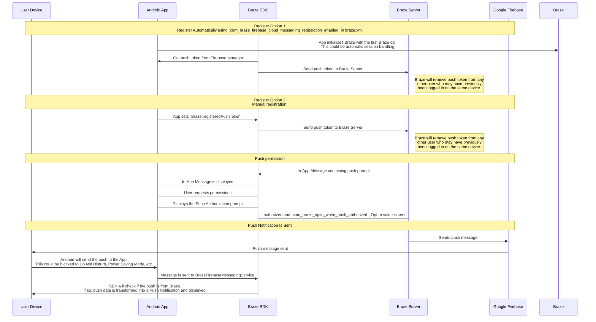

# Troubleshoot push notifications

> Learn how to troubleshoot push notifications for the Braze SDK.


## Troubleshooting

If you're experiencing issues after setting up push notifications, consider the following:

- Web push notifications require that your site be HTTPS.
- Not all browsers can receive push messages. Ensure that `braze.isPushSupported()` returns `true` in the browser.
- Some browsers, such as Firefox, do not display images in push notifications. For details on browser support, refer to the [MDN documentation for Notification images](https://developer.mozilla.org/en-US/docs/Web/API/Notification/image).
- If a user has denied a site push access, they won't be prompted for permission again unless they remove the denied status from their browser preferences.


## Understanding the Braze push workflow

The Firebase Cloud Messaging (FCM) service is Google's infrastructure for push notifications sent to Android applications. Here is the simplified structure of how push notifications are enabled for your users' devices and how Braze can send push notifications to them:




### Step 1: Configuring your Google Cloud API key

In developing your app, you'll need to provide the Braze Android SDK with your Firebase sender ID. Additionally, you'll need to provide an API Key for server applications to the Braze dashboard. Braze will use this API key to send messages to your devices. You will also need to check that FCM service is enabled in Google Developer's console. 

**Note:**


A common mistake during this step is using the app identifier API key instead of the REST API key.


### Step 2: Devices register for FCM and provide Braze with push tokens

In typical integrations, the Braze Android SDK will handle registering devices for FCM capability. This will usually happen immediately upon opening the app for the first time. After registration, Braze will be provided with an FCM Registration ID, which is used to send messages to that device specifically. We will store the Registration ID for that user, and that user will become "push registered" if they previously did not have a push token for any of your apps.

### Step 3: Launching a Braze push campaign

When a push campaign is launched, Braze will make requests to FCM to deliver your message. Braze will use the API key copied in the dashboard to authenticate and verify that we can send push notifications to the push tokens provided.

### Step 4: Removing invalid tokens

If FCM informs us that any of the push tokens we were attempting to send a message to are invalid, we remove those tokens from the user profiles they were associated with. If users have no other push tokens, they will no longer show up as "Push Registered" under the **Segments** page.

For more details about FCM, visit [Cloud messaging](https://firebase.google.com/docs/cloud-messaging/).

## Utilizing the push error logs

Braze provides push notification errors within the message activity log. This error log provides a variety of warnings which can be very helpful for identifying why your campaigns aren't working as expected. Clicking on an error message will redirect you to relevant documentation to help you troubleshoot a particular incident.


## Troubleshooting scenarios

### Push isn't sending

Your push messages might not be sending because of the following situations:

- Your credentials exist in the wrong Google Cloud Platform project ID (wrong sender ID).
- Your credentials have the wrong permission scope.
- You uploaded wrong credentials to the wrong Braze workspace (wrong sender ID).

For other issues that may prevent you from sending a push message, refer to [User Guide: Troubleshooting Push Notifications](https://www.braze.com/docs/user_guide/message_building_by_channel/push/troubleshooting/).

### No "push registered" users showing in the Braze dashboard (prior to sending messages)

Confirm that your app is correctly configured to allow push notifications. Common failure points to check include:

#### Incorrect sender ID

Check that the correct FCM sender ID is included in the `braze.xml` file. An incorrect sender ID will lead to `MismatchSenderID` errors reported in the dashboard's message activity log.

#### Braze registration not occurring

Since FCM registration is handled outside of Braze, failure to register can only occur in two places:

1. During registration with FCM
2. When passing the FCM-generated push token to Braze

We recommend setting a breakpoint or logging to confirm that the FCM-generated push token is being sent to Braze. If a token is not generated correctly or at all, we recommend consulting the [FCM documentation](https://firebase.google.com/docs/cloud-messaging/android/client).

#### Google Play Services not present

For FCM push to work, Google Play Services must be present on the device. If Google Play Services isn't on a device, push registration will not occur.

**Note:** Google Play Services is not installed on Android emulators without Google APIs installed.

#### Device not connected to the internet

Check that your device has good internet connectivity and isn't sending network traffic through a proxy.

### Tapping push notification doesn't open the app

Check if `com_braze_handle_push_deep_links_automatically` is set to `true` or `false`. To enable Braze to automatically open the app and any deep links when a push notification is tapped, set `com_braze_handle_push_deep_links_automatically` to `true` in your `braze.xml` file.

If `com_braze_handle_push_deep_links_automatically` is set to its default of `false`, you need to use a Braze Push Callback to listen for and handle the push received and opened intents.

### Push notifications bounced

If a push notification isn't delivered, make sure it didn't bounce by looking in the [developer console](https://www.braze.com/docs/developer_guide/platforms/android/push_notifications/troubleshooting/#utilizing-the-push-error-logs). The following are descriptions of common errors that may be logged in the developer console:

#### Error: MismatchSenderID

`MismatchSenderID` indicates an authentication failure. Confirm your Firebase sender ID and FCM API key are correct.

#### Error: InvalidRegistration

`InvalidRegistration` can be caused by a malformed push token.

1. Make sure to pass a valid push token to Braze from [Firebase Cloud Messaging](https://firebase.google.com/docs/cloud-messaging/android/client#retrieve-the-current-registration-token).

#### Error: NotRegistered

1. `NotRegistered` typically occurs when an app has been deleted from a device. Braze uses `NotRegistered` internally to signal that an app has been uninstalled from a device.

2. `NotRegistered` may also occur when multiple registrations occur and a second registration invalidates the first token.

### Push notifications sent but not displayed on users' devices

There are a few reasons why this could be occurring:

#### Application was force quit

If you force-quit your application through your system settings, your push notifications will not be sent. Launching the app again will re-enable your device to receive push notifications.

#### BrazeFirebaseMessagingService not registered

The BrazeFirebaseMessagingService must be properly registered in `AndroidManifest.xml` for push notifications to appear:

```xml
<service android:name="com.braze.push.BrazeFirebaseMessagingService"
  android:exported="false">
  <intent-filter>
    <action android:name="com.google.firebase.MESSAGING_EVENT" />
  </intent-filter>
</service>
```

#### Firewall is blocking push

If you are testing push over Wi-Fi, your firewall may be blocking ports necessary for FCM to receive messages. Confirm that ports `5228`, `5229`, and `5230` are open. Additionally, since FCM doesn't specify its IPs, you must also allow your firewall to accept outgoing connections to all IP addresses contained in the IP blocks listed in Google's ASN of `15169`.

#### Custom notification factory returning null

If you have implemented a [custom notification factory](https://www.braze.com/docs/developer_guide/platform_integration_guides/android/push_notifications/android/integration/standard_integration/#custom-displaying-notifications), ensure that it is not returning `null`. This will cause notifications not to be displayed.

### "Push registered" users no longer enabled after sending messages

There are a few reasons why this could be happening:

#### Application was uninstalled

Users have uninstalled the application. This will invalidate their FCM push token.

#### Invalid Firebase Cloud Messaging server key

The Firebase Cloud Messaging server key provided in the Braze dashboard is invalid. The sender ID provided should match the one referenced in your app's `braze.xml` file. The server key and sender ID are found here in your Firebase Console:


### Push clicks not logged

Braze logs push clicks automatically, so this scenario should be comparatively rare.

If push clicks are not being logged, it is possible that push click data has not been flushed to our servers yet. Braze throttles the frequency of its flushes based on the strength of the network connection. With a good network connection, push click-data should arrive at the server within a minute in most circumstances.

### Deep links not working

#### Verify deep link configuration

Deep links can be [tested with ADB](https://developer.android.com/training/app-indexing/deep-linking.html#testing-filters). We recommend testing your deep link with the following command:

`adb shell am start -W -a android.intent.action.VIEW -d "THE_DEEP_LINK" THE_PACKAGE_NAME`

If the deep link fails to work, the deep link may be misconfigured. A misconfigured deep link will not work when sent through Braze push.

#### Verify custom handling logic

If the deep link [works correctly with ADB](https://developer.android.com/training/app-indexing/deep-linking.html#testing-filters) but fails to work from Braze push, check whether any [custom push open handling](https://www.braze.com/docs/developer_guide/platform_integration_guides/android/push_notifications/android/integration/standard_integration/#android-push-listener-callback) has been implemented. If so, verify that the custom handling code properly handles the incoming deep link.

#### Disable back stack behavior

If the deep link [works correctly with ADB](https://developer.android.com/training/app-indexing/deep-linking.html#testing-filters) but fails to work from Braze push, try disabling [back stack](https://developer.android.com/guide/components/activities/tasks-and-back-stack). To do so, update your **braze.xml** file to include:

```xml
<bool name="com_braze_push_deep_link_back_stack_activity_enabled">false</bool>
```


## Understanding the Braze/APNs workflow

The Apple Push Notification service (APNs) is the infrastructure for sending push notifications to applications running on Apple's platforms. Here is the simplified structure of how push notifications are enabled for your users' devices and how Braze can send push notifications to them:

1. You configure the push certificate and provisioning profile
2. Devices register for APNs and provide Braze with push tokens
3. You launch a Braze push campaign
4. Braze removes invalid tokens

### Step 1: Configuring the push certificate and provisioning profile

In developing your app, you'll need to create an SSL certificate to enable push notifications. This certificate will be included in the provisioning profile your app is built with and will also need to be uploaded to the Braze dashboard. The certificate allows Braze to tell APNs that we are allowed to send push notifications on your behalf.

There are two types of [provisioning profiles](https://developer.apple.com/library/content/documentation/IDEs/Conceptual/AppDistributionGuide/MaintainingProfiles/MaintainingProfiles.html) and certificates: development and distribution. We recommend just using distribution profiles and certificates to avoid any confusion. If you choose to use different profiles and certificates for development and distribution, ensure that the certificate uploaded to the dashboard matches the provisioning profile you are currently using.

**Warning:**


Do not change the push certificate environment (development versus production). Changing the push certificate to the wrong environment can lead to your users having their push token accidentally removed, making them unreachable by push. 


### Step 2: Devices register for APNs and provide Braze with push tokens

When users open your app, they will be prompted to accept push notifications. If they accept this prompt, APNs will generate a push token for that particular device. The Swift SDK will immediately and asynchronously send up the push token for apps using the default [automatic flush policy](https://www.braze.com/docs/developer_guide/platform_integration_guides/swift/advanced_use_cases/fine_network_traffic_control/#automatic-request-processing). After we have a push token associated with a user, they will show as "Push Registered" in the dashboard on their user profile under the **Engagement** tab and will be eligible to receive push notifications from Braze campaigns.

**Note:**


Starting in macOS 13, on certain devices, you can test push notifications on an iOS 16 Simulator running on Xcode 14. For further details, refer to the [Xcode 14 Release Notes](https://developer.apple.com/documentation/xcode-release-notes/xcode-14-release-notes).


#### Considerations for push token generation

- If users install your app on another device, another token will be created and captured in the same way. 
- If users reinstall your app, a new token will be generated and passed to Braze. However, the original token may still be logged as valid by APNs and Braze.
- If users uninstall your app, Braze doesn't get immediately notified of this and the token will still appear as valid until it is retired by APNs. 
- At some point, APNs will retire old tokens. Braze doesn't have control or visibility of this. 

### Step 3: Launching a Braze push campaign

When a push campaign is launched, Braze will make requests to APNs to deliver your message. Specifically, the requests are passed to APNs for each current valid push token unless **Send to a user's most recent device** is selected. After Braze receives a successful response from APNs, we will log a successful delivery on the user profile, though the user may not have received the actual message for reasons including:
- Their device is powered off.
- Their device isn't connected to the internet (Wi-Fi or cellular).
- They recently uninstalled the app.

Braze will use the SSL push certificate uploaded in the dashboard to authenticate and verify that we are allowed to send push notifications to the push tokens provided. If a device is online, the notification should be received shortly after the campaign has been sent. Note that Braze sets the default APNs [expiration date](https://developer.apple.com/documentation/usernotifications/setting_up_a_remote_notification_server/sending_notification_requests_to_apns#2947607) for notifications to 30 days.

### Step 4: Removing invalid tokens

If [APNs](https://developer.apple.com/library/content/documentation/NetworkingInternet/Conceptual/RemoteNotificationsPG/APNSOverview.html#//apple_ref/doc/uid/TP40008194-CH8-SW1) informs us that any of the push tokens we were attempting to send a message to are invalid, we remove those tokens from the user profiles they were associated with.

**Note:**


It's normal for APNs to initially return a success status even if a token becomes unregistered, as APNs doesn't immediately report token invalidation events. APNs intentionally delays returning a `410` status for invalid tokens on a randomized schedule, designed to protect user privacy and prevent tracking of app uninstalls. You can safely continue sending notifications to an unregistered token until APNs returns a `410` status.


## Using the push error logs

The [Message Activity Log](https://www.braze.com/docs/user_guide/administrative/app_settings/message_activity_log_tab/) gives you the opportunity to see any messages (especially error messages) associated with your campaigns and sends, including push notification errors. This error log provides a variety of warnings which can be very helpful for identifying why your campaigns aren't working as expected. Clicking on an error message will redirect you to relevant documentation to help you troubleshoot a particular incident.


Common errors you might see here include user-specific notifications, such as ["Received Unregistered Sending to Push Token"](#swift_received-unregistered-sending).

In addition, Braze also provides a push changelog on the user profile under the **Engagement** tab. This changelog provides insight into push registration behavior such as token invalidation, push registration errors, tokens being moved to new users, etc.

{: style="max-width:50%;" }

### Message Activity Log errors

#### Received unregistered sending to push token {#received-unregistered-sending}

- Make sure that the push token being sent to Braze from the method `AppDelegate.braze?.notifications.register(deviceToken:)` is valid. You can look in the **Message Activity Log** to see the push token. It should look something like `6e407a9be8d07f0cdeb9e724733a89445f57a89ec890d63867c482a483506fa6`, a long string containing a mix of letters and numbers. If your push token looks different, check your [code](https://www.braze.com/docs/developer_guide/platform_integration_guides/swift/push_notifications/integration/#step-4-register-push-tokens-with-braze) for sending Braze the push tokens.
- Ensure that your push provisioning profile matches the environment you're testing. Universal certificates may be configured in the Braze dashboard to send to either the development or production APNs environment. Using a development certificate for a production app or a production certificate for a development app will not work.
 - Check that the push token you have uploaded to Braze matches the provisioning profile you used to build the app you sent the push token from.

#### Device token not for topic

This error indicates that your app's push certificate and bundle ID are mismatched. Check that the push certificate you uploaded to Braze matches the provisioning profile used to build the app from which the push token was sent.

#### BadDeviceToken sending to push token

The `BadDeviceToken` is an APNs error code and does not originate from Braze. There could be a number of reasons for this response being returned, including the following:

- The app received a push token that was invalid for the credentials uploaded to the dashboard.
- Push was disabled for this workspace.
- The user has opted out of push.
- The app was uninstalled.
- Apple refreshed the push token, which invalidated the old token.
- The app was built for a production environment, but the push credentials uploaded to Braze are set for a development environment (or the other way around).

## Push registration issues

### No push registration prompt

If the application does not prompt you to register for push notifications, there is likely an issue with your push registration integration. Ensure you have followed our [documentation](https://www.braze.com/docs/developer_guide/push_notifications/?sdktab=swift) and correctly integrated our push registration. You can also set breakpoints in your code to ensure the push registration code is running.

### No "push registered" users showing in the dashboard (prior to sending messages)

Ensure that your app is correctly configured to allow push notifications. Common failure points to check include:

- Check that your app is prompting you to allow push notifications. Typically, this prompt will appear upon your first open of the app, but it can be programmed to appear elsewhere. If it does not appear where it should be, the problem is likely with the basic configuration of your app's push capabilities.
  - Verify the steps for [push integration](https://www.braze.com/docs/developer_guide/push_notifications/?sdktab=swift) were successfully completed.
  - Check that the provisioning profile your app was built with includes permissions for push. Make sure that you're pulling down all of the available provisioning profiles from your Apple developer account. To confirm this, perform the following steps:
    1. In Xcode, navigate to **Preferences > Accounts** (or use the keyboard shortcut <kbd>Command</kbd>+<kbd>,</kbd>).
    2. Select the Apple ID you use for your developer account and click **View Details**.
    3. On the next page, click **<i class="fas fa-redo-alt"></i> Refresh** and confirm that you're pulling all available provisioning profiles.
- Check you have [properly enabled push capability](https://www.braze.com/docs/developer_guide/platform_integration_guides/swift/push_notifications/integration/#step-2-enable-push-capabilities) in your app.
- Check your push provisioning profile matches the environment you're testing in. Universal certificates may be configured in the Braze dashboard to send to either the development or production APNs environment. Using a development certificate for a production app or a production certificate for a development app will not work.
- Check that you are calling our `registerPushToken` method by setting a breakpoint in your code.
- Make sure you're testing using a device (push will not work on a simulator) and have good network connectivity.

## Push notifications sent but not displayed on users’ devices

### "Push registered" users no longer enabled after sending messages

This likely indicates that the user had an invalid push token. This can happen for several reasons:

#### Dashboard and app certificate mismatch

If the push certificate you uploaded in the dashboard is not the same one in the provisioning profile that your app was built with, APNs will reject the token. Verify that you have uploaded the correct certificate and completed another session in the app before attempting another test notification.

#### Application was uninstalled

If a user has uninstalled your application, their push token will be invalid and removed upon the next send.

#### Regenerating your provisioning profile

As a last resort, starting over fresh and creating a whole new provisioning profile can clear up configuration errors that come from working with multiple environments, profiles, and apps at the same time. There are many "moving parts" in setting up push notifications, so sometimes, it is best to retry from the beginning. This will also help isolate the problem if you need to continue troubleshooting.

### Messages not delivered to "push registered" users

#### App is foregrounded

On iOS versions that do not integrate push via the `UserNotifications` framework, if the app is in the foreground when the push message is received, it will not be displayed. You should background the app on your test devices before sending test messages.

#### Test notification scheduled incorrectly

Check the schedule you set for your test message. If it is set to local time zone delivery or [Intelligent Timing](https://www.braze.com/docs/user_guide/brazeai/intelligence/intelligent_timing/), you may have just not received the message yet (or had the app in the foreground when it was received).

### User not "push registered" for the app being tested

Check the user profile of the user you are trying to send a test message to. Under the **Engagement** tab, there should be a list of "pushable apps." Verify the app you are trying to send test messages to is in this list. Users will show up as "Push Registered" if they have a push token for any app in your workspace, so this could be something of a false positive.

The following would indicate a problem with push registration or that the user's token had been returned to Braze as invalid by APNs after being pushed:

{: style="max-width:50%"}

## Push clicks not logged {#push-clicks-not-logged}

- Make sure you have followed the [push integration steps](https://www.braze.com/docs/developer_guide/platform_integration_guides/swift/push_notifications/integration/#step-5-enable-push-handling).
- Braze does not handle push notifications received silently in the foreground (default foreground push behavior prior to the `UserNotifications` framework). This means that links will not be opened,  and push clicks will not be logged. If your application has not yet integrated the `UserNotifications` framework, Braze will not handle push notifications when the application state is `UIApplicationStateActive`. Ensure that your app does not delay calls to [push handling methods](https://www.braze.com/docs/developer_guide/platform_integration_guides/swift/push_notifications/integration/#step-5-enable-push-handling); otherwise, the Swift SDK may treat push notifications as silent foreground push events and not handle them.

## Deep links not working

For comprehensive troubleshooting across all channels—including universal links, custom schemes, email, and third-party providers like Branch—see [Deep linking troubleshooting](https://www.braze.com/docs/developer_guide/push_notifications/deep_linking_troubleshooting).

### Web links from push clicks not opening

Links in push notifications need to be ATS compliant to be opened in web views. Ensure that your web links use HTTPS. For more information, refer to [ATS compliance](https://www.braze.com/docs/developer_guide/platform_integration_guides/swift/advanced_use_cases/linking/#app-transport-security-ats).

### Deep links from push clicks not opening

Most of the code that handles deep links also handles push opens. First, ensure that push opens are being logged. If not, fix that issue (as the fix often fixes link handling).

If opens are being logged, check whether it is an issue with the deep link in general or with the deep linking push click handling. To do this, test to see if a deep link from an in-app message click works.


## Understanding the Braze push workflow

The Firebase Cloud Messaging (FCM) service is Google's infrastructure for push notifications sent to Android applications. Here is the simplified structure of how push notifications are enabled for your users' devices and how Braze can send push notifications to them:


### Step 1: Configuring your Google Cloud API key

In developing your app, you'll need to provide the Braze Android SDK with your Firebase sender ID. Additionally, you'll need to provide an API Key for server applications to the Braze dashboard. Braze will use this API key to send messages to your devices. You will also need to check that FCM service is enabled in Google Developer's console. 

**Note:**


A common mistake during this step is using the app identifier API key instead of the REST API key.


### Step 2: Devices register for FCM and provide Braze with push tokens

In typical integrations, the Braze Android SDK will handle registering devices for FCM capability. This will usually happen immediately upon opening the app for the first time. After registration, Braze will be provided with an FCM Registration ID, which is used to send messages to that device specifically. We will store the Registration ID for that user, and that user will become "push registered" if they previously did not have a push token for any of your apps.

### Step 3: Launching a Braze push campaign

When a push campaign is launched, Braze will make requests to FCM to deliver your message. Braze will use the API key copied in the dashboard to authenticate and verify that we can send push notifications to the push tokens provided.

### Step 4: Removing invalid tokens

If FCM informs us that any of the push tokens we were attempting to send a message to are invalid, we remove those tokens from the user profiles they were associated with. If users have no other push tokens, they will no longer show up as "Push Registered" under the **Segments** page.

For more details about FCM, visit [Cloud messaging](https://firebase.google.com/docs/cloud-messaging/).

## Utilizing the push error logs

Braze provides push notification errors within the message activity log. This error log provides a variety of warnings which can be very helpful for identifying why your campaigns aren't working as expected. Clicking on an error message will redirect you to relevant documentation to help you troubleshoot a particular incident.


## Troubleshooting scenarios

### Push isn't sending

Your push messages might not be sending because of the following situations:

- Your credentials exist in the wrong Google Cloud Platform project ID (wrong sender ID).
- Your credentials have the wrong permission scope.
- You uploaded wrong credentials to the wrong Braze workspace (wrong sender ID).

For other issues that may prevent you from sending a push message, refer to [User Guide: Troubleshooting Push Notifications](https://www.braze.com/docs/user_guide/message_building_by_channel/push/troubleshooting/).

### No "push registered" users showing in the Braze dashboard (prior to sending messages)

Confirm that your app is correctly configured to allow push notifications. Common failure points to check include:

#### Incorrect sender ID

Check that the correct FCM sender ID is included in the `braze.xml` file. An incorrect sender ID will lead to `MismatchSenderID` errors reported in the dashboard's message activity log.

#### Braze registration not occurring

Since FCM registration is handled outside of Braze, failure to register can only occur in two places:

1. During registration with FCM
2. When passing the FCM-generated push token to Braze

We recommend setting a breakpoint or logging to confirm that the FCM-generated push token is being sent to Braze. If a token is not generated correctly or at all, we recommend consulting the [FCM documentation](https://firebase.google.com/docs/cloud-messaging/android/client).

#### Google Play Services not present

For FCM push to work, Google Play Services must be present on the device. If Google Play Services isn't on a device, push registration will not occur.

**Note:** Google Play Services is not installed on Android emulators without Google APIs installed.

#### Device not connected to the internet

Check that your device has good internet connectivity and isn't sending network traffic through a proxy.

### Tapping push notification doesn't open the app

Check if `com_braze_handle_push_deep_links_automatically` is set to `true` or `false`. To enable Braze to automatically open the app and any deep links when a push notification is tapped, set `com_braze_handle_push_deep_links_automatically` to `true` in your `braze.xml` file.

If `com_braze_handle_push_deep_links_automatically` is set to its default of `false`, you need to use a Braze Push Callback to listen for and handle the push received and opened intents.

### Push notifications bounced

If a push notification isn't delivered, make sure it didn't bounce by looking in the [developer console](https://www.braze.com/docs/developer_guide/platforms/android/push_notifications/troubleshooting/#utilizing-the-push-error-logs). The following are descriptions of common errors that may be logged in the developer console:

#### Error: MismatchSenderID

`MismatchSenderID` indicates an authentication failure. Confirm your Firebase sender ID and FCM API key are correct.

#### Error: InvalidRegistration

`InvalidRegistration` can be caused by a malformed push token.

1. Make sure to pass a valid push token to Braze from [Firebase Cloud Messaging](https://firebase.google.com/docs/cloud-messaging/android/client#retrieve-the-current-registration-token).

#### Error: NotRegistered

1. `NotRegistered` typically occurs when an app has been deleted from a device. Braze uses `NotRegistered` internally to signal that an app has been uninstalled from a device.

2. `NotRegistered` may also occur when multiple registrations occur and a second registration invalidates the first token.

### Push notifications sent but not displayed on users' devices

There are a few reasons why this could be occurring:

#### Application was force quit

If you force-quit your application through your system settings, your push notifications will not be sent. Launching the app again will re-enable your device to receive push notifications.

#### BrazeFirebaseMessagingService not registered

The BrazeFirebaseMessagingService must be properly registered in `AndroidManifest.xml` for push notifications to appear:

```xml
<service android:name="com.braze.push.BrazeFirebaseMessagingService"
  android:exported="false">
  <intent-filter>
    <action android:name="com.google.firebase.MESSAGING_EVENT" />
  </intent-filter>
</service>
```

#### Firewall is blocking push

If you are testing push over Wi-Fi, your firewall may be blocking ports necessary for FCM to receive messages. Confirm that ports `5228`, `5229`, and `5230` are open. Additionally, since FCM doesn't specify its IPs, you must also allow your firewall to accept outgoing connections to all IP addresses contained in the IP blocks listed in Google's ASN of `15169`.

#### Custom notification factory returning null

If you have implemented a [custom notification factory](https://www.braze.com/docs/developer_guide/platform_integration_guides/android/push_notifications/android/integration/standard_integration/#custom-displaying-notifications), ensure that it is not returning `null`. This will cause notifications not to be displayed.

### "Push registered" users no longer enabled after sending messages

There are a few reasons why this could be happening:

#### Application was uninstalled

Users have uninstalled the application. This will invalidate their FCM push token.

#### Invalid Firebase Cloud Messaging server key

The Firebase Cloud Messaging server key provided in the Braze dashboard is invalid. The sender ID provided should match the one referenced in your app's `braze.xml` file. The server key and sender ID are found here in your Firebase Console:


### Push clicks not logged

Braze logs push clicks automatically, so this scenario should be comparatively rare.

If push clicks are not being logged, it is possible that push click data has not been flushed to our servers yet. Braze throttles the frequency of its flushes based on the strength of the network connection. With a good network connection, push click-data should arrive at the server within a minute in most circumstances.

### Deep links not working

#### Verify deep link configuration

Deep links can be [tested with ADB](https://developer.android.com/training/app-indexing/deep-linking.html#testing-filters). We recommend testing your deep link with the following command:

`adb shell am start -W -a android.intent.action.VIEW -d "THE_DEEP_LINK" THE_PACKAGE_NAME`

If the deep link fails to work, the deep link may be misconfigured. A misconfigured deep link will not work when sent through Braze push.

#### Verify custom handling logic

If the deep link [works correctly with ADB](https://developer.android.com/training/app-indexing/deep-linking.html#testing-filters) but fails to work from Braze push, check whether any [custom push open handling](https://www.braze.com/docs/developer_guide/platform_integration_guides/android/push_notifications/android/integration/standard_integration/#android-push-listener-callback) has been implemented. If so, verify that the custom handling code properly handles the incoming deep link.

#### Disable back stack behavior

If the deep link [works correctly with ADB](https://developer.android.com/training/app-indexing/deep-linking.html#testing-filters) but fails to work from Braze push, try disabling [back stack](https://developer.android.com/guide/components/activities/tasks-and-back-stack). To do so, update your **braze.xml** file to include:

```xml
<bool name="com_braze_push_deep_link_back_stack_activity_enabled">false</bool>
```


## Troubleshooting

### Push doesn't appear after app is closed from task switcher

If you observe that push notifications no longer appear after the app is closed from the task switcher, your app is likely in Debug mode. .NET MAUI adds scaffolding in Debug mode that prevents apps from receiving push after their process is killed. If you run your app in Release Mode, you should see push even after the app is closed from the task switcher.

### Custom notification factory not being set correctly

Custom notification factories (and all delegates) must extend [`Java.Lang.Object`](https://developer.xamarin.com/api/type/Android.Runtime.IJavaObject/) to work properly across the C# and Java divide. See [Xamarin](https://developer.xamarin.com/guides/android/advanced_topics/java_integration_overview/working_with_jni/#Implementing_Interfaces) on implementing Java interfaces for more information.


## Line breaks in push notifications {#push-linebreaks}

When composing push notifications with Liquid tags, line breaks adjacent to Liquid tags are automatically removed before the message is sent. In the [push notification composer](https://www.braze.com/docs/user_guide/message_building_by_channel/push/creating_a_push_message/), these line breaks are re-added so your message remains readable while editing. If you notice line breaks around Liquid tags when saving your message, this is expected behavior.

