```mermaid
---
config:
  layout: elk
  elk:
    mergeEdges: true
    nodePlacementStrategy: LINEAR_SEGMENTS
---
erDiagram
        EVENT["CONTENT_CARD_EVENT"] {
        string id PK
        string campaign_id FK
        string campaign_updated_at
        string canvas_id FK
        string canvas_updated_at
        string canvas_step_id FK
        string canvas_step_updated_at
        string canvas_variation_id FK
        string device_id FK
        string message_variation_id FK
        string message_variation_updated_at
        string canvas_step_message_variation_id FK
        string canvas_step_message_variation_updated_at
        string user_id FK
        string abort_type
        string abort_log
        string app_group_id
        string app_id
        string content_card_id
        string dispatch_id
        string event_type
        string external_user_id
        string message_extras
        string send_id
        string time
        string timezone
    }

    CHANGELOGS_CANVAS_SHARED {
        string Id FK
        string time
        string app_group_id
        string api_id
        string name
        string conversion_behaviors
        string variations
    }
    SNAPSHOTS_CANVAS_FLOW_STEP_SHARED {
        string Id FK
        string time
        string app_group_id
        string type
        string api_step_id
        string experiment_splits
        string conversion_behaviors
        string name
    }
    SNAPSHOTS_CANVAS_STEP_SHARED {
        string Id FK
        string time
        string app_group_id
        string api_id
        string name
        string actions
    }
    SNAPSHOTS_CANVAS_VARIATION_SHARED {
        string Id FK
        string time
        string app_group_id
        string api_id
        string name
    }
    SNAPSHOTS_EXPERIMENT_STEP_SHARED {
        string Id FK
        string time
        string app_group_id
        string type
        string api_step_id
        string experiment_splits
        string conversion_behaviors
        string name
    }

    CHANGELOGS_CAMPAIGN_SHARED {
        string Id FK
        string time
        string app_group_id
        string api_id
        string name
        string conversion_behaviors
        string actions
    }
    SNAPSHOTS_CAMPAIGN_MESSAGE_VARIATION_SHARED {
        string Id FK
        string time
        string app_group_id
        string api_id
        string name
    }

    CAMPAIGN_ENROLLMENT_EVENT {
        string id PK
        string campaign_id FK
        string campaign_updated_at FK
        string user_id FK
        string external_user_id
        string message_variation_id
        string send_id
        string time
        string timezone
    }
    CAMPAIGN_CONVERSION_EVENT {
        string id PK
        string campaign_id FK
        string campaign_updated_at FK
        string conversion_behavior_index FK
        string message_variation_id FK
        string user_id FK
        string event_type
        string app_id
        string external_user_id
        string send_id
        string time
        string timezone
    }

    CANVAS_VARIATION {
        string id PK
        string name PK
        string canvas_id FK
        string canvas_updated_at FK
    }
    CANVAS_STEP {
        string id PK
        string canvas_id FK
        string canvas_updated_at FK
        string canvas_step_name
        string channel_android_push
        string channel_content_cards
        string channel_email
        string channel_ios_push
        string channel_in_app_message
        string channel_sms
        string channel_web_push
        string channel_webhook
    }

    CANVAS_ENTRY_EVENT {
        string id PK
        string canvas_id FK
        string canvas_updated_at FK
        string canvas_step_id FK
        string canvas_step_updated_at FK
        string canvas_variation_id FK
        string user_id FK
        string event_type
        string external_user_id
        string in_control_group
        string time
        string timezone
    }
    CANVAS_EXPERIMENT_STEP_ENTRY_EVENT {
        string id PK
        string canvas_id FK
        string canvas_updated_at FK
        string canvas_step_id FK
        string canvas_step_updated_at FK
        string canvas_variation_id FK
        string user_id FK
        string event_type
        string experiment_split_id
        string experiment_split_name
        string experiment_step_id
        string external_user_id
        string in_control_group
        string time
    }
    CANVAS_EXIT_EVENT {
        string id PK
        string canvas_id FK
        string canvas_updated_at FK
        string canvas_step_id FK
        string canvas_step_updated_at FK
        string canvas_variation_id FK
        string user_id FK
        string app_group_id
        string event_type
        string time
    }

    CANVAS_EXPERIMENT_STEP_CONVERSION_EVENT {
        string id PK
        string canvas_id FK
        string canvas_updated_at FK
        string canvas_step_id FK
        string canvas_step_updated_at FK
        string canvas_conversion_behaviour_id FK
        string canvas_variation_id FK
        string user_id FK
        string app_id
        string event_type
        string experiment_step_id
        string experiment_split_id
        string experiment_split_name
        string time
    }
    CANVAS_CONVERSION_EVENT {
        string id PK
        string canvas_id FK
        string canvas_updated_at FK
        string canvas_step_id FK
        string canvas_conversion_behaviour_id FK
        string canvas_variation_id FK
        string user_id FK
        string event_type
        string app_id
        string external_user_id
        string time
        string timezone
    }

    %% Relationships for Group Labels
    GROUP_1["Campaign Snapshots and Log"] { }
    CHANGELOGS_CAMPAIGN_SHARED ||--o{ GROUP_1 : joins
    SNAPSHOTS_CAMPAIGN_MESSAGE_VARIATION_SHARED ||--o{ GROUP_1 : joins
    GROUP_1 ||--o{ EVENT : joins

    GROUP_2["Campaign Events"] { }
    CAMPAIGN_ENROLLMENT_EVENT ||--o{ GROUP_2 : joins
    CAMPAIGN_CONVERSION_EVENT ||--o{ GROUP_2 : joins
    GROUP_2 ||--o{ EVENT : joins

    GROUP_3["Canvas Events"] { }
    CANVAS_ENTRY_EVENT ||--o{ GROUP_3 : joins
    CANVAS_EXPERIMENT_STEP_ENTRY_EVENT ||--o{ GROUP_3 : joins
    CANVAS_EXIT_EVENT ||--o{ GROUP_3 : joins
    GROUP_3 ||--o{ EVENT : joins

    GROUP_4["Canvas Steps"] { }
    CANVAS_VARIATION ||--o{ GROUP_4 : joins
    CANVAS_STEP ||--o{ GROUP_4 : joins
    GROUP_4 ||--o{ EVENT : joins

    GROUP_5["Canvas Experiments"] { }
    CANVAS_EXPERIMENT_STEP_CONVERSION_EVENT ||--o{ GROUP_5 : joins
    CANVAS_CONVERSION_EVENT ||--o{ GROUP_5 : joins
    GROUP_5 ||--o{ EVENT : joins

    GROUP_6["Canvas Snapshots and Log"] { }
    CHANGELOGS_CANVAS_SHARED ||--o{ GROUP_6 : joins
    SNAPSHOTS_CANVAS_FLOW_STEP_SHARED ||--o{ GROUP_6 : joins
    SNAPSHOTS_CANVAS_STEP_SHARED ||--o{ GROUP_6 : joins
    SNAPSHOTS_CANVAS_VARIATION_SHARED ||--o{ GROUP_6 : joins
    SNAPSHOTS_EXPERIMENT_STEP_SHARED ||--o{ GROUP_6 : joins
    GROUP_6 ||--o{ EVENT : joins
```

```mermaid
---
config:
  layout: elk
  elk:
    mergeEdges: true
    nodePlacementStrategy: LINEAR_SEGMENTS
---
erDiagram
        EVENT["EMAIL_EVENT"] {
        string id PK
        string campaign_id FK
        string campaign_updated_at
        string canvas_id FK
        string canvas_updated_at
        string canvas_step_id FK
        string canvas_step_updated_at
        string canvas_variation_id FK
        string message_variation_id FK
        string message_variation_updated_at
        string canvas_step_message_variation_id FK
        string canvas_step_message_variation_updated_at
        string device_id FK
        string user_id FK
        string abort_type
        string abort_log
        string app_group_id
        string bounce_reason
        string dispatch_id
        string email_address
        string esp
        string event_type
        string external_user_id
        string from_domain
        string ip_pool
        string is_amp
        string is_drop
        string link_alias
        string link_id
        string machine_open
        string message_extras
        string send_id
        string sending_ip
        string time
        string timezone
        string url
        string user_agent
    }


    CHANGELOGS_CANVAS_SHARED {
        string Id FK
        string time
        string app_group_id
        string api_id
        string name
        string conversion_behaviors
        string variations
    }
    SNAPSHOTS_CANVAS_FLOW_STEP_SHARED {
        string Id FK
        string time
        string app_group_id
        string type
        string api_step_id
        string experiment_splits
        string conversion_behaviors
        string name
    }
    SNAPSHOTS_CANVAS_STEP_SHARED {
        string Id FK
        string time
        string app_group_id
        string api_id
        string name
        string actions
    }
    SNAPSHOTS_CANVAS_VARIATION_SHARED {
        string Id FK
        string time
        string app_group_id
        string api_id
        string name
    }
    SNAPSHOTS_EXPERIMENT_STEP_SHARED {
        string Id FK
        string time
        string app_group_id
        string type
        string api_step_id
        string experiment_splits
        string conversion_behaviors
        string name
    }

    CHANGELOGS_CAMPAIGN_SHARED {
        string Id FK
        string time
        string app_group_id
        string api_id
        string name
        string conversion_behaviors
        string actions
    }
    SNAPSHOTS_CAMPAIGN_MESSAGE_VARIATION_SHARED {
        string Id FK
        string time
        string app_group_id
        string api_id
        string name
    }

    CAMPAIGN_ENROLLMENT_EVENT {
        string id PK
        string campaign_id FK
        string campaign_updated_at FK
        string user_id FK
        string external_user_id
        string message_variation_id
        string send_id
        string time
        string timezone
    }
    CAMPAIGN_CONVERSION_EVENT {
        string id PK
        string campaign_id FK
        string campaign_updated_at FK
        string conversion_behavior_index FK
        string message_variation_id FK
        string user_id FK
        string event_type
        string app_id
        string external_user_id
        string send_id
        string time
        string timezone
    }

    CANVAS_VARIATION {
        string id PK
        string name PK
        string canvas_id FK
        string canvas_updated_at FK
    }
    CANVAS_STEP {
        string id PK
        string canvas_id FK
        string canvas_updated_at FK
        string canvas_step_name
        string channel_android_push
        string channel_content_cards
        string channel_email
        string channel_ios_push
        string channel_in_app_message
        string channel_sms
        string channel_web_push
        string channel_webhook
    }

    CANVAS_ENTRY_EVENT {
        string id PK
        string canvas_id FK
        string canvas_updated_at FK
        string canvas_step_id FK
        string canvas_step_updated_at FK
        string canvas_variation_id FK
        string user_id FK
        string event_type
        string external_user_id
        string in_control_group
        string time
        string timezone
    }
    CANVAS_EXPERIMENT_STEP_ENTRY_EVENT {
        string id PK
        string canvas_id FK
        string canvas_updated_at FK
        string canvas_step_id FK
        string canvas_step_updated_at FK
        string canvas_variation_id FK
        string user_id FK
        string event_type
        string experiment_split_id
        string experiment_split_name
        string experiment_step_id
        string external_user_id
        string in_control_group
        string time
    }
    CANVAS_EXIT_EVENT {
        string id PK
        string canvas_id FK
        string canvas_updated_at FK
        string canvas_step_id FK
        string canvas_step_updated_at FK
        string canvas_variation_id FK
        string user_id FK
        string app_group_id
        string event_type
        string time
    }

    CANVAS_EXPERIMENT_STEP_CONVERSION_EVENT {
        string id PK
        string canvas_id FK
        string canvas_updated_at FK
        string canvas_step_id FK
        string canvas_step_updated_at FK
        string canvas_conversion_behaviour_id FK
        string canvas_variation_id FK
        string user_id FK
        string app_id
        string event_type
        string experiment_step_id
        string experiment_split_id
        string experiment_split_name
        string time
    }
    CANVAS_CONVERSION_EVENT {
        string id PK
        string canvas_id FK
        string canvas_updated_at FK
        string canvas_step_id FK
        string canvas_conversion_behaviour_id FK
        string canvas_variation_id FK
        string user_id FK
        string event_type
        string app_id
        string external_user_id
        string time
        string timezone
    }

    %% Relationships for Group Labels
    GROUP_1["Campaign Snapshots and Log"] { }
    CHANGELOGS_CAMPAIGN_SHARED ||--o{ GROUP_1 : joins
    SNAPSHOTS_CAMPAIGN_MESSAGE_VARIATION_SHARED ||--o{ GROUP_1 : joins
    GROUP_1 ||--o{ EVENT : joins

    GROUP_2["Campaign Events"] { }
    CAMPAIGN_ENROLLMENT_EVENT ||--o{ GROUP_2 : joins
    CAMPAIGN_CONVERSION_EVENT ||--o{ GROUP_2 : joins
    GROUP_2 ||--o{ EVENT : joins

    GROUP_3["Canvas Events"] { }
    CANVAS_ENTRY_EVENT ||--o{ GROUP_3 : joins
    CANVAS_EXPERIMENT_STEP_ENTRY_EVENT ||--o{ GROUP_3 : joins
    CANVAS_EXIT_EVENT ||--o{ GROUP_3 : joins
    GROUP_3 ||--o{ EVENT : joins

    GROUP_4["Canvas Steps"] { }
    CANVAS_VARIATION ||--o{ GROUP_4 : joins
    CANVAS_STEP ||--o{ GROUP_4 : joins
    GROUP_4 ||--o{ EVENT : joins

    GROUP_5["Canvas Experiments"] { }
    CANVAS_EXPERIMENT_STEP_CONVERSION_EVENT ||--o{ GROUP_5 : joins
    CANVAS_CONVERSION_EVENT ||--o{ GROUP_5 : joins
    GROUP_5 ||--o{ EVENT : joins

    GROUP_6["Canvas Snapshots and Log"] { }
    CHANGELOGS_CANVAS_SHARED ||--o{ GROUP_6 : joins
    SNAPSHOTS_CANVAS_FLOW_STEP_SHARED ||--o{ GROUP_6 : joins
    SNAPSHOTS_CANVAS_STEP_SHARED ||--o{ GROUP_6 : joins
    SNAPSHOTS_CANVAS_VARIATION_SHARED ||--o{ GROUP_6 : joins
    SNAPSHOTS_EXPERIMENT_STEP_SHARED ||--o{ GROUP_6 : joins
    GROUP_6 ||--o{ EVENT : joins
```

```mermaid
---
config:
  layout: elk
  elk:
    mergeEdges: true
    nodePlacementStrategy: LINEAR_SEGMENTS
---
erDiagram
        EVENT["IN_APP_MESSAGE_EVENT"] {
        string id PK
        string campaign_id FK
        string campaign_updated_at
        string canvas_id FK
        string canvas_updated_at
        string canvas_step_id FK
        string canvas_step_updated_at
        string canvas_variation_id FK
        string message_variation_id FK
        string message_variation_updated_at
        string canvas_step_message_variation_id FK
        string canvas_step_message_variation_updated_at
        string card_id FK
        string card_updated_at
        string device_id FK
        string user_id FK
        string abort_type
        string abort_log
        string ad_id
        string ad_id_type
        string ad_tracking_enabled
        string app_group_id
        string app_id
        string browser
        string button_id
        string carrier
        string dispatch_id
        string event_type
        string external_user_id
        string resolution
        string send_id
        string time
        string timezone
        string version
    }


    CHANGELOGS_CANVAS_SHARED {
        string Id FK
        string time
        string app_group_id
        string api_id
        string name
        string conversion_behaviors
        string variations
    }
    SNAPSHOTS_CANVAS_FLOW_STEP_SHARED {
        string Id FK
        string time
        string app_group_id
        string type
        string api_step_id
        string experiment_splits
        string conversion_behaviors
        string name
    }
    SNAPSHOTS_CANVAS_STEP_SHARED {
        string Id FK
        string time
        string app_group_id
        string api_id
        string name
        string actions
    }
    SNAPSHOTS_CANVAS_VARIATION_SHARED {
        string Id FK
        string time
        string app_group_id
        string api_id
        string name
    }
    SNAPSHOTS_EXPERIMENT_STEP_SHARED {
        string Id FK
        string time
        string app_group_id
        string type
        string api_step_id
        string experiment_splits
        string conversion_behaviors
        string name
    }

    CHANGELOGS_CAMPAIGN_SHARED {
        string Id FK
        string time
        string app_group_id
        string api_id
        string name
        string conversion_behaviors
        string actions
    }
    SNAPSHOTS_CAMPAIGN_MESSAGE_VARIATION_SHARED {
        string Id FK
        string time
        string app_group_id
        string api_id
        string name
    }

    CAMPAIGN_ENROLLMENT_EVENT {
        string id PK
        string campaign_id FK
        string campaign_updated_at FK
        string user_id FK
        string external_user_id
        string message_variation_id
        string send_id
        string time
        string timezone
    }
    CAMPAIGN_CONVERSION_EVENT {
        string id PK
        string campaign_id FK
        string campaign_updated_at FK
        string conversion_behavior_index FK
        string message_variation_id FK
        string user_id FK
        string event_type
        string app_id
        string external_user_id
        string send_id
        string time
        string timezone
    }

    CANVAS_VARIATION {
        string id PK
        string name PK
        string canvas_id FK
        string canvas_updated_at FK
    }
    CANVAS_STEP {
        string id PK
        string canvas_id FK
        string canvas_updated_at FK
        string canvas_step_name
        string channel_android_push
        string channel_content_cards
        string channel_email
        string channel_ios_push
        string channel_in_app_message
        string channel_sms
        string channel_web_push
        string channel_webhook
    }

    CANVAS_ENTRY_EVENT {
        string id PK
        string canvas_id FK
        string canvas_updated_at FK
        string canvas_step_id FK
        string canvas_step_updated_at FK
        string canvas_variation_id FK
        string user_id FK
        string event_type
        string external_user_id
        string in_control_group
        string time
        string timezone
    }
    CANVAS_EXPERIMENT_STEP_ENTRY_EVENT {
        string id PK
        string canvas_id FK
        string canvas_updated_at FK
        string canvas_step_id FK
        string canvas_step_updated_at FK
        string canvas_variation_id FK
        string user_id FK
        string event_type
        string experiment_split_id
        string experiment_split_name
        string experiment_step_id
        string external_user_id
        string in_control_group
        string time
    }
    CANVAS_EXIT_EVENT {
        string id PK
        string canvas_id FK
        string canvas_updated_at FK
        string canvas_step_id FK
        string canvas_step_updated_at FK
        string canvas_variation_id FK
        string user_id FK
        string app_group_id
        string event_type
        string time
    }

    CANVAS_EXPERIMENT_STEP_CONVERSION_EVENT {
        string id PK
        string canvas_id FK
        string canvas_updated_at FK
        string canvas_step_id FK
        string canvas_step_updated_at FK
        string canvas_conversion_behaviour_id FK
        string canvas_variation_id FK
        string user_id FK
        string app_id
        string event_type
        string experiment_step_id
        string experiment_split_id
        string experiment_split_name
        string time
    }
    CANVAS_CONVERSION_EVENT {
        string id PK
        string canvas_id FK
        string canvas_updated_at FK
        string canvas_step_id FK
        string canvas_conversion_behaviour_id FK
        string canvas_variation_id FK
        string user_id FK
        string event_type
        string app_id
        string external_user_id
        string time
        string timezone
    }

    %% Relationships for Group Labels
    GROUP_1["Campaign Snapshots and Log"] { }
    CHANGELOGS_CAMPAIGN_SHARED ||--o{ GROUP_1 : joins
    SNAPSHOTS_CAMPAIGN_MESSAGE_VARIATION_SHARED ||--o{ GROUP_1 : joins
    GROUP_1 ||--o{ EVENT : joins

    GROUP_2["Campaign Events"] { }
    CAMPAIGN_ENROLLMENT_EVENT ||--o{ GROUP_2 : joins
    CAMPAIGN_CONVERSION_EVENT ||--o{ GROUP_2 : joins
    GROUP_2 ||--o{ EVENT : joins

    GROUP_3["Canvas Events"] { }
    CANVAS_ENTRY_EVENT ||--o{ GROUP_3 : joins
    CANVAS_EXPERIMENT_STEP_ENTRY_EVENT ||--o{ GROUP_3 : joins
    CANVAS_EXIT_EVENT ||--o{ GROUP_3 : joins
    GROUP_3 ||--o{ EVENT : joins

    GROUP_4["Canvas Steps"] { }
    CANVAS_VARIATION ||--o{ GROUP_4 : joins
    CANVAS_STEP ||--o{ GROUP_4 : joins
    GROUP_4 ||--o{ EVENT : joins

    GROUP_5["Canvas Experiments"] { }
    CANVAS_EXPERIMENT_STEP_CONVERSION_EVENT ||--o{ GROUP_5 : joins
    CANVAS_CONVERSION_EVENT ||--o{ GROUP_5 : joins
    GROUP_5 ||--o{ EVENT : joins

    GROUP_6["Canvas Snapshots and Log"] { }
    CHANGELOGS_CANVAS_SHARED ||--o{ GROUP_6 : joins
    SNAPSHOTS_CANVAS_FLOW_STEP_SHARED ||--o{ GROUP_6 : joins
    SNAPSHOTS_CANVAS_STEP_SHARED ||--o{ GROUP_6 : joins
    SNAPSHOTS_CANVAS_VARIATION_SHARED ||--o{ GROUP_6 : joins
    SNAPSHOTS_EXPERIMENT_STEP_SHARED ||--o{ GROUP_6 : joins
    GROUP_6 ||--o{ EVENT : joins
```

```mermaid
---
config:
  layout: elk
  elk:
    mergeEdges: true
    nodePlacementStrategy: LINEAR_SEGMENTS
---
erDiagram
        EVENT["PUSH_NOTIFICATION_EVENT"] {
        string id PK
        string campaign_id FK
        string campaign_updated_at
        string canvas_id FK
        string canvas_updated_at
        string canvas_step_id FK
        string canvas_step_updated_at
        string canvas_variation_id FK
        string message_variation_id FK
        string message_variation_updated_at
        string canvas_step_message_variation_id FK
        string canvas_step_message_variation_updated_at
        string device_id FK
        string user_id FK
        string abort_type
        string abort_log
        string app_group_id
        string app_id
        string event_type
        string external_user_id
        string message_extras
        string send_id
        string time
        string timezone
    }


    CHANGELOGS_CANVAS_SHARED {
        string Id FK
        string time
        string app_group_id
        string api_id
        string name
        string conversion_behaviors
        string variations
    }
    SNAPSHOTS_CANVAS_FLOW_STEP_SHARED {
        string Id FK
        string time
        string app_group_id
        string type
        string api_step_id
        string experiment_splits
        string conversion_behaviors
        string name
    }
    SNAPSHOTS_CANVAS_STEP_SHARED {
        string Id FK
        string time
        string app_group_id
        string api_id
        string name
        string actions
    }
    SNAPSHOTS_CANVAS_VARIATION_SHARED {
        string Id FK
        string time
        string app_group_id
        string api_id
        string name
    }
    SNAPSHOTS_EXPERIMENT_STEP_SHARED {
        string Id FK
        string time
        string app_group_id
        string type
        string api_step_id
        string experiment_splits
        string conversion_behaviors
        string name
    }

    CHANGELOGS_CAMPAIGN_SHARED {
        string Id FK
        string time
        string app_group_id
        string api_id
        string name
        string conversion_behaviors
        string actions
    }
    SNAPSHOTS_CAMPAIGN_MESSAGE_VARIATION_SHARED {
        string Id FK
        string time
        string app_group_id
        string api_id
        string name
    }

    CAMPAIGN_ENROLLMENT_EVENT {
        string id PK
        string campaign_id FK
        string campaign_updated_at FK
        string user_id FK
        string external_user_id
        string message_variation_id
        string send_id
        string time
        string timezone
    }
    CAMPAIGN_CONVERSION_EVENT {
        string id PK
        string campaign_id FK
        string campaign_updated_at FK
        string conversion_behavior_index FK
        string message_variation_id FK
        string user_id FK
        string event_type
        string app_id
        string external_user_id
        string send_id
        string time
        string timezone
    }

    CANVAS_VARIATION {
        string id PK
        string name PK
        string canvas_id FK
        string canvas_updated_at FK
    }
    CANVAS_STEP {
        string id PK
        string canvas_id FK
        string canvas_updated_at FK
        string canvas_step_name
        string channel_android_push
        string channel_content_cards
        string channel_email
        string channel_ios_push
        string channel_in_app_message
        string channel_sms
        string channel_web_push
        string channel_webhook
    }

    CANVAS_ENTRY_EVENT {
        string id PK
        string canvas_id FK
        string canvas_updated_at FK
        string canvas_step_id FK
        string canvas_step_updated_at FK
        string canvas_variation_id FK
        string user_id FK
        string event_type
        string external_user_id
        string in_control_group
        string time
        string timezone
    }
    CANVAS_EXPERIMENT_STEP_ENTRY_EVENT {
        string id PK
        string canvas_id FK
        string canvas_updated_at FK
        string canvas_step_id FK
        string canvas_step_updated_at FK
        string canvas_variation_id FK
        string user_id FK
        string event_type
        string experiment_split_id
        string experiment_split_name
        string experiment_step_id
        string external_user_id
        string in_control_group
        string time
    }
    CANVAS_EXIT_EVENT {
        string id PK
        string canvas_id FK
        string canvas_updated_at FK
        string canvas_step_id FK
        string canvas_step_updated_at FK
        string canvas_variation_id FK
        string user_id FK
        string app_group_id
        string event_type
        string time
    }

    CANVAS_EXPERIMENT_STEP_CONVERSION_EVENT {
        string id PK
        string canvas_id FK
        string canvas_updated_at FK
        string canvas_step_id FK
        string canvas_step_updated_at FK
        string canvas_conversion_behaviour_id FK
        string canvas_variation_id FK
        string user_id FK
        string app_id
        string event_type
        string experiment_step_id
        string experiment_split_id
        string experiment_split_name
        string time
    }
    CANVAS_CONVERSION_EVENT {
        string id PK
        string canvas_id FK
        string canvas_updated_at FK
        string canvas_step_id FK
        string canvas_conversion_behaviour_id FK
        string canvas_variation_id FK
        string user_id FK
        string event_type
        string app_id
        string external_user_id
        string time
        string timezone
    }

    %% Relationships for Group Labels
    GROUP_1["Campaign Snapshots and Log"] { }
    CHANGELOGS_CAMPAIGN_SHARED ||--o{ GROUP_1 : joins
    SNAPSHOTS_CAMPAIGN_MESSAGE_VARIATION_SHARED ||--o{ GROUP_1 : joins
    GROUP_1 ||--o{ EVENT : joins

    GROUP_2["Campaign Events"] { }
    CAMPAIGN_ENROLLMENT_EVENT ||--o{ GROUP_2 : joins
    CAMPAIGN_CONVERSION_EVENT ||--o{ GROUP_2 : joins
    GROUP_2 ||--o{ EVENT : joins

    GROUP_3["Canvas Events"] { }
    CANVAS_ENTRY_EVENT ||--o{ GROUP_3 : joins
    CANVAS_EXPERIMENT_STEP_ENTRY_EVENT ||--o{ GROUP_3 : joins
    CANVAS_EXIT_EVENT ||--o{ GROUP_3 : joins
    GROUP_3 ||--o{ EVENT : joins

    GROUP_4["Canvas Steps"] { }
    CANVAS_VARIATION ||--o{ GROUP_4 : joins
    CANVAS_STEP ||--o{ GROUP_4 : joins
    GROUP_4 ||--o{ EVENT : joins

    GROUP_5["Canvas Experiments"] { }
    CANVAS_EXPERIMENT_STEP_CONVERSION_EVENT ||--o{ GROUP_5 : joins
    CANVAS_CONVERSION_EVENT ||--o{ GROUP_5 : joins
    GROUP_5 ||--o{ EVENT : joins

    GROUP_6["Canvas Snapshots and Log"] { }
    CHANGELOGS_CANVAS_SHARED ||--o{ GROUP_6 : joins
    SNAPSHOTS_CANVAS_FLOW_STEP_SHARED ||--o{ GROUP_6 : joins
    SNAPSHOTS_CANVAS_STEP_SHARED ||--o{ GROUP_6 : joins
    SNAPSHOTS_CANVAS_VARIATION_SHARED ||--o{ GROUP_6 : joins
    SNAPSHOTS_EXPERIMENT_STEP_SHARED ||--o{ GROUP_6 : joins
    GROUP_6 ||--o{ EVENT : joins
```

```mermaid
---
config:
  layout: elk
  elk:
    mergeEdges: true
    nodePlacementStrategy: LINEAR_SEGMENTS
---
erDiagram
        EVENT["SMS_EVENT"] {
        string id PK
        string campaign_id FK
        string campaign_updated_at
        string canvas_id FK
        string canvas_updated_at
        string canvas_step_id FK
        string canvas_step_updated_at
        string canvas_variation_id FK
        string message_variation_id FK
        string message_variation_updated_at
        string canvas_step_message_variation_id FK
        string canvas_step_message_variation_updated_at
        string user_id FK
        string abort_log
        string abort_type
        string action
        string app_group_id
        string dispatch_id
        string error
        string external_user_id
        string from_phone_number
        string inbound_phone_number
        string message_body
        string message_extras
        string event_type
        string provider_error_code
        string short_url
        string subscription_group_id
        string subscription_group_api_id
        string to_phone_number
        string time
        string timezone
        string url
        string user_agent
        string user_phone_number
        boolean is_suspected_bot_click
        array suspected_bot_click_reason
}


    CHANGELOGS_CANVAS_SHARED {
        string Id FK
        string time
        string app_group_id
        string api_id
        string name
        string conversion_behaviors
        string variations
    }
    SNAPSHOTS_CANVAS_FLOW_STEP_SHARED {
        string Id FK
        string time
        string app_group_id
        string type
        string api_step_id
        string experiment_splits
        string conversion_behaviors
        string name
    }
    SNAPSHOTS_CANVAS_STEP_SHARED {
        string Id FK
        string time
        string app_group_id
        string api_id
        string name
        string actions
    }
    SNAPSHOTS_CANVAS_VARIATION_SHARED {
        string Id FK
        string time
        string app_group_id
        string api_id
        string name
    }
    SNAPSHOTS_EXPERIMENT_STEP_SHARED {
        string Id FK
        string time
        string app_group_id
        string type
        string api_step_id
        string experiment_splits
        string conversion_behaviors
        string name
    }

    CHANGELOGS_CAMPAIGN_SHARED {
        string Id FK
        string time
        string app_group_id
        string api_id
        string name
        string conversion_behaviors
        string actions
    }
    SNAPSHOTS_CAMPAIGN_MESSAGE_VARIATION_SHARED {
        string Id FK
        string time
        string app_group_id
        string api_id
        string name
    }

    CAMPAIGN_ENROLLMENT_EVENT {
        string id PK
        string campaign_id FK
        string campaign_updated_at FK
        string user_id FK
        string external_user_id
        string message_variation_id
        string send_id
        string time
        string timezone
    }
    CAMPAIGN_CONVERSION_EVENT {
        string id PK
        string campaign_id FK
        string campaign_updated_at FK
        string conversion_behavior_index FK
        string message_variation_id FK
        string user_id FK
        string event_type
        string app_id
        string external_user_id
        string send_id
        string time
        string timezone
    }

    CANVAS_VARIATION {
        string id PK
        string name PK
        string canvas_id FK
        string canvas_updated_at FK
    }
    CANVAS_STEP {
        string id PK
        string canvas_id FK
        string canvas_updated_at FK
        string canvas_step_name
        string channel_android_push
        string channel_content_cards
        string channel_email
        string channel_ios_push
        string channel_in_app_message
        string channel_sms
        string channel_web_push
        string channel_webhook
    }

    CANVAS_ENTRY_EVENT {
        string id PK
        string canvas_id FK
        string canvas_updated_at FK
        string canvas_step_id FK
        string canvas_step_updated_at FK
        string canvas_variation_id FK
        string user_id FK
        string event_type
        string external_user_id
        string in_control_group
        string time
        string timezone
    }
    CANVAS_EXPERIMENT_STEP_ENTRY_EVENT {
        string id PK
        string canvas_id FK
        string canvas_updated_at FK
        string canvas_step_id FK
        string canvas_step_updated_at FK
        string canvas_variation_id FK
        string user_id FK
        string event_type
        string experiment_split_id
        string experiment_split_name
        string experiment_step_id
        string external_user_id
        string in_control_group
        string time
    }
    CANVAS_EXIT_EVENT {
        string id PK
        string canvas_id FK
        string canvas_updated_at FK
        string canvas_step_id FK
        string canvas_step_updated_at FK
        string canvas_variation_id FK
        string user_id FK
        string app_group_id
        string event_type
        string time
    }

    CANVAS_EXPERIMENT_STEP_CONVERSION_EVENT {
        string id PK
        string canvas_id FK
        string canvas_updated_at FK
        string canvas_step_id FK
        string canvas_step_updated_at FK
        string canvas_conversion_behaviour_id FK
        string canvas_variation_id FK
        string user_id FK
        string app_id
        string event_type
        string experiment_step_id
        string experiment_split_id
        string experiment_split_name
        string time
    }
    CANVAS_CONVERSION_EVENT {
        string id PK
        string canvas_id FK
        string canvas_updated_at FK
        string canvas_step_id FK
        string canvas_conversion_behaviour_id FK
        string canvas_variation_id FK
        string user_id FK
        string event_type
        string app_id
        string external_user_id
        string time
        string timezone
    }

    %% Relationships for Group Labels
    GROUP_1["Campaign Snapshots and Log"] { }
    CHANGELOGS_CAMPAIGN_SHARED ||--o{ GROUP_1 : joins
    SNAPSHOTS_CAMPAIGN_MESSAGE_VARIATION_SHARED ||--o{ GROUP_1 : joins
    GROUP_1 ||--o{ EVENT : joins

    GROUP_2["Campaign Events"] { }
    CAMPAIGN_ENROLLMENT_EVENT ||--o{ GROUP_2 : joins
    CAMPAIGN_CONVERSION_EVENT ||--o{ GROUP_2 : joins
    GROUP_2 ||--o{ EVENT : joins

    GROUP_3["Canvas Events"] { }
    CANVAS_ENTRY_EVENT ||--o{ GROUP_3 : joins
    CANVAS_EXPERIMENT_STEP_ENTRY_EVENT ||--o{ GROUP_3 : joins
    CANVAS_EXIT_EVENT ||--o{ GROUP_3 : joins
    GROUP_3 ||--o{ EVENT : joins

    GROUP_4["Canvas Steps"] { }
    CANVAS_VARIATION ||--o{ GROUP_4 : joins
    CANVAS_STEP ||--o{ GROUP_4 : joins
    GROUP_4 ||--o{ EVENT : joins

    GROUP_5["Canvas Experiments"] { }
    CANVAS_EXPERIMENT_STEP_CONVERSION_EVENT ||--o{ GROUP_5 : joins
    CANVAS_CONVERSION_EVENT ||--o{ GROUP_5 : joins
    GROUP_5 ||--o{ EVENT : joins

    GROUP_6["Canvas Snapshots and Log"] { }
    CHANGELOGS_CANVAS_SHARED ||--o{ GROUP_6 : joins
    SNAPSHOTS_CANVAS_FLOW_STEP_SHARED ||--o{ GROUP_6 : joins
    SNAPSHOTS_CANVAS_STEP_SHARED ||--o{ GROUP_6 : joins
    SNAPSHOTS_CANVAS_VARIATION_SHARED ||--o{ GROUP_6 : joins
    SNAPSHOTS_EXPERIMENT_STEP_SHARED ||--o{ GROUP_6 : joins
    GROUP_6 ||--o{ EVENT : joins
```

# Entity relationships for Snowflake and Braze

> These are the list of entity relationships between Snowflake and Braze for each messaging channel.

**Important:**


The entity relationship diagrams highlight shared fields and relationships across tables and are not full table schemas. For a complete list of fields, refer to the [individual table schemas](https://www.braze.com/docs/assets/download_file/data-sharing-raw-table-schemas.txt).


## Relationship diagram



- `PK` = primary key
- `FK` = foreign key

## Relationship tables

### `ABORT_SHARED`

```json
// USERS_MESSAGES_CONTENTCARD_ABORT_SHARED
// An originally scheduled contentcard message was aborted for some reason.

{
    "primary_key": {
        "ID": "Globally unique ID for this event"
    },
    "foreign_keys": {
        "USER_ID": "Braze user ID of the user who performed this event",
        "EXTERNAL_USER_ID": "[PII] External ID of the user",
        "DEVICE_ID": "ID of the device on which the event occurred",
        "APP_GROUP_ID": "BSON ID of the app group this user belongs to",
        "APP_GROUP_API_ID": "API ID of the app group this user belongs to",
        "DISPATCH_ID": "ID of the dispatch this message belongs to",
        "CAMPAIGN_ID": "BSON ID of the campaign this event belongs to",
        "CAMPAIGN_API_ID": "API ID of the campaign this event belongs to",
        "MESSAGE_VARIATION_API_ID": "API ID of the message variation this user received",
        "CANVAS_ID": "BSON ID of the Canvas this event belongs to",
        "CANVAS_API_ID": "API ID of the Canvas this event belongs to",
        "CANVAS_VARIATION_API_ID": "API ID of the Canvas variation this event belongs to",
        "CANVAS_STEP_API_ID": "API ID of the Canvas step this event belongs to",
        "CANVAS_STEP_MESSAGE_VARIATION_API_ID": "API ID of the Canvas step message variation this user received"
    },
    "native_keys": {
        "TIME": "UNIX timestamp at which the event happened",
        "GENDER": "[PII] Gender of the user",
        "COUNTRY": "[PII] Country of the user",
        "TIMEZONE": "Time zone of the user",
        "LANGUAGE": "[PII] Language of the user",
        "ABORT_TYPE": "Type of abort. Refer to the abort types reference for a full list of values.",
        "ABORT_LOG": "[PII] Log message describing abort details (up to 128 chars)",
        "SF_CREATED_AT": "when this event was picked up by the Snowpipe",
        "SEND_ID": "Message send ID this message belongs to"
    }
}
```

### `CLICK_SHARED`

```json
// USERS_MESSAGES_CONTENTCARD_CLICK_SHARED
// When a user clicks a content card.

{
    "primary_key": {
        "ID": "Globally unique ID for this event"
    },
    "foreign_keys": {
        "USER_ID": "Braze user ID of the user who performed this event",
        "CONTENT_CARD_ID": "ID of the card that generated this event",
        "EXTERNAL_USER_ID": "[PII] External ID of the user",
        "APP_GROUP_ID": "BSON ID of the app group this user belongs to",
        "APP_GROUP_API_ID": "API ID of the app group this user belongs to",
        "APP_API_ID": "API ID of the app on which this event occurred",
        "DISPATCH_ID": "ID of the dispatch this message belongs to",
        "CAMPAIGN_ID": "BSON ID of the campaign this event belongs to",
        "CAMPAIGN_API_ID": "API ID of the campaign this event belongs to",
        "MESSAGE_VARIATION_API_ID": "API ID of the message variation this user received",
        "CANVAS_ID": "BSON ID of the Canvas this event belongs to",
        "CANVAS_API_ID": "API ID of the Canvas this event belongs to",
        "CANVAS_VARIATION_API_ID": "API ID of the Canvas variation this event belongs to",
        "CANVAS_STEP_API_ID": "API ID of the Canvas step this event belongs to",
        "CANVAS_STEP_MESSAGE_VARIATION_API_ID": "API ID of the Canvas step message variation this user received",
        "DEVICE_ID": "ID of the device on which the event occurred"
    },
    "native_keys": {
        "TIME": "UNIX timestamp at which the event happened",
        "GENDER": "[PII] Gender of the user",
        "COUNTRY": "[PII] Country of the user",
        "TIMEZONE": "Time zone of the user",
        "LANGUAGE": "[PII] Language of the user",
        "SDK_VERSION": "Version of the Braze SDK in use during the event",
        "PLATFORM": "Platform of the device",
        "OS_VERSION": "Version of the operating system of the device",
        "DEVICE_MODEL": "Model of the device",
        "RESOLUTION": "Resolution of the device",
        "CARRIER": "Carrier of the device",
        "BROWSER": "Device browser - extracted from user_agent - on which the open occurred",
        "AD_ID_TYPE": "One of ['ios_idfa', 'google_ad_id', 'windows_ad_id', 'roku_ad_id']",
        "AD_TRACKING_ENABLED": "Whether advertising tracking is enabled for the device",
        "SF_CREATED_AT": "when this event was picked up by the Snowpipe",
        "AD_ID": "[PII] Advertising identifier",
        "SEND_ID": "Message send ID this message belongs to"
    }
}
```

### `DISMISS_SHARED`

```json
// USERS_MESSAGES_CONTENTCARD_DISMISS_SHARED
// When a user dismisses a content card.

{
    "primary_key": {
        "ID": "Globally unique ID for this event"
    },
    "foreign_keys": {
        "USER_ID": "Braze user ID of the user who performed this event",
        "CONTENT_CARD_ID": "ID of the card that generated this event",
        "EXTERNAL_USER_ID": "[PII] External ID of the user",
        "APP_GROUP_ID": "BSON ID of the app group this user belongs to",
        "APP_GROUP_API_ID": "API ID of the app group this user belongs to",
        "APP_API_ID": "API ID of the app on which this event occurred",
        "DISPATCH_ID": "ID of the dispatch this message belongs to",
        "CAMPAIGN_ID": "BSON ID of the campaign this event belongs to",
        "CAMPAIGN_API_ID": "API ID of the campaign this event belongs to",
        "MESSAGE_VARIATION_API_ID": "API ID of the message variation this user received",
        "CANVAS_ID": "BSON ID of the Canvas this event belongs to",
        "CANVAS_API_ID": "API ID of the Canvas this event belongs to",
        "CANVAS_VARIATION_API_ID": "API ID of the Canvas variation this event belongs to",
        "CANVAS_STEP_API_ID": "API ID of the Canvas step this event belongs to",
        "CANVAS_STEP_MESSAGE_VARIATION_API_ID": "API ID of the Canvas step message variation this user received",
        "DEVICE_ID": "ID of the device on which the event occurred"
    },
    "native_keys": {
        "TIME": "UNIX timestamp at which the event happened",
        "GENDER": "[PII] Gender of the user",
        "COUNTRY": "[PII] Country of the user",
        "TIMEZONE": "Time zone of the user",
        "LANGUAGE": "[PII] Language of the user",
        "SDK_VERSION": "Version of the Braze SDK in use during the event",
        "PLATFORM": "Platform of the device",
        "OS_VERSION": "Version of the operating system of the device",
        "DEVICE_MODEL": "Model of the device",
        "RESOLUTION": "Resolution of the device",
        "CARRIER": "Carrier of the device",
        "BROWSER": "Device browser - extracted from user_agent - on which the open occurred",
        "AD_ID_TYPE": "One of ['ios_idfa', 'google_ad_id', 'windows_ad_id', 'roku_ad_id']",
        "AD_TRACKING_ENABLED": "Whether advertising tracking is enabled for the device",
        "SF_CREATED_AT": "when this event was picked up by the Snowpipe",
        "AD_ID": "[PII] Advertising identifier",
        "SEND_ID": "Message send ID this message belongs to"
    }
}
```

### `IMPRESSION_SHARED`

```json
// USERS_MESSAGES_CONTENTCARD_IMPRESSION_SHARED
// When a user views a content card.

{
    "primary_key": {
        "ID": "Globally unique ID for this event"
    },
    "foreign_keys": {
        "USER_ID": "Braze user ID of the user who performed this event",
        "CONTENT_CARD_ID": "ID of the card that generated this event",
        "EXTERNAL_USER_ID": "[PII] External ID of the user",
        "APP_GROUP_ID": "BSON ID of the app group this user belongs to",
        "APP_GROUP_API_ID": "API ID of the app group this user belongs to",
        "APP_API_ID": "API ID of the app on which this event occurred",
        "DISPATCH_ID": "ID of the dispatch this message belongs to",
        "CAMPAIGN_ID": "BSON ID of the campaign this event belongs to",
        "CAMPAIGN_API_ID": "API ID of the campaign this event belongs to",
        "MESSAGE_VARIATION_API_ID": "API ID of the message variation this user received",
        "CANVAS_ID": "BSON ID of the Canvas this event belongs to",
        "CANVAS_API_ID": "API ID of the Canvas this event belongs to",
        "CANVAS_VARIATION_API_ID": "API ID of the Canvas variation this event belongs to",
        "CANVAS_STEP_API_ID": "API ID of the Canvas step this event belongs to",
        "CANVAS_STEP_MESSAGE_VARIATION_API_ID": "API ID of the Canvas step message variation this user received",
        "DEVICE_ID": "ID of the device on which the event occurred"
    },
    "native_keys": {
        "TIME": "UNIX timestamp at which the event happened",
        "GENDER": "[PII] Gender of the user",
        "COUNTRY": "[PII] Country of the user",
        "TIMEZONE": "Time zone of the user",
        "LANGUAGE": "[PII] Language of the user",
        "SDK_VERSION": "Version of the Braze SDK in use during the event",
        "PLATFORM": "Platform of the device",
        "OS_VERSION": "Version of the operating system of the device",
        "DEVICE_MODEL": "Model of the device",
        "RESOLUTION": "Resolution of the device",
        "CARRIER": "Carrier of the device",
        "BROWSER": "Device browser - extracted from user_agent - on which the open occurred",
        "AD_ID_TYPE": "One of ['ios_idfa', 'google_ad_id', 'windows_ad_id', 'roku_ad_id']",
        "AD_TRACKING_ENABLED": "Whether advertising tracking is enabled for the device",
        "SF_CREATED_AT": "when this event was picked up by the Snowpipe",
        "AD_ID": "[PII] Advertising identifier",
        "SEND_ID": "Message send ID this message belongs to"
    }
}
```

### `SEND_SHARED`

```json
// USERS_MESSAGES_CONTENTCARD_SEND_SHARED
// When we send a content card to a user.

{
    "primary_key": {
        "ID": "Globally unique ID for this event"
    },
    "foreign_keys": {
        "USER_ID": "Braze user ID of the user who performed this event",
        "EXTERNAL_USER_ID": "[PII] External ID of the user",
        "DEVICE_ID": "ID of the device on which the event occurred",
        "APP_GROUP_ID": "BSON ID of the app group this user belongs to",
        "APP_GROUP_API_ID": "API ID of the app group this user belongs to",
        "DISPATCH_ID": "ID of the dispatch this message belongs to",
        "CAMPAIGN_ID": "BSON ID of the campaign this event belongs to",
        "CAMPAIGN_API_ID": "API ID of the campaign this event belongs to",
        "MESSAGE_VARIATION_API_ID": "API ID of the message variation this user received",
        "CANVAS_ID": "BSON ID of the Canvas this event belongs to",
        "CANVAS_API_ID": "API ID of the Canvas this event belongs to",
        "CANVAS_VARIATION_API_ID": "API ID of the Canvas variation this event belongs to",
        "CANVAS_STEP_API_ID": "API ID of the Canvas step this event belongs to",
        "CANVAS_STEP_MESSAGE_VARIATION_API_ID": "API ID of the Canvas step message variation this user received",
        "CONTENT_CARD_ID": "ID of the card that generated this event"
    },
    "native_keys": {
        "TIME": "UNIX timestamp at which the event happened",
        "GENDER": "[PII] Gender of the user",
        "COUNTRY": "[PII] Country of the user",
        "TIMEZONE": "Time zone of the user",
        "LANGUAGE": "[PII] Language of the user",
        "MESSAGE_EXTRAS": "[PII] A JSON string of the tagged key-value pairs during liquid rendering",
        "SF_CREATED_AT": "when this event was picked up by the Snowpipe",
        "SEND_ID": "Message send ID this message belongs to"
    }
}
```


## Relationship diagram



- `PK` = primary key
- `FK` = foreign key

## Relationship tables

### `ABORT_SHARED`

```json
// USERS_MESSAGES_EMAIL_ABORT_SHARED
// An originally scheduled email message was aborted for some reason.

{
    "primary_key": {
        "ID": "Globally unique ID for this event"
    },
    "foreign_keys": {
        "USER_ID": "Braze user ID of the user who performed this event",
        "EXTERNAL_USER_ID": "[PII] External ID of the user",
        "DEVICE_ID": "ID of the device on which the event occurred",
        "APP_GROUP_ID": "BSON ID of the app group this user belongs to",
        "APP_GROUP_API_ID": "API ID of the app group this user belongs to",
        "DISPATCH_ID": "ID of the dispatch this message belongs to",
        "CAMPAIGN_ID": "BSON ID of the campaign this event belongs to",
        "CAMPAIGN_API_ID": "API ID of the campaign this event belongs to",
        "MESSAGE_VARIATION_API_ID": "API ID of the message variation this user received",
        "CANVAS_ID": "BSON ID of the Canvas this event belongs to",
        "CANVAS_API_ID": "API ID of the Canvas this event belongs to",
        "CANVAS_VARIATION_API_ID": "API ID of the Canvas variation this event belongs to",
        "CANVAS_STEP_API_ID": "API ID of the Canvas step this event belongs to",
        "CANVAS_STEP_MESSAGE_VARIATION_API_ID": "API ID of the Canvas step message variation this user received"
    },
    "native_keys": {
        "TIME": "UNIX timestamp at which the event happened",
        "GENDER": "[PII] Gender of the user",
        "COUNTRY": "[PII] Country of the user",
        "TIMEZONE": "Time zone of the user",
        "LANGUAGE": "[PII] Language of the user",
        "EMAIL_ADDRESS": "[PII] Email address of the user",
        "IP_POOL": "IP pool from which the email send was made",
        "ABORT_TYPE": "Type of abort. Refer to the abort types reference for a full list of values.",
        "ABORT_LOG": "[PII] Log message describing abort details (up to 128 chars)",
        "SF_CREATED_AT": "when this event was picked up by the Snowpipe",
        "SEND_ID": "Message send ID this message belongs to"
    }
}
```

### `BOUNCE_SHARED`

```json
// USERS_MESSAGES_EMAIL_BOUNCE_SHARED
// An Email Service Provider returned a hard bounce. A hard bounce signifies a permanent deliverability failure.

{
    "primary_key": {
        "ID": "Globally unique ID for this event"
    },
    "foreign_keys": {
        "USER_ID": "Braze user ID of the user who performed this event",
        "EXTERNAL_USER_ID": "[PII] External ID of the user",
        "DEVICE_ID": "ID of the device on which the event occurred",
        "APP_GROUP_ID": "BSON ID of the app group this user belongs to",
        "APP_GROUP_API_ID": "API ID of the app group this user belongs to",
        "DISPATCH_ID": "ID of the dispatch this message belongs to",
        "CAMPAIGN_ID": "BSON ID of the campaign this event belongs to",
        "CAMPAIGN_API_ID": "API ID of the campaign this event belongs to",
        "MESSAGE_VARIATION_API_ID": "API ID of the message variation this user received",
        "CANVAS_ID": "BSON ID of the Canvas this event belongs to",
        "CANVAS_API_ID": "API ID of the Canvas this event belongs to",
        "CANVAS_VARIATION_API_ID": "API ID of the Canvas variation this event belongs to",
        "CANVAS_STEP_API_ID": "API ID of the Canvas step this event belongs to",
        "CANVAS_STEP_MESSAGE_VARIATION_API_ID": "API ID of the Canvas step message variation this user received"
    },
    "native_keys": {
        "TIME": "UNIX timestamp at which the event happened",
        "GENDER": "[PII] Gender of the user",
        "COUNTRY": "[PII] Country of the user",
        "TIMEZONE": "Time zone of the user",
        "LANGUAGE": "[PII] Language of the user",
        "EMAIL_ADDRESS": "[PII] Email address of the user",
        "SENDING_IP": "IP address from which the email send was made",
        "IP_POOL": "IP pool from which the email send was made",
        "BOUNCE_REASON": "[PII] The SMTP reason code and user friendly message received for this bounce event",
        "ESP": "ESP related to the event (SparkPost, SendGrid, or Amazon SES)",
        "FROM_DOMAIN": "Sending domain for the email",
        "IS_DROP": "Indicates that this event counts as a drop event",
        "SF_CREATED_AT": "when this event was picked up by the Snowpipe",
        "SEND_ID": "Message send ID this message belongs to"
    }
}
```

### `CLICK_SHARED`

```json
// USERS_MESSAGES_EMAIL_CLICK_SHARED
// When a user clicks a link in an email.

{
    "primary_key": {
        "ID": "Globally unique ID for this event"
    },
    "foreign_keys": {
        "USER_ID": "Braze user ID of the user who performed this event",
        "EXTERNAL_USER_ID": "[PII] External ID of the user",
        "DEVICE_ID": "ID of the device on which the event occurred",
        "APP_GROUP_ID": "BSON ID of the app group this user belongs to",
        "APP_GROUP_API_ID": "API ID of the app group this user belongs to",
        "DISPATCH_ID": "ID of the dispatch this message belongs to",
        "CAMPAIGN_ID": "BSON ID of the campaign this event belongs to",
        "CAMPAIGN_API_ID": "API ID of the campaign this event belongs to",
        "MESSAGE_VARIATION_API_ID": "API ID of the message variation this user received",
        "CANVAS_ID": "BSON ID of the Canvas this event belongs to",
        "CANVAS_API_ID": "API ID of the Canvas this event belongs to",
        "CANVAS_VARIATION_API_ID": "API ID of the Canvas variation this event belongs to",
        "CANVAS_STEP_API_ID": "API ID of the Canvas step this event belongs to",
        "CANVAS_STEP_MESSAGE_VARIATION_API_ID": "API ID of the Canvas step message variation this user received"
    },
    "native_keys": {
        "TIME": "UNIX timestamp at which the event happened",
        "GENDER": "[PII] Gender of the user",
        "COUNTRY": "[PII] Country of the user",
        "TIMEZONE": "Time zone of the user",
        "LANGUAGE": "[PII] Language of the user",
        "EMAIL_ADDRESS": "[PII] Email address of the user",
        "URL": "URL that the user clicked on",
        "USER_AGENT": "User agent on which the spam report occurred",
        "IP_POOL": "IP pool from which the email send was made",
        "LINK_ALIAS": "Alias associated with this link ID",
        "ESP": "ESP related to the event (SparkPost, SendGrid, or Amazon SES)",
        "FROM_DOMAIN": "Sending domain for the email",
        "IS_AMP": "Indicates that this is an AMP event",
        "SF_CREATED_AT": "when this event was picked up by the Snowpipe",
        "SEND_ID": "Message send ID this message belongs to",
        "LINK_ID": "Unique ID for the link which was clicked, as created by Braze"
    }
}
```

### `DEFERRAL_SHARED`

```json
// USERS_MESSAGES_EMAIL_DEFERRAL_SHARED
// When an email deferred.

{
    "primary_key": {
        "ID": "Globally unique ID for this event"
    },
    "foreign_keys": {
        "USER_ID": "Braze user ID of the user who performed this event",
        "EXTERNAL_USER_ID": "[PII] External ID of the user",
        "APP_GROUP_ID": "BSON ID of the app group this user belongs to",
        "APP_GROUP_API_ID": "API ID of the app group this user belongs to",
        "CAMPAIGN_ID": "BSON ID of the campaign this event belongs to",
        "CAMPAIGN_API_ID": "API ID of the campaign this event belongs to",
        "MESSAGE_VARIATION_API_ID": "API ID of the message variation this user received",
        "CANVAS_ID": "BSON ID of the Canvas this event belongs to",
        "CANVAS_API_ID": "API ID of the Canvas this event belongs to",
        "CANVAS_VARIATION_API_ID": "API ID of the Canvas variation this event belongs to",
        "CANVAS_STEP_API_ID": "API ID of the Canvas step this event belongs to",
        "CANVAS_STEP_MESSAGE_VARIATION_API_ID": "API ID of the Canvas step message variation this user received",
        "DISPATCH_ID": "ID of the dispatch this message belongs to"
    },
    "native_keys": {
        "TIME": "UNIX timestamp at which the event happened",
        "EMAIL_ADDRESS": "[PII] Email address of the user",
        "RECIPIENT_DOMAIN": "Receipient's email domain",
        "ESP": "ESP related to the event (SparkPost, SendGrid, or Amazon SES)",
        "FROM_DOMAIN": "Sending domain for the email",
        "IP_POOL": "IP pool from which the email send was made",
        "SENDING_IP": "IP address from which the email send was made",
        "TIMEZONE": "Time zone of the user",
        "DEFERRAL_REASON": "[PII] The SMTP reason code and user friendly message received for this deferral event",
        "ATTEMPT_COUNT": "Number of attempts made to send the message",
        "SF_CREATED_AT": "when this event was picked up by the Snowpipe",
        "SEND_ID": "Message send ID this message belongs to"
    }
}
```

### `DELIVERY_SHARED`

```json
// USERS_MESSAGES_EMAIL_DELIVERY_SHARED
// When an email is delivered.

{
    "primary_key": {
        "ID": "Globally unique ID for this event"
    },
    "foreign_keys": {
        "USER_ID": "Braze user ID of the user who performed this event",
        "EXTERNAL_USER_ID": "[PII] External ID of the user",
        "DEVICE_ID": "ID of the device on which the event occurred",
        "APP_GROUP_ID": "BSON ID of the app group this user belongs to",
        "APP_GROUP_API_ID": "API ID of the app group this user belongs to",
        "DISPATCH_ID": "ID of the dispatch this message belongs to",
        "CAMPAIGN_ID": "BSON ID of the campaign this event belongs to",
        "CAMPAIGN_API_ID": "API ID of the campaign this event belongs to",
        "MESSAGE_VARIATION_API_ID": "API ID of the message variation this user received",
        "CANVAS_ID": "BSON ID of the Canvas this event belongs to",
        "CANVAS_API_ID": "API ID of the Canvas this event belongs to",
        "CANVAS_VARIATION_API_ID": "API ID of the Canvas variation this event belongs to",
        "CANVAS_STEP_API_ID": "API ID of the Canvas step this event belongs to",
        "CANVAS_STEP_MESSAGE_VARIATION_API_ID": "API ID of the Canvas step message variation this user received"
    },
    "native_keys": {
        "TIME": "UNIX timestamp at which the event happened",
        "GENDER": "[PII] Gender of the user",
        "COUNTRY": "[PII] Country of the user",
        "TIMEZONE": "Time zone of the user",
        "LANGUAGE": "[PII] Language of the user",
        "EMAIL_ADDRESS": "[PII] Email address of the user",
        "SENDING_IP": "IP address from which the email send was made",
        "IP_POOL": "IP pool from which the email send was made",
        "ESP": "ESP related to the event (SparkPost, SendGrid, or Amazon SES)",
        "FROM_DOMAIN": "Sending domain for the email",
        "SF_CREATED_AT": "when this event was picked up by the Snowpipe",
        "SEND_ID": "Message send ID this message belongs to"
    }
}
```

### `MARKASSPAM_SHARED`

```json
// USERS_MESSAGES_EMAIL_MARKASSPAM_SHARED
// When an email is marked as spam.

{
    "primary_key": {
        "ID": "Globally unique ID for this event"
    },
    "foreign_keys": {
        "USER_ID": "Braze user ID of the user who performed this event",
        "EXTERNAL_USER_ID": "[PII] External ID of the user",
        "DEVICE_ID": "ID of the device on which the event occurred",
        "APP_GROUP_ID": "BSON ID of the app group this user belongs to",
        "APP_GROUP_API_ID": "API ID of the app group this user belongs to",
        "DISPATCH_ID": "ID of the dispatch this message belongs to",
        "CAMPAIGN_ID": "BSON ID of the campaign this event belongs to",
        "CAMPAIGN_API_ID": "API ID of the campaign this event belongs to",
        "MESSAGE_VARIATION_API_ID": "API ID of the message variation this user received",
        "CANVAS_ID": "BSON ID of the Canvas this event belongs to",
        "CANVAS_API_ID": "API ID of the Canvas this event belongs to",
        "CANVAS_VARIATION_API_ID": "API ID of the Canvas variation this event belongs to",
        "CANVAS_STEP_API_ID": "API ID of the Canvas step this event belongs to",
        "CANVAS_STEP_MESSAGE_VARIATION_API_ID": "API ID of the Canvas step message variation this user received"
    },
    "native_keys": {
        "TIME": "UNIX timestamp at which the event happened",
        "GENDER": "[PII] Gender of the user",
        "COUNTRY": "[PII] Country of the user",
        "TIMEZONE": "Time zone of the user",
        "LANGUAGE": "[PII] Language of the user",
        "EMAIL_ADDRESS": "[PII] Email address of the user",
        "USER_AGENT": "User agent on which the spam report occurred",
        "IP_POOL": "IP pool from which the email send was made",
        "ESP": "ESP related to the event (SparkPost, SendGrid, or Amazon SES)",
        "FROM_DOMAIN": "Sending domain for the email",
        "SF_CREATED_AT": "when this event was picked up by the Snowpipe",
        "SEND_ID": "Message send ID this message belongs to"
    }
}
```

### `OPEN_SHARED`

```json
// USERS_MESSAGES_EMAIL_OPEN_SHARED
// When a user begins opens an email.

{
    "primary_key": {
        "ID": "Globally unique ID for this event"
    },
    "foreign_keys": {
        "USER_ID": "Braze user ID of the user who performed this event",
        "EXTERNAL_USER_ID": "[PII] External ID of the user",
        "DEVICE_ID": "ID of the device on which the event occurred",
        "APP_GROUP_ID": "BSON ID of the app group this user belongs to",
        "APP_GROUP_API_ID": "API ID of the app group this user belongs to",
        "DISPATCH_ID": "ID of the dispatch this message belongs to",
        "CAMPAIGN_ID": "BSON ID of the campaign this event belongs to",
        "CAMPAIGN_API_ID": "API ID of the campaign this event belongs to",
        "MESSAGE_VARIATION_API_ID": "API ID of the message variation this user received",
        "CANVAS_ID": "BSON ID of the Canvas this event belongs to",
        "CANVAS_API_ID": "API ID of the Canvas this event belongs to",
        "CANVAS_VARIATION_API_ID": "API ID of the Canvas variation this event belongs to",
        "CANVAS_STEP_API_ID": "API ID of the Canvas step this event belongs to",
        "CANVAS_STEP_MESSAGE_VARIATION_API_ID": "API ID of the Canvas step message variation this user received"
    },
    "native_keys": {
        "TIME": "UNIX timestamp at which the event happened",
        "GENDER": "[PII] Gender of the user",
        "COUNTRY": "[PII] Country of the user",
        "TIMEZONE": "Time zone of the user",
        "LANGUAGE": "[PII] Language of the user",
        "EMAIL_ADDRESS": "[PII] Email address of the user",
        "USER_AGENT": "User agent on which the spam report occurred",
        "IP_POOL": "IP pool from which the email send was made",
        "MACHINE_OPEN": "Populated to 'true' if the open event is triggered without user engagement, for example by an Apple device with Mail Privacy Protection enabled. Value may change over time to provide more granularity.",
        "ESP": "ESP related to the event (SparkPost, SendGrid, or Amazon SES)",
        "FROM_DOMAIN": "Sending domain for the email",
        "IS_AMP": "Indicates that this is an AMP event",
        "SF_CREATED_AT": "when this event was picked up by the Snowpipe",
        "SEND_ID": "Message send ID this message belongs to"
    }
}
```

### `SEND_SHARED`

```json
// USERS_MESSAGES_EMAIL_SEND_SHARED
// When we send an email to a user.

{
    "primary_key": {
        "ID": "Globally unique ID for this event"
    },
    "foreign_keys": {
        "USER_ID": "Braze user ID of the user who performed this event",
        "EXTERNAL_USER_ID": "[PII] External ID of the user",
        "DEVICE_ID": "ID of the device on which the event occurred",
        "APP_GROUP_ID": "BSON ID of the app group this user belongs to",
        "APP_GROUP_API_ID": "API ID of the app group this user belongs to",
        "DISPATCH_ID": "ID of the dispatch this message belongs to",
        "CAMPAIGN_ID": "BSON ID of the campaign this event belongs to",
        "CAMPAIGN_API_ID": "API ID of the campaign this event belongs to",
        "MESSAGE_VARIATION_API_ID": "API ID of the message variation this user received",
        "CANVAS_ID": "BSON ID of the Canvas this event belongs to",
        "CANVAS_API_ID": "API ID of the Canvas this event belongs to",
        "CANVAS_VARIATION_API_ID": "API ID of the Canvas variation this event belongs to",
        "CANVAS_STEP_API_ID": "API ID of the Canvas step this event belongs to",
        "CANVAS_STEP_MESSAGE_VARIATION_API_ID": "API ID of the Canvas step message variation this user received"
    },
    "native_keys": {
        "TIME": "UNIX timestamp at which the event happened",
        "GENDER": "[PII] Gender of the user",
        "COUNTRY": "[PII] Country of the user",
        "TIMEZONE": "Time zone of the user",
        "LANGUAGE": "[PII] Language of the user",
        "EMAIL_ADDRESS": "[PII] Email address of the user",
        "IP_POOL": "IP pool from which the email send was made",
        "MESSAGE_EXTRAS": "[PII] A JSON string of the tagged key-value pairs during liquid rendering",
        "ESP": "ESP related to the event (SparkPost, SendGrid, or Amazon SES)",
        "FROM_DOMAIN": "Sending domain for the email",
        "SF_CREATED_AT": "when this event was picked up by the Snowpipe",
        "SEND_ID": "Message send ID this message belongs to"
    }
}
```

### `SOFTBOUNCE_SHARED`

```json
// USERS_MESSAGES_EMAIL_SOFTBOUNCE_SHARED
// When an email soft bounces.

{
    "primary_key": {
        "ID": "Globally unique ID for this event"
    },
    "foreign_keys": {
        "USER_ID": "Braze user ID of the user who performed this event",
        "EXTERNAL_USER_ID": "[PII] External ID of the user",
        "DEVICE_ID": "ID of the device on which the event occurred",
        "APP_GROUP_ID": "BSON ID of the app group this user belongs to",
        "APP_GROUP_API_ID": "API ID of the app group this user belongs to",
        "DISPATCH_ID": "ID of the dispatch this message belongs to",
        "CAMPAIGN_ID": "BSON ID of the campaign this event belongs to",
        "CAMPAIGN_API_ID": "API ID of the campaign this event belongs to",
        "MESSAGE_VARIATION_API_ID": "API ID of the message variation this user received",
        "CANVAS_ID": "BSON ID of the Canvas this event belongs to",
        "CANVAS_API_ID": "API ID of the Canvas this event belongs to",
        "CANVAS_VARIATION_API_ID": "API ID of the Canvas variation this event belongs to",
        "CANVAS_STEP_API_ID": "API ID of the Canvas step this event belongs to",
        "CANVAS_STEP_MESSAGE_VARIATION_API_ID": "API ID of the Canvas step message variation this user received"
    },
    "native_keys": {
        "TIME": "UNIX timestamp at which the event happened",
        "GENDER": "[PII] Gender of the user",
        "COUNTRY": "[PII] Country of the user",
        "TIMEZONE": "Time zone of the user",
        "LANGUAGE": "[PII] Language of the user",
        "EMAIL_ADDRESS": "[PII] Email address of the user",
        "SENDING_IP": "IP address from which the email send was made",
        "IP_POOL": "IP pool from which the email send was made",
        "BOUNCE_REASON": "[PII] The SMTP reason code and user friendly message received for this bounce event",
        "ESP": "ESP related to the event (SparkPost, SendGrid, or Amazon SES)",
        "FROM_DOMAIN": "Sending domain for the email",
        "SF_CREATED_AT": "when this event was picked up by the Snowpipe",
        "SEND_ID": "Message send ID this message belongs to"
    }
}
```

### `UNSUBSCRIBE_SHARED`

```json
// USERS_MESSAGES_EMAIL_UNSUBSCRIBE_SHARED
// When a user unsubscribes from email.

{
    "primary_key": {
        "ID": "Globally unique ID for this event"
    },
    "foreign_keys": {
        "USER_ID": "Braze user ID of the user who performed this event",
        "EXTERNAL_USER_ID": "[PII] External ID of the user",
        "DEVICE_ID": "ID of the device on which the event occurred",
        "APP_GROUP_ID": "BSON ID of the app group this user belongs to",
        "APP_GROUP_API_ID": "API ID of the app group this user belongs to",
        "DISPATCH_ID": "ID of the dispatch this message belongs to",
        "CAMPAIGN_ID": "BSON ID of the campaign this event belongs to",
        "CAMPAIGN_API_ID": "API ID of the campaign this event belongs to",
        "MESSAGE_VARIATION_API_ID": "API ID of the message variation this user received",
        "CANVAS_ID": "BSON ID of the Canvas this event belongs to",
        "CANVAS_API_ID": "API ID of the Canvas this event belongs to",
        "CANVAS_VARIATION_API_ID": "API ID of the Canvas variation this event belongs to",
        "CANVAS_STEP_API_ID": "API ID of the Canvas step this event belongs to",
        "CANVAS_STEP_MESSAGE_VARIATION_API_ID": "API ID of the Canvas step message variation this user received"
    },
    "native_keys": {
        "TIME": "UNIX timestamp at which the event happened",
        "GENDER": "[PII] Gender of the user",
        "COUNTRY": "[PII] Country of the user",
        "TIMEZONE": "Time zone of the user",
        "LANGUAGE": "[PII] Language of the user",
        "EMAIL_ADDRESS": "[PII] Email address of the user",
        "IP_POOL": "IP pool from which the email send was made",
        "SF_CREATED_AT": "when this event was picked up by the Snowpipe",
        "SEND_ID": "Message send ID this message belongs to"
    }
}
```


## Relationship tables

### `IMPRESSION_SHARED`

```json
// USERS_MESSAGES_FEATUREFLAG_IMPRESSION_SHARED
// When a user views an feature flag.

{
    "primary_key": {
        "ID": "Globally unique ID for this event"
    },
    "foreign_keys": {
        "APP_API_ID": "API ID of the app on which this event occurred",
        "APP_GROUP_ID": "BSON ID of the app group this user belongs to",
        "APP_GROUP_API_ID": "API ID of the app group this user belongs to",
        "CAMPAIGN_API_ID": "API ID of the campaign this event belongs to",
        "CAMPAIGN_ID": "BSON ID of the campaign this event belongs to",
        "CANVAS_API_ID": "API ID of the Canvas this event belongs to",
        "CANVAS_ID": "BSON ID of the Canvas this event belongs to",
        "CANVAS_STEP_API_ID": "API ID of the Canvas step this event belongs to",
        "CANVAS_STEP_MESSAGE_VARIATION_API_ID": "API ID of the Canvas step message variation this user received",
        "CANVAS_VARIATION_API_ID": "API ID of the Canvas variation this event belongs to",
        "MESSAGE_VARIATION_API_ID": "API ID of the message variation this user received",
        "EXTERNAL_USER_ID": "[PII] External ID of the user",
        "DEVICE_ID": "ID of the device on which the event occurred",
        "USER_ID": "Braze user ID of the user who performed this event"
    },
    "native_keys": {
        "FEATURE_FLAG_ID_NAME": "The Feature Flag Rollout identifier",
        "TIME": "UNIX timestamp at which the event happened",
        "GENDER": "[PII] Gender of the user",
        "BROWSER": "Device browser - extracted from user_agent - on which the open occurred",
        "CARRIER": "Carrier of the device",
        "COUNTRY": "[PII] Country of the user",
        "DEVICE_MODEL": "Model of the device",
        "LANGUAGE": "[PII] Language of the user",
        "OS_VERSION": "Version of the operating system of the device",
        "PLATFORM": "Platform of the device",
        "RESOLUTION": "Resolution of the device",
        "SDK_VERSION": "Version of the Braze SDK in use during the event",
        "TIMEZONE": "Time zone of the user",
        "SF_CREATED_AT": "when this event was picked up by the Snowpipe"
    }
}
```


## Relationship diagram



- `PK` = primary key
- `FK` = foreign key

## Relationship tables

### `ABORT_SHARED`

```json
// USERS_MESSAGES_INAPPMESSAGE_ABORT_SHARED
// An originally scheduled inappmessage message was aborted for some reason.

{
    "primary_key": {
        "ID": "Globally unique ID for this event"
    },
    "foreign_keys": {
        "USER_ID": "Braze user ID of the user who performed this event",
        "EXTERNAL_USER_ID": "[PII] External ID of the user",
        "APP_GROUP_ID": "BSON ID of the app group this user belongs to",
        "APP_GROUP_API_ID": "API ID of the app group this user belongs to",
        "APP_API_ID": "API ID of the app on which this event occurred",
        "CARD_API_ID": "API ID of the card",
        "DISPATCH_ID": "ID of the dispatch this message belongs to",
        "CAMPAIGN_ID": "BSON ID of the campaign this event belongs to",
        "CAMPAIGN_API_ID": "API ID of the campaign this event belongs to",
        "MESSAGE_VARIATION_API_ID": "API ID of the message variation this user received",
        "CANVAS_ID": "BSON ID of the Canvas this event belongs to",
        "CANVAS_API_ID": "API ID of the Canvas this event belongs to",
        "CANVAS_VARIATION_API_ID": "API ID of the Canvas variation this event belongs to",
        "CANVAS_STEP_API_ID": "API ID of the Canvas step this event belongs to",
        "CANVAS_STEP_MESSAGE_VARIATION_API_ID": "API ID of the Canvas step message variation this user received",
        "DEVICE_ID": "ID of the device on which the event occurred"
    },
    "native_keys": {
        "TIME": "UNIX timestamp at which the event happened",
        "GENDER": "[PII] Gender of the user",
        "COUNTRY": "[PII] Country of the user",
        "TIMEZONE": "Time zone of the user",
        "LANGUAGE": "[PII] Language of the user",
        "SDK_VERSION": "Version of the Braze SDK in use during the event",
        "PLATFORM": "Platform of the device",
        "OS_VERSION": "Version of the operating system of the device",
        "DEVICE_MODEL": "Model of the device",
        "RESOLUTION": "Resolution of the device",
        "CARRIER": "Carrier of the device",
        "BROWSER": "Device browser - extracted from user_agent - on which the open occurred",
        "VERSION": "Which version of in-app message, legacy or triggered",
        "AD_ID_TYPE": "One of ['ios_idfa', 'google_ad_id', 'windows_ad_id', 'roku_ad_id']",
        "AD_TRACKING_ENABLED": "Whether advertising tracking is enabled for the device",
        "ABORT_TYPE": "Type of abort. Refer to the abort types reference for a full list of values.",
        "ABORT_LOG": "[PII] Log message describing abort details (up to 128 chars)",
        "SF_CREATED_AT": "when this event was picked up by the Snowpipe",
        "AD_ID": "[PII] Advertising identifier",
        "SEND_ID": "Message send ID this message belongs to"
    }
}
```

### `CLICK_SHARED`

```json
// USERS_MESSAGES_INAPPMESSAGE_CLICK_SHARED
// When a user clicks an in app message.

{
    "primary_key": {
        "ID": "Globally unique ID for this event"
    },
    "foreign_keys": {
        "USER_ID": "Braze user ID of the user who performed this event",
        "EXTERNAL_USER_ID": "[PII] External ID of the user",
        "APP_GROUP_ID": "BSON ID of the app group this user belongs to",
        "APP_GROUP_API_ID": "API ID of the app group this user belongs to",
        "APP_API_ID": "API ID of the app on which this event occurred",
        "CARD_API_ID": "API ID of the card",
        "DISPATCH_ID": "ID of the dispatch this message belongs to",
        "CAMPAIGN_ID": "BSON ID of the campaign this event belongs to",
        "CAMPAIGN_API_ID": "API ID of the campaign this event belongs to",
        "MESSAGE_VARIATION_API_ID": "API ID of the message variation this user received",
        "CANVAS_ID": "BSON ID of the Canvas this event belongs to",
        "CANVAS_API_ID": "API ID of the Canvas this event belongs to",
        "CANVAS_VARIATION_API_ID": "API ID of the Canvas variation this event belongs to",
        "CANVAS_STEP_API_ID": "API ID of the Canvas step this event belongs to",
        "CANVAS_STEP_MESSAGE_VARIATION_API_ID": "API ID of the Canvas step message variation this user received",
        "DEVICE_ID": "ID of the device on which the event occurred"
    },
    "native_keys": {
        "TIME": "UNIX timestamp at which the event happened",
        "GENDER": "[PII] Gender of the user",
        "COUNTRY": "[PII] Country of the user",
        "TIMEZONE": "Time zone of the user",
        "LANGUAGE": "[PII] Language of the user",
        "SDK_VERSION": "Version of the Braze SDK in use during the event",
        "PLATFORM": "Platform of the device",
        "OS_VERSION": "Version of the operating system of the device",
        "DEVICE_MODEL": "Model of the device",
        "RESOLUTION": "Resolution of the device",
        "CARRIER": "Carrier of the device",
        "BROWSER": "Device browser - extracted from user_agent - on which the open occurred",
        "VERSION": "Which version of in-app message, legacy or triggered",
        "AD_ID_TYPE": "One of ['ios_idfa', 'google_ad_id', 'windows_ad_id', 'roku_ad_id']",
        "AD_TRACKING_ENABLED": "Whether advertising tracking is enabled for the device",
        "SF_CREATED_AT": "when this event was picked up by the Snowpipe",
        "AD_ID": "[PII] Advertising identifier",
        "SEND_ID": "Message send ID this message belongs to",
        "BUTTON_ID": "ID of the button clicked, if this click represents a click on a button"
    }
}
```

### `IMPRESSION_SHARED`

```json
// USERS_MESSAGES_INAPPMESSAGE_IMPRESSION_SHARED
// When a user views an in app message.

{
    "primary_key": {
        "ID": "Globally unique ID for this event"
    },
    "foreign_keys": {
        "USER_ID": "Braze user ID of the user who performed this event",
        "EXTERNAL_USER_ID": "[PII] External ID of the user",
        "APP_GROUP_ID": "BSON ID of the app group this user belongs to",
        "APP_GROUP_API_ID": "API ID of the app group this user belongs to",
        "APP_API_ID": "API ID of the app on which this event occurred",
        "CARD_API_ID": "API ID of the card",
        "DISPATCH_ID": "ID of the dispatch this message belongs to",
        "CAMPAIGN_ID": "BSON ID of the campaign this event belongs to",
        "CAMPAIGN_API_ID": "API ID of the campaign this event belongs to",
        "MESSAGE_VARIATION_API_ID": "API ID of the message variation this user received",
        "CANVAS_ID": "BSON ID of the Canvas this event belongs to",
        "CANVAS_API_ID": "API ID of the Canvas this event belongs to",
        "CANVAS_VARIATION_API_ID": "API ID of the Canvas variation this event belongs to",
        "CANVAS_STEP_API_ID": "API ID of the Canvas step this event belongs to",
        "CANVAS_STEP_MESSAGE_VARIATION_API_ID": "API ID of the Canvas step message variation this user received",
        "DEVICE_ID": "ID of the device on which the event occurred"
    },
    "native_keys": {
        "TIME": "UNIX timestamp at which the event happened",
        "GENDER": "[PII] Gender of the user",
        "COUNTRY": "[PII] Country of the user",
        "TIMEZONE": "Time zone of the user",
        "LANGUAGE": "[PII] Language of the user",
        "SDK_VERSION": "Version of the Braze SDK in use during the event",
        "PLATFORM": "Platform of the device",
        "OS_VERSION": "Version of the operating system of the device",
        "DEVICE_MODEL": "Model of the device",
        "RESOLUTION": "Resolution of the device",
        "CARRIER": "Carrier of the device",
        "BROWSER": "Device browser - extracted from user_agent - on which the open occurred",
        "VERSION": "Which version of in-app message, legacy or triggered",
        "AD_ID_TYPE": "One of ['ios_idfa', 'google_ad_id', 'windows_ad_id', 'roku_ad_id']",
        "AD_TRACKING_ENABLED": "Whether advertising tracking is enabled for the device",
        "MESSAGE_EXTRAS": "[PII] A JSON string of the tagged key-value pairs during liquid rendering",
        "SF_CREATED_AT": "when this event was picked up by the Snowpipe",
        "AD_ID": "[PII] Advertising identifier",
        "SEND_ID": "Message send ID this message belongs to"
    }
}
```


## Relationship diagram



- `PK` = primary key
- `FK` = foreign key

## Relationship tables

### `TOKENSTATECHANGE_SHARED`

```json
// USERS_BEHAVIORS_PUSHNOTIFICATION_TOKENSTATECHANGE_SHARED
// Push Notification Token State Change Events.

{
    "primary_key": {
        "ID": "Globally unique ID for this event"
    },
    "foreign_keys": {
        "USER_ID": "Braze user ID of the user who performed this event",
        "EXTERNAL_USER_ID": "[PII] External ID of the user",
        "APP_GROUP_ID": "BSON ID of the app group this user belongs to",
        "PUSH_TOKEN_DEVICE_ID": "Device id of the push token"
    },
    "native_keys": {
        "TIME": "UNIX timestamp at which the event happened",
        "SDK_VERSION": "Version of the Braze SDK in use during the event",
        "PLATFORM": "Platform of the device",
        "PUSH_TOKEN": "Push token of the event",
        "PUSH_TOKEN_CREATED_AT": "UNIX timestamp at which the push token was created",
        "PUSH_TOKEN_UPDATED_AT": "UNIX timestamp at which the push token was last updated",
        "PUSH_TOKEN_FOREGROUND_PUSH_DISABLED": "Foreground push disabled flag of the push token",
        "PUSH_TOKEN_PROVISIONALLY_OPTED_IN": "Provisionally opted in flag of the push token",
        "IOS_PUSH_TOKEN_APNS_GATEWAY": "APNS gateway of the push token, only applies to iOS push tokens, 1 for development, 2 for production",
        "WEB_PUSH_TOKEN_PUBLIC_KEY": "Public key of the push token, only applies to web push tokens",
        "WEB_PUSH_TOKEN_USER_AUTH": "User auth of the push token, only applies to web push tokens",
        "WEB_PUSH_TOKEN_VAPID_PUBLIC_KEY": "VAPID public key of the push token, only applies to web push tokens",
        "PUSH_TOKEN_STATE_CHANGE_TYPE": "A description of the push token state change type",
        "SF_CREATED_AT": "when this event was picked up by the Snowpipe"
    }
}
```

### `ABORT_SHARED`

```json
// USERS_MESSAGES_PUSHNOTIFICATION_ABORT_SHARED
// An originally scheduled pushnotification message was aborted for some reason.

{
    "primary_key": {
        "ID": "Globally unique ID for this event"
    },
    "foreign_keys": {
        "USER_ID": "Braze user ID of the user who performed this event",
        "EXTERNAL_USER_ID": "[PII] External ID of the user",
        "DEVICE_ID": "ID of the device on which the event occurred",
        "APP_GROUP_ID": "BSON ID of the app group this user belongs to",
        "APP_GROUP_API_ID": "API ID of the app group this user belongs to",
        "APP_API_ID": "API ID of the app on which this event occurred",
        "DISPATCH_ID": "ID of the dispatch this message belongs to",
        "CAMPAIGN_ID": "BSON ID of the campaign this event belongs to",
        "CAMPAIGN_API_ID": "API ID of the campaign this event belongs to",
        "MESSAGE_VARIATION_API_ID": "API ID of the message variation this user received",
        "CANVAS_ID": "BSON ID of the Canvas this event belongs to",
        "CANVAS_API_ID": "API ID of the Canvas this event belongs to",
        "CANVAS_VARIATION_API_ID": "API ID of the Canvas variation this event belongs to",
        "CANVAS_STEP_API_ID": "API ID of the Canvas step this event belongs to",
        "CANVAS_STEP_MESSAGE_VARIATION_API_ID": "API ID of the Canvas step message variation this user received"
    },
    "native_keys": {
        "TIME": "UNIX timestamp at which the event happened",
        "GENDER": "[PII] Gender of the user",
        "COUNTRY": "[PII] Country of the user",
        "TIMEZONE": "Time zone of the user",
        "LANGUAGE": "[PII] Language of the user",
        "PLATFORM": "Platform of the device",
        "ABORT_TYPE": "Type of abort. Refer to the abort types reference for a full list of values.",
        "ABORT_LOG": "[PII] Log message describing abort details (up to 128 chars)",
        "SF_CREATED_AT": "when this event was picked up by the Snowpipe",
        "SEND_ID": "Message send ID this message belongs to"
    }
}
```

### `BOUNCE_SHARED`

```json
// USERS_MESSAGES_PUSHNOTIFICATION_BOUNCE_SHARED
// When a push notification bounces.

{
    "primary_key": {
        "ID": "Globally unique ID for this event"
    },
    "foreign_keys": {
        "USER_ID": "Braze user ID of the user who performed this event",
        "EXTERNAL_USER_ID": "[PII] External ID of the user",
        "DEVICE_ID": "ID of the device on which the event occurred",
        "APP_GROUP_ID": "BSON ID of the app group this user belongs to",
        "APP_GROUP_API_ID": "API ID of the app group this user belongs to",
        "APP_API_ID": "API ID of the app on which this event occurred",
        "DISPATCH_ID": "ID of the dispatch this message belongs to",
        "CAMPAIGN_ID": "BSON ID of the campaign this event belongs to",
        "CAMPAIGN_API_ID": "API ID of the campaign this event belongs to",
        "MESSAGE_VARIATION_API_ID": "API ID of the message variation this user received",
        "CANVAS_ID": "BSON ID of the Canvas this event belongs to",
        "CANVAS_API_ID": "API ID of the Canvas this event belongs to",
        "CANVAS_VARIATION_API_ID": "API ID of the Canvas variation this event belongs to",
        "CANVAS_STEP_API_ID": "API ID of the Canvas step this event belongs to",
        "CANVAS_STEP_MESSAGE_VARIATION_API_ID": "API ID of the Canvas step message variation this user received"
    },
    "native_keys": {
        "PUSH_TOKEN": "Push token of the event",
        "TIME": "UNIX timestamp at which the event happened",
        "GENDER": "[PII] Gender of the user",
        "COUNTRY": "[PII] Country of the user",
        "TIMEZONE": "Time zone of the user",
        "LANGUAGE": "[PII] Language of the user",
        "PLATFORM": "Platform of the device",
        "AD_ID_TYPE": "One of ['ios_idfa', 'google_ad_id', 'windows_ad_id', 'roku_ad_id']",
        "AD_TRACKING_ENABLED": "Whether advertising tracking is enabled for the device",
        "SF_CREATED_AT": "when this event was picked up by the Snowpipe",
        "AD_ID": "[PII] Advertising identifier",
        "SEND_ID": "Message send ID this message belongs to"
    }
}
```

### `INFLUENCEDOPEN_SHARED`

```json
// USERS_MESSAGES_PUSHNOTIFICATION_INFLUENCEDOPEN_SHARED
// When a user opens the app after receiving a notification without clicking on the notification.

{
    "primary_key": {
        "ID": "Globally unique ID for this event"
    },
    "foreign_keys": {
        "USER_ID": "Braze user ID of the user who performed this event",
        "EXTERNAL_USER_ID": "[PII] External ID of the user",
        "APP_GROUP_ID": "BSON ID of the app group this user belongs to",
        "APP_GROUP_API_ID": "API ID of the app group this user belongs to",
        "APP_API_ID": "API ID of the app on which this event occurred",
        "DISPATCH_ID": "ID of the dispatch this message belongs to",
        "CAMPAIGN_ID": "BSON ID of the campaign this event belongs to",
        "CAMPAIGN_API_ID": "API ID of the campaign this event belongs to",
        "MESSAGE_VARIATION_API_ID": "API ID of the message variation this user received",
        "CANVAS_ID": "BSON ID of the Canvas this event belongs to",
        "CANVAS_API_ID": "API ID of the Canvas this event belongs to",
        "CANVAS_VARIATION_API_ID": "API ID of the Canvas variation this event belongs to",
        "CANVAS_STEP_API_ID": "API ID of the Canvas step this event belongs to",
        "CANVAS_STEP_MESSAGE_VARIATION_API_ID": "API ID of the Canvas step message variation this user received",
        "DEVICE_ID": "ID of the device on which the event occurred"
    },
    "native_keys": {
        "TIME": "UNIX timestamp at which the event happened",
        "GENDER": "[PII] Gender of the user",
        "COUNTRY": "[PII] Country of the user",
        "TIMEZONE": "Time zone of the user",
        "LANGUAGE": "[PII] Language of the user",
        "SDK_VERSION": "Version of the Braze SDK in use during the event",
        "PLATFORM": "Platform of the device",
        "OS_VERSION": "Version of the operating system of the device",
        "DEVICE_MODEL": "Model of the device",
        "RESOLUTION": "Resolution of the device",
        "CARRIER": "Carrier of the device",
        "BROWSER": "Device browser - extracted from user_agent - on which the open occurred",
        "SF_CREATED_AT": "when this event was picked up by the Snowpipe",
        "SEND_ID": "Message send ID this message belongs to"
    }
}
```

### `IOSFOREGROUND_SHARED`

```json
// USERS_MESSAGES_PUSHNOTIFICATION_IOSFOREGROUND_SHARED
// When a user receives a push notification while the app is open.
// This event is not supported by the Swift SDK and is deprecated in the Obj-C SDK.

{
    "primary_key": {
        "ID": "Globally unique ID for this event"
    },
    "foreign_keys": {
        "USER_ID": "Braze user ID of the user who performed this event",
        "EXTERNAL_USER_ID": "[PII] External ID of the user",
        "APP_GROUP_ID": "BSON ID of the app group this user belongs to",
        "APP_GROUP_API_ID": "API ID of the app group this user belongs to",
        "APP_API_ID": "API ID of the app on which this event occurred",
        "DISPATCH_ID": "ID of the dispatch this message belongs to",
        "CAMPAIGN_ID": "BSON ID of the campaign this event belongs to",
        "CAMPAIGN_API_ID": "API ID of the campaign this event belongs to",
        "MESSAGE_VARIATION_API_ID": "API ID of the message variation this user received",
        "CANVAS_ID": "BSON ID of the Canvas this event belongs to",
        "CANVAS_API_ID": "API ID of the Canvas this event belongs to",
        "CANVAS_VARIATION_API_ID": "API ID of the Canvas variation this event belongs to",
        "CANVAS_STEP_API_ID": "API ID of the Canvas step this event belongs to",
        "CANVAS_STEP_MESSAGE_VARIATION_API_ID": "API ID of the Canvas step message variation this user received",
        "DEVICE_ID": "ID of the device on which the event occurred",
        "SEND_ID": "Message send ID this message belongs to",
        "AD_ID": "[PII] Advertising identifier"
    },
    "native_keys": {
        "TIME": "UNIX timestamp at which the event happened",
        "GENDER": "[PII] Gender of the user",
        "COUNTRY": "[PII] Country of the user",
        "TIMEZONE": "Time zone of the user",
        "LANGUAGE": "[PII] Language of the user",
        "SDK_VERSION": "Version of the Braze SDK in use during the event",
        "PLATFORM": "Platform of the device",
        "OS_VERSION": "Version of the operating system of the device",
        "DEVICE_MODEL": "Model of the device",
        "RESOLUTION": "Resolution of the device",
        "CARRIER": "Carrier of the device",
        "BROWSER": "Device browser - extracted from user_agent - on which the open occurred",
        "AD_ID_TYPE": "One of ['ios_idfa', 'google_ad_id', 'windows_ad_id', 'roku_ad_id']",
        "AD_TRACKING_ENABLED": "Whether advertising tracking is enabled for the device",
        "SF_CREATED_AT": "when this event was picked up by the Snowpipe",
        "USERS_MESSAGES_PUSHNOTIFICATION_OPEN_SHARED: when a user opens a push notification or clicks a push notification button": "",
        "BUTTON_STRING": "Identifier (button_string) of the push notification button clicked. null if not from a button click",
        "BUTTON_ACTION_TYPE": "Action type of the push notification button, null if not from a button click. One of ['uri', 'deep_link', 'none', 'close']",
        "SLIDE_ACTION_TYPE": "Action type of the push carousel slide",
        "AD_ID": "[PII] Advertising identifier",
        "SEND_ID": "Message send ID this message belongs to",
        "SLIDE_ID": "Slide identifier of the push carousel slide user clicks on"
    }
}
```

### `SEND_SHARED`

```json
// USERS_MESSAGES_PUSHNOTIFICATION_SEND_SHARED
// When we send a push notification to a user.

{
    "primary_key": {
        "ID": "Globally unique ID for this event"
    },
    "foreign_keys": {
        "USER_ID": "Braze user ID of the user who performed this event",
        "EXTERNAL_USER_ID": "[PII] External ID of the user",
        "DEVICE_ID": "ID of the device on which the event occurred",
        "APP_GROUP_ID": "BSON ID of the app group this user belongs to",
        "APP_GROUP_API_ID": "API ID of the app group this user belongs to",
        "APP_API_ID": "API ID of the app on which this event occurred",
        "DISPATCH_ID": "ID of the dispatch this message belongs to",
        "CAMPAIGN_ID": "BSON ID of the campaign this event belongs to",
        "CAMPAIGN_API_ID": "API ID of the campaign this event belongs to",
        "MESSAGE_VARIATION_API_ID": "API ID of the message variation this user received",
        "CANVAS_ID": "BSON ID of the Canvas this event belongs to",
        "CANVAS_API_ID": "API ID of the Canvas this event belongs to",
        "CANVAS_VARIATION_API_ID": "API ID of the Canvas variation this event belongs to",
        "CANVAS_STEP_API_ID": "API ID of the Canvas step this event belongs to",
        "CANVAS_STEP_MESSAGE_VARIATION_API_ID": "API ID of the Canvas step message variation this user received"
    },
    "native_keys": {
        "PUSH_TOKEN": "Push token of the event",
        "TIME": "UNIX timestamp at which the event happened",
        "GENDER": "[PII] Gender of the user",
        "COUNTRY": "[PII] Country of the user",
        "TIMEZONE": "Time zone of the user",
        "LANGUAGE": "[PII] Language of the user",
        "PLATFORM": "Platform of the device",
        "AD_ID_TYPE": "One of ['ios_idfa', 'google_ad_id', 'windows_ad_id', 'roku_ad_id']",
        "AD_TRACKING_ENABLED": "Whether advertising tracking is enabled for the device",
        "MESSAGE_EXTRAS": "[PII] A JSON string of the tagged key-value pairs during liquid rendering",
        "IS_SAMPLED": "Indicates whether the push send was sampled and expected a delivery event",
        "SF_CREATED_AT": "when this event was picked up by the Snowpipe",
        "AD_ID": "[PII] Advertising identifier",
        "SEND_ID": "Message send ID this message belongs to"
    }
}
```


## Relationship diagram



- `PK` = primary key
- `FK` = foreign key

## Relationship tables

### `ABORT_SHARED`

```json
// USERS_MESSAGES_SMS_ABORT_SHARED
// An originally scheduled SMS message was aborted.

{
    "primary_key": {
        "ID": "Globally unique ID for this event"
    },
    "foreign_keys": {
        "USER_ID": "Braze user ID of the user who performed this event",
        "EXTERNAL_USER_ID": "[PII] External ID of the user",
        "APP_GROUP_ID": "BSON ID of the app group this user belongs to",
        "APP_GROUP_API_ID": "API ID of the app group this user belongs to",
        "CAMPAIGN_ID": "BSON ID of the campaign this event belongs to",
        "CAMPAIGN_API_ID": "API ID of the campaign this event belongs to",
        "MESSAGE_VARIATION_API_ID": "API ID of the message variation this user received",
        "CANVAS_ID": "BSON ID of the Canvas this event belongs to",
        "CANVAS_API_ID": "API ID of the Canvas this event belongs to",
        "CANVAS_VARIATION_API_ID": "API ID of the Canvas variation this event belongs to",
        "CANVAS_STEP_API_ID": "API ID of the Canvas step this event belongs to",
        "CANVAS_STEP_MESSAGE_VARIATION_API_ID": "API ID of the Canvas step message variation this user received",
        "SUBSCRIPTION_GROUP_API_ID": "Subscription group API ID"
    },
    "native_keys": {
        "TIME": "UNIX timestamp at which the event happened",
        "ABORT_TYPE": "Type of abort. Refer to the abort types reference for a full list of values.",
        "ABORT_LOG": "[PII] Log message describing abort details (up to 128 chars)",
        "SF_CREATED_AT": "when this event was picked up by the Snowpipe"
    }
}
```

### `CARRIERSEND_SHARED`

```json
// USERS_MESSAGES_SMS_CARRIERSEND_SHARED
// When a SMS message is sent to carrier.

{
    "primary_key": {
        "ID": "Globally unique ID for this event"
    },
    "foreign_keys": {
        "USER_ID": "Braze user ID of the user who performed this event",
        "EXTERNAL_USER_ID": "[PII] External ID of the user",
        "DEVICE_ID": "ID of the device on which the event occurred",
        "APP_GROUP_ID": "BSON ID of the app group this user belongs to",
        "APP_GROUP_API_ID": "API ID of the app group this user belongs to",
        "DISPATCH_ID": "ID of the dispatch this message belongs to",
        "CAMPAIGN_ID": "BSON ID of the campaign this event belongs to",
        "CAMPAIGN_API_ID": "API ID of the campaign this event belongs to",
        "MESSAGE_VARIATION_API_ID": "API ID of the message variation this user received",
        "CANVAS_ID": "BSON ID of the Canvas this event belongs to",
        "CANVAS_API_ID": "API ID of the Canvas this event belongs to",
        "CANVAS_VARIATION_API_ID": "API ID of the Canvas variation this event belongs to",
        "CANVAS_STEP_API_ID": "API ID of the Canvas step this event belongs to",
        "CANVAS_STEP_MESSAGE_VARIATION_API_ID": "API ID of the Canvas step message variation this user received",
        "SUBSCRIPTION_GROUP_API_ID": "Subscription group API ID"
    },
    "native_keys": {
        "TIME": "UNIX timestamp at which the event happened",
        "GENDER": "[PII] Gender of the user",
        "COUNTRY": "[PII] Country of the user",
        "TIMEZONE": "Time zone of the user",
        "LANGUAGE": "[PII] Language of the user",
        "TO_PHONE_NUMBER": "[PII] Phone number of the user receiving the message in e.164 format (for example +14155552671)",
        "FROM_PHONE_NUMBER": "Phone number used to send in e.164 format (for example +14155552671)",
        "SF_CREATED_AT": "when this event was picked up by the Snowpipe",
        "SEND_ID": "Message send ID this message belongs to"
    }
}
```

### `DELIVERY_SHARED`

```json
// USERS_MESSAGES_SMS_DELIVERY_SHARED
// When a SMS message is delivered.

{
    "primary_key": {
        "ID": "Globally unique ID for this event"
    },
    "foreign_keys": {
        "USER_ID": "Braze user ID of the user who performed this event",
        "EXTERNAL_USER_ID": "[PII] External ID of the user",
        "DEVICE_ID": "ID of the device on which the event occurred",
        "APP_GROUP_ID": "BSON ID of the app group this user belongs to",
        "APP_GROUP_API_ID": "API ID of the app group this user belongs to",
        "DISPATCH_ID": "ID of the dispatch this message belongs to",
        "CAMPAIGN_ID": "BSON ID of the campaign this event belongs to",
        "CAMPAIGN_API_ID": "API ID of the campaign this event belongs to",
        "MESSAGE_VARIATION_API_ID": "API ID of the message variation this user received",
        "CANVAS_ID": "BSON ID of the Canvas this event belongs to",
        "CANVAS_API_ID": "API ID of the Canvas this event belongs to",
        "CANVAS_VARIATION_API_ID": "API ID of the Canvas variation this event belongs to",
        "CANVAS_STEP_API_ID": "API ID of the Canvas step this event belongs to",
        "CANVAS_STEP_MESSAGE_VARIATION_API_ID": "API ID of the Canvas step message variation this user received",
        "SUBSCRIPTION_GROUP_API_ID": "Subscription group API ID"
    },
    "native_keys": {
        "TIME": "UNIX timestamp at which the event happened",
        "GENDER": "[PII] Gender of the user",
        "COUNTRY": "[PII] Country of the user",
        "TIMEZONE": "Time zone of the user",
        "LANGUAGE": "[PII] Language of the user",
        "TO_PHONE_NUMBER": "[PII] Phone number of the user receiving the message in e.164 format (for example +14155552671)",
        "FROM_PHONE_NUMBER": "Phone number used to send in e.164 format (for example +14155552671)",
        "SF_CREATED_AT": "when this event was picked up by the Snowpipe",
        "SEND_ID": "Message send ID this message belongs to"
    }
}
```

### `DELIVERYFAILURE_SHARED`

```json
// USERS_MESSAGES_SMS_DELIVERYFAILURE_SHARED
// When Braze is unable to deliver the SMS message to the SMS service provider.

{
    "primary_key": {
        "ID": "Globally unique ID for this event"
    },
    "foreign_keys": {
        "USER_ID": "Braze user ID of the user who performed this event",
        "EXTERNAL_USER_ID": "[PII] External ID of the user",
        "DEVICE_ID": "ID of the device on which the event occurred",
        "APP_GROUP_ID": "BSON ID of the app group this user belongs to",
        "APP_GROUP_API_ID": "API ID of the app group this user belongs to",
        "DISPATCH_ID": "ID of the dispatch this message belongs to",
        "CAMPAIGN_ID": "BSON ID of the campaign this event belongs to",
        "CAMPAIGN_API_ID": "API ID of the campaign this event belongs to",
        "MESSAGE_VARIATION_API_ID": "API ID of the message variation this user received",
        "CANVAS_ID": "BSON ID of the Canvas this event belongs to",
        "CANVAS_API_ID": "API ID of the Canvas this event belongs to",
        "CANVAS_VARIATION_API_ID": "API ID of the Canvas variation this event belongs to",
        "CANVAS_STEP_API_ID": "API ID of the Canvas step this event belongs to",
        "CANVAS_STEP_MESSAGE_VARIATION_API_ID": "API ID of the Canvas step message variation this user received",
        "SUBSCRIPTION_GROUP_API_ID": "Subscription group API ID"
    },
    "native_keys": {
        "TIME": "UNIX timestamp at which the event happened",
        "GENDER": "[PII] Gender of the user",
        "COUNTRY": "[PII] Country of the user",
        "TIMEZONE": "Time zone of the user",
        "LANGUAGE": "[PII] Language of the user",
        "TO_PHONE_NUMBER": "[PII] Phone number of the user receiving the message in e.164 format (for example +14155552671)",
        "ERROR": "Error name",
        "PROVIDER_ERROR_CODE": "Error code from the SMS provider",
        "SF_CREATED_AT": "when this event was picked up by the Snowpipe",
        "SEND_ID": "Message send ID this message belongs to"
    }
}
```

### `INBOUNDRECEIVE_SHARED`

```json
// USERS_MESSAGES_SMS_INBOUNDRECEIVE_SHARED
// When a SMS message is received from a user.

{
    "primary_key": {
        "ID": "Globally unique ID for this event"
    },
    "foreign_keys": {
        "USER_ID": "Braze user ID of the user who performed this event",
        "EXTERNAL_USER_ID": "[PII] External ID of the user",
        "APP_GROUP_ID": "BSON ID of the app group this user belongs to",
        "APP_GROUP_API_ID": "API ID of the app group this user belongs to",
        "SUBSCRIPTION_GROUP_ID": "BSON ID of subscription group",
        "SUBSCRIPTION_GROUP_API_ID": "Subscription group API ID",
        "CAMPAIGN_ID": "BSON ID of the campaign this event belongs to",
        "CAMPAIGN_API_ID": "API ID of the campaign this event belongs to",
        "MESSAGE_VARIATION_API_ID": "API ID of the message variation this user received",
        "CANVAS_ID": "BSON ID of the Canvas this event belongs to",
        "CANVAS_API_ID": "API ID of the Canvas this event belongs to",
        "CANVAS_VARIATION_API_ID": "API ID of the Canvas variation this event belongs to",
        "CANVAS_STEP_API_ID": "API ID of the Canvas step this event belongs to",
        "CANVAS_STEP_MESSAGE_VARIATION_API_ID": "API ID of the Canvas step message variation this user received"
    },
    "native_keys": {
        "TIME": "UNIX timestamp at which the event happened",
        "USER_PHONE_NUMBER": "[PII] The user's phone number from which the message was received",
        "INBOUND_PHONE_NUMBER": "The inbound number that the message was sent to",
        "ACTION": "Action taken in response to this message. (for example Subscribed, Unsubscribed or None).",
        "MESSAGE_BODY": "Typed response from the user",
        "MEDIA_URLS": "Media URLs from the user",
        "SF_CREATED_AT": "when this event was picked up by the Snowpipe"
    }
}
```

### `REJECTION_SHARED`

```json
// USERS_MESSAGES_SMS_REJECTION_SHARED
// When a SMS message is not delivered to a user.

{
    "primary_key": {
        "ID": "Globally unique ID for this event"
    },
    "foreign_keys": {
        "USER_ID": "Braze user ID of the user who performed this event",
        "EXTERNAL_USER_ID": "[PII] External ID of the user",
        "DEVICE_ID": "ID of the device on which the event occurred",
        "APP_GROUP_ID": "BSON ID of the app group this user belongs to",
        "APP_GROUP_API_ID": "API ID of the app group this user belongs to",
        "DISPATCH_ID": "ID of the dispatch this message belongs to",
        "CAMPAIGN_ID": "BSON ID of the campaign this event belongs to",
        "CAMPAIGN_API_ID": "API ID of the campaign this event belongs to",
        "MESSAGE_VARIATION_API_ID": "API ID of the message variation this user received",
        "CANVAS_ID": "BSON ID of the Canvas this event belongs to",
        "CANVAS_API_ID": "API ID of the Canvas this event belongs to",
        "CANVAS_VARIATION_API_ID": "API ID of the Canvas variation this event belongs to",
        "CANVAS_STEP_API_ID": "API ID of the Canvas step this event belongs to",
        "CANVAS_STEP_MESSAGE_VARIATION_API_ID": "API ID of the Canvas step message variation this user received",
        "SUBSCRIPTION_GROUP_API_ID": "Subscription group API ID"
    },
    "native_keys": {
        "TIME": "UNIX timestamp at which the event happened",
        "GENDER": "[PII] Gender of the user",
        "COUNTRY": "[PII] Country of the user",
        "TIMEZONE": "Time zone of the user",
        "LANGUAGE": "[PII] Language of the user",
        "TO_PHONE_NUMBER": "[PII] Phone number of the user receiving the message in e.164 format (for example +14155552671)",
        "FROM_PHONE_NUMBER": "Phone number used to send in e.164 format (for example +14155552671)",
        "ERROR": "Error name",
        "PROVIDER_ERROR_CODE": "Error code from the SMS provider",
        "SF_CREATED_AT": "when this event was picked up by the Snowpipe",
        "SEND_ID": "Message send ID this message belongs to"
    }
}
```

### `SEND_SHARED`

```json
// USERS_MESSAGES_SMS_SEND_SHARED
// When a SMS message is sent.

{
    "primary_key": {
        "ID": "Globally unique ID for this event"
    },
    "foreign_keys": {
        "USER_ID": "Braze user ID of the user who performed this event",
        "EXTERNAL_USER_ID": "[PII] External ID of the user",
        "DEVICE_ID": "ID of the device on which the event occurred",
        "APP_GROUP_ID": "BSON ID of the app group this user belongs to",
        "APP_GROUP_API_ID": "API ID of the app group this user belongs to",
        "DISPATCH_ID": "ID of the dispatch this message belongs to",
        "CAMPAIGN_ID": "BSON ID of the campaign this event belongs to",
        "CAMPAIGN_API_ID": "API ID of the campaign this event belongs to",
        "MESSAGE_VARIATION_API_ID": "API ID of the message variation this user received",
        "CANVAS_ID": "BSON ID of the Canvas this event belongs to",
        "CANVAS_API_ID": "API ID of the Canvas this event belongs to",
        "CANVAS_VARIATION_API_ID": "API ID of the Canvas variation this event belongs to",
        "CANVAS_STEP_API_ID": "API ID of the Canvas step this event belongs to",
        "CANVAS_STEP_MESSAGE_VARIATION_API_ID": "API ID of the Canvas step message variation this user received",
        "SUBSCRIPTION_GROUP_API_ID": "Subscription group API ID"
    },
    "native_keys": {
        "TIME": "UNIX timestamp at which the event happened",
        "GENDER": "[PII] Gender of the user",
        "COUNTRY": "[PII] Country of the user",
        "TIMEZONE": "Time zone of the user",
        "LANGUAGE": "[PII] Language of the user",
        "TO_PHONE_NUMBER": "[PII] Phone number of the user receiving the message in e.164 format (for example +14155552671)",
        "CATEGORY": "Keyword category name, only populated for auto-reply messages: 'opt-in', 'opt-out', 'help', or custom value",
        "MESSAGE_EXTRAS": "[PII] A JSON string of the tagged key-value pairs during liquid rendering",
        "SF_CREATED_AT": "when this event was picked up by the Snowpipe",
        "SEND_ID": "Message send ID this message belongs to"
    }
}
```

### `SHORTLINKCLICK_SHARED`

```json
// USERS_MESSAGES_SMS_SHORTLINKCLICK_SHARED
// When a user clicks a Braze shortened URL included in an SMS message.

{
    "primary_key": {
        "ID": "Globally unique ID for this event"
    },
    "foreign_keys": {
        "USER_ID": "Braze user ID of the user who performed this event",
        "EXTERNAL_USER_ID": "[PII] External ID of the user",
        "DEVICE_ID": "ID of the device on which the event occurred",
        "APP_GROUP_ID": "BSON ID of the app group this user belongs to",
        "APP_GROUP_API_ID": "API ID of the app group this user belongs to",
        "CAMPAIGN_ID": "BSON ID of the campaign this event belongs to",
        "CAMPAIGN_API_ID": "API ID of the campaign this event belongs to",
        "MESSAGE_VARIATION_API_ID": "API ID of the message variation this user received",
        "CANVAS_ID": "BSON ID of the Canvas this event belongs to",
        "CANVAS_API_ID": "API ID of the Canvas this event belongs to",
        "CANVAS_VARIATION_API_ID": "API ID of the Canvas variation this event belongs to",
        "CANVAS_STEP_API_ID": "API ID of the Canvas step this event belongs to",
        "CANVAS_STEP_MESSAGE_VARIATION_API_ID": "API ID of the Canvas step message variation this user received"
    },
    "native_keys": {
        "TIME": "UNIX timestamp at which the event happened",
        "TIMEZONE": "Time zone of the user",
        "URL": "URL that the user clicked on",
        "SHORT_URL": "Shortened url that was clicked",
        "USER_AGENT": "User agent on which the spam report occurred",
        "USER_PHONE_NUMBER": "[PII] The user's phone number from which the message was received",
        "SF_CREATED_AT": "when this event was picked up by the Snowpipe",
        "IS_SUSPECTED_BOT_CLICK": "Whether this event was processed as a bot event",
        "SUSPECTED_BOT_CLICK_REASON": "Array of reasons why this event was classified as a bot"
    }
}
```


## Relationship diagram


- `PK` = primary key
- `FK` = foreign key

## Relationship tables

### `ABORT_SHARED`

```json
// USERS_MESSAGES_WEBHOOK_ABORT_SHARED
// An originally scheduled webhook message was aborted for some reason.

{
    "primary_key": {
        "ID": "Globally unique ID for this event"
    },
    "foreign_keys": {
        "USER_ID": "Braze user ID of the user who performed this event",
        "EXTERNAL_USER_ID": "[PII] External ID of the user",
        "DEVICE_ID": "ID of the device on which the event occurred",
        "APP_GROUP_ID": "BSON ID of the app group this user belongs to",
        "APP_GROUP_API_ID": "API ID of the app group this user belongs to",
        "DISPATCH_ID": "ID of the dispatch this message belongs to",
        "CAMPAIGN_ID": "BSON ID of the campaign this event belongs to",
        "CAMPAIGN_API_ID": "API ID of the campaign this event belongs to",
        "MESSAGE_VARIATION_API_ID": "API ID of the message variation this user received",
        "CANVAS_ID": "BSON ID of the Canvas this event belongs to",
        "CANVAS_API_ID": "API ID of the Canvas this event belongs to",
        "CANVAS_VARIATION_API_ID": "API ID of the Canvas variation this event belongs to",
        "CANVAS_STEP_API_ID": "API ID of the Canvas step this event belongs to",
        "CANVAS_STEP_MESSAGE_VARIATION_API_ID": "API ID of the Canvas step message variation this user received"
    },
    "native_keys": {
        "TIME": "UNIX timestamp at which the event happened",
        "GENDER": "[PII] Gender of the user",
        "COUNTRY": "[PII] Country of the user",
        "TIMEZONE": "Time zone of the user",
        "LANGUAGE": "[PII] Language of the user",
        "ABORT_TYPE": "Type of abort. Refer to the abort types reference for a full list of values.",
        "ABORT_LOG": "[PII] Log message describing abort details (up to 128 chars)",
        "SF_CREATED_AT": "when this event was picked up by the Snowpipe",
        "SEND_ID": "Message send ID this message belongs to"
    }
}
```

### `SEND_SHARED`

```json
// USERS_MESSAGES_WEBHOOK_SEND_SHARED
// When we send a webhook for a user.

{
    "primary_key": {
        "ID": "Globally unique ID for this event"
    },
    "foreign_keys": {
        "USER_ID": "Braze user ID of the user who performed this event",
        "EXTERNAL_USER_ID": "[PII] External ID of the user",
        "DEVICE_ID": "ID of the device on which the event occurred",
        "APP_GROUP_ID": "BSON ID of the app group this user belongs to",
        "APP_GROUP_API_ID": "API ID of the app group this user belongs to",
        "DISPATCH_ID": "ID of the dispatch this message belongs to",
        "CAMPAIGN_ID": "BSON ID of the campaign this event belongs to",
        "CAMPAIGN_API_ID": "API ID of the campaign this event belongs to",
        "MESSAGE_VARIATION_API_ID": "API ID of the message variation this user received",
        "CANVAS_ID": "BSON ID of the Canvas this event belongs to",
        "CANVAS_API_ID": "API ID of the Canvas this event belongs to",
        "CANVAS_VARIATION_API_ID": "API ID of the Canvas variation this event belongs to",
        "CANVAS_STEP_API_ID": "API ID of the Canvas step this event belongs to",
        "CANVAS_STEP_MESSAGE_VARIATION_API_ID": "API ID of the Canvas step message variation this user received"
    },
    "native_keys": {
        "TIME": "UNIX timestamp at which the event happened",
        "GENDER": "[PII] Gender of the user",
        "COUNTRY": "[PII] Country of the user",
        "TIMEZONE": "Time zone of the user",
        "LANGUAGE": "[PII] Language of the user",
        "MESSAGE_EXTRAS": "[PII] A JSON string of the tagged key-value pairs during liquid rendering",
        "SF_CREATED_AT": "when this event was picked up by the Snowpipe",
        "SEND_ID": "Message send ID this message belongs to"
    }
}
```


## Relationship diagram


- `PK` = primary key
- `FK` = foreign key

## Relationship tables

### `ABORT_SHARED`

```json
// USERS_MESSAGES_WHATSAPP_ABORT_SHARED
// When a scheduled WhatsApp message cannot be delivered, before sending to Meta.

{
    "primary_key": {
        "ID": "Globally unique ID for this event"
    },
    "foreign_keys": {
        "USER_ID": "Braze user ID of the user who performed this event",
        "EXTERNAL_USER_ID": "[PII] External ID of the user",
        "DEVICE_ID": "ID of the device on which the event occurred",
        "APP_GROUP_ID": "BSON ID of the app group this user belongs to",
        "APP_GROUP_API_ID": "API ID of the app group this user belongs to",
        "SUBSCRIPTION_GROUP_API_ID": "Subscription group API ID",
        "CAMPAIGN_ID": "BSON ID of the campaign this event belongs to",
        "CAMPAIGN_API_ID": "API ID of the campaign this event belongs to",
        "MESSAGE_VARIATION_API_ID": "API ID of the message variation this user received",
        "CANVAS_ID": "BSON ID of the Canvas this event belongs to",
        "CANVAS_API_ID": "API ID of the Canvas this event belongs to",
        "CANVAS_VARIATION_API_ID": "API ID of the Canvas variation this event belongs to",
        "CANVAS_STEP_API_ID": "API ID of the Canvas step this event belongs to",
        "CANVAS_STEP_MESSAGE_VARIATION_API_ID": "API ID of the Canvas step message variation this user received",
        "DISPATCH_ID": "ID of the dispatch this message belongs to"
    },
    "native_keys": {
        "TIME": "UNIX timestamp at which the event happened",
        "TO_PHONE_NUMBER": "[PII] Phone number of the user receiving the message in e.164 format (for example +14155552671)",
        "TIMEZONE": "Time zone of the user",
        "ABORT_TYPE": "Type of abort. Refer to the abort types reference for a full list of values.",
        "ABORT_LOG": "[PII] Log message describing abort details (up to 128 chars)",
        "SF_CREATED_AT": "when this event was picked up by the Snowpipe"
    }
}
```

### `CLICK_SHARED`

```json
// USERS_MESSAGES_WHATSAPP_CLICK_SHARED
// When a user clicks a link or button in a WhatsApp message where the link's domain matches the click tracking domain.

{
    "primary_key": {
        "ID": "Globally unique ID for this event"
    },
    "foreign_keys": {
        "USER_ID": "Braze user ID of the user who performed this event",
        "EXTERNAL_USER_ID": "[PII] External ID of the user",
        "DEVICE_ID": "ID of the device on which the event occurred",
        "APP_GROUP_ID": "BSON ID of the app group this user belongs to",
        "APP_GROUP_API_ID": "API ID of the app group this user belongs to",
        "CAMPAIGN_ID": "BSON ID of the campaign this event belongs to",
        "CAMPAIGN_API_ID": "API ID of the campaign this event belongs to",
        "MESSAGE_VARIATION_API_ID": "API ID of the message variation this user received",
        "CANVAS_ID": "BSON ID of the Canvas this event belongs to",
        "CANVAS_API_ID": "API ID of the Canvas this event belongs to",
        "CANVAS_VARIATION_API_ID": "API ID of the Canvas variation this event belongs to",
        "CANVAS_STEP_API_ID": "API ID of the Canvas step this event belongs to",
        "CANVAS_STEP_MESSAGE_VARIATION_API_ID": "API ID of the Canvas step message variation this user received"
    },
    "native_keys": {
        "TIME": "UNIX timestamp at which the event happened",
        "TIMEZONE": "Time zone of the user",
        "URL": "URL that the user clicked on",
        "SHORT_URL": "Shortened url that was clicked",
        "USER_AGENT": "User agent on which the spam report occurred",
        "USER_PHONE_NUMBER": "[PII] The user's phone number from which the message was received",
        "SF_CREATED_AT": "when this event was picked up by the Snowpipe"
    }
}
```

### `DELIVERY_SHARED`

```json
// USERS_MESSAGES_WHATSAPP_DELIVERY_SHARED
// When a WhatsApp message is delivered to the end user.

{
    "primary_key": {
        "ID": "Globally unique ID for this event"
    },
    "foreign_keys": {
        "USER_ID": "Braze user ID of the user who performed this event",
        "EXTERNAL_USER_ID": "[PII] External ID of the user",
        "DEVICE_ID": "ID of the device on which the event occurred",
        "APP_GROUP_ID": "BSON ID of the app group this user belongs to",
        "APP_GROUP_API_ID": "API ID of the app group this user belongs to",
        "SUBSCRIPTION_GROUP_API_ID": "Subscription group API ID",
        "CAMPAIGN_ID": "BSON ID of the campaign this event belongs to",
        "CAMPAIGN_API_ID": "API ID of the campaign this event belongs to",
        "MESSAGE_VARIATION_API_ID": "API ID of the message variation this user received",
        "CANVAS_ID": "BSON ID of the Canvas this event belongs to",
        "CANVAS_API_ID": "API ID of the Canvas this event belongs to",
        "CANVAS_VARIATION_API_ID": "API ID of the Canvas variation this event belongs to",
        "CANVAS_STEP_API_ID": "API ID of the Canvas step this event belongs to",
        "CANVAS_STEP_MESSAGE_VARIATION_API_ID": "API ID of the Canvas step message variation this user received",
        "DISPATCH_ID": "ID of the dispatch this message belongs to"
    },
    "native_keys": {
        "TIME": "UNIX timestamp at which the event happened",
        "TO_PHONE_NUMBER": "[PII] Phone number of the user receiving the message in e.164 format (for example +14155552671)",
        "TIMEZONE": "Time zone of the user",
        "FROM_PHONE_NUMBER": "Phone number used to send in e.164 format (for example +14155552671)",
        "SF_CREATED_AT": "when this event was picked up by the Snowpipe",
        "SEND_ID": "Message send ID this message belongs to"
    }
}
```

### `FAILURE_SHARED`

```json
// USERS_MESSAGES_WHATSAPP_FAILURE_SHARED
// When a WhatsApp message cannot be delivered, after sending to Meta.

{
    "primary_key": {
        "ID": "Globally unique ID for this event"
    },
    "foreign_keys": {
        "USER_ID": "Braze user ID of the user who performed this event",
        "EXTERNAL_USER_ID": "[PII] External ID of the user",
        "DEVICE_ID": "ID of the device on which the event occurred",
        "APP_GROUP_ID": "BSON ID of the app group this user belongs to",
        "APP_GROUP_API_ID": "API ID of the app group this user belongs to",
        "SUBSCRIPTION_GROUP_API_ID": "Subscription group API ID",
        "CAMPAIGN_ID": "BSON ID of the campaign this event belongs to",
        "CAMPAIGN_API_ID": "API ID of the campaign this event belongs to",
        "MESSAGE_VARIATION_API_ID": "API ID of the message variation this user received",
        "CANVAS_ID": "BSON ID of the Canvas this event belongs to",
        "CANVAS_API_ID": "API ID of the Canvas this event belongs to",
        "CANVAS_VARIATION_API_ID": "API ID of the Canvas variation this event belongs to",
        "CANVAS_STEP_API_ID": "API ID of the Canvas step this event belongs to",
        "CANVAS_STEP_MESSAGE_VARIATION_API_ID": "API ID of the Canvas step message variation this user received",
        "DISPATCH_ID": "ID of the dispatch this message belongs to"
    },
    "native_keys": {
        "TIME": "UNIX timestamp at which the event happened",
        "TO_PHONE_NUMBER": "[PII] Phone number of the user receiving the message in e.164 format (for example +14155552671)",
        "TIMEZONE": "Time zone of the user",
        "FROM_PHONE_NUMBER": "Phone number used to send in e.164 format (for example +14155552671)",
        "PROVIDER_ERROR_CODE": "Error code from WhatsApp",
        "PROVIDER_ERROR_TITLE": "Description of error from WhatsApp",
        "SF_CREATED_AT": "when this event was picked up by the Snowpipe",
        "SEND_ID": "Message send ID this message belongs to"
    }
}
```

### `INBOUNDRECEIVE_SHARED`

```json
// USERS_MESSAGES_WHATSAPP_INBOUNDRECEIVE_SHARED
// When a WhatsApp message is received from a user.

{
    "primary_key": {
        "ID": "Globally unique ID for this event"
    },
    "foreign_keys": {
        "USER_ID": "Braze user ID of the user who performed this event",
        "EXTERNAL_USER_ID": "[PII] External ID of the user",
        "DEVICE_ID": "ID of the device on which the event occurred",
        "APP_GROUP_ID": "BSON ID of the app group this user belongs to",
        "APP_GROUP_API_ID": "API ID of the app group this user belongs to",
        "SUBSCRIPTION_GROUP_API_ID": "Subscription group API ID",
        "CAMPAIGN_ID": "BSON ID of the campaign this event belongs to",
        "CAMPAIGN_API_ID": "API ID of the campaign this event belongs to",
        "MESSAGE_VARIATION_API_ID": "API ID of the message variation this user received",
        "CANVAS_ID": "BSON ID of the Canvas this event belongs to",
        "CANVAS_API_ID": "API ID of the Canvas this event belongs to",
        "CANVAS_VARIATION_API_ID": "API ID of the Canvas variation this event belongs to",
        "CANVAS_STEP_API_ID": "API ID of the Canvas step this event belongs to",
        "CANVAS_STEP_MESSAGE_VARIATION_API_ID": "API ID of the Canvas step message variation this user received"
    },
    "native_keys": {
        "TIME": "UNIX timestamp at which the event happened",
        "USER_PHONE_NUMBER": "[PII] The user's phone number from which the message was received",
        "INBOUND_PHONE_NUMBER": "The inbound number that the message was sent to",
        "TIMEZONE": "Time zone of the user",
        "MESSAGE_BODY": "Typed response from the user",
        "QUICK_REPLY_TEXT": "Text of button pressed by the user",
        "MEDIA_URLS": "Media URLs from the user",
        "ACTION": "Action taken in response to this message. (for example Subscribed, Unsubscribed or None).",
        "SF_CREATED_AT": "when this event was picked up by the Snowpipe"
    }
}
```

### `READ_SHARED`

```json
// USERS_MESSAGES_WHATSAPP_READ_SHARED
// When a WhatsApp message is read by the user.

{
    "primary_key": {
        "ID": "Globally unique ID for this event"
    },
    "foreign_keys": {
        "USER_ID": "Braze user ID of the user who performed this event",
        "EXTERNAL_USER_ID": "[PII] External ID of the user",
        "DEVICE_ID": "ID of the device on which the event occurred",
        "APP_GROUP_ID": "BSON ID of the app group this user belongs to",
        "APP_GROUP_API_ID": "API ID of the app group this user belongs to",
        "SUBSCRIPTION_GROUP_API_ID": "Subscription group API ID",
        "CAMPAIGN_ID": "BSON ID of the campaign this event belongs to",
        "CAMPAIGN_API_ID": "API ID of the campaign this event belongs to",
        "MESSAGE_VARIATION_API_ID": "API ID of the message variation this user received",
        "CANVAS_ID": "BSON ID of the Canvas this event belongs to",
        "CANVAS_API_ID": "API ID of the Canvas this event belongs to",
        "CANVAS_VARIATION_API_ID": "API ID of the Canvas variation this event belongs to",
        "CANVAS_STEP_API_ID": "API ID of the Canvas step this event belongs to",
        "CANVAS_STEP_MESSAGE_VARIATION_API_ID": "API ID of the Canvas step message variation this user received",
        "DISPATCH_ID": "ID of the dispatch this message belongs to"
    },
    "native_keys": {
        "TIME": "UNIX timestamp at which the event happened",
        "TO_PHONE_NUMBER": "[PII] Phone number of the user receiving the message in e.164 format (for example +14155552671)",
        "TIMEZONE": "Time zone of the user",
        "FROM_PHONE_NUMBER": "Phone number used to send in e.164 format (for example +14155552671)",
        "SF_CREATED_AT": "when this event was picked up by the Snowpipe",
        "SEND_ID": "Message send ID this message belongs to"
    }
}
```

### `SEND_SHARED`

```json
// USERS_MESSAGES_WHATSAPP_SEND_SHARED
// When a WhatsApp message is sent to Meta.

{
    "primary_key": {
        "ID": "Globally unique ID for this event"
    },
    "foreign_keys": {
        "USER_ID": "Braze user ID of the user who performed this event",
        "EXTERNAL_USER_ID": "[PII] External ID of the user",
        "DEVICE_ID": "ID of the device on which the event occurred",
        "APP_GROUP_ID": "BSON ID of the app group this user belongs to",
        "APP_GROUP_API_ID": "API ID of the app group this user belongs to",
        "SUBSCRIPTION_GROUP_API_ID": "Subscription group API ID",
        "CAMPAIGN_ID": "BSON ID of the campaign this event belongs to",
        "CAMPAIGN_API_ID": "API ID of the campaign this event belongs to",
        "MESSAGE_VARIATION_API_ID": "API ID of the message variation this user received",
        "CANVAS_ID": "BSON ID of the Canvas this event belongs to",
        "CANVAS_API_ID": "API ID of the Canvas this event belongs to",
        "CANVAS_VARIATION_API_ID": "API ID of the Canvas variation this event belongs to",
        "CANVAS_STEP_API_ID": "API ID of the Canvas step this event belongs to",
        "CANVAS_STEP_MESSAGE_VARIATION_API_ID": "API ID of the Canvas step message variation this user received",
        "DISPATCH_ID": "ID of the dispatch this message belongs to"
    },
    "native_keys": {
        "TIME": "UNIX timestamp at which the event happened",
        "TO_PHONE_NUMBER": "[PII] Phone number of the user receiving the message in e.164 format (for example +14155552671)",
        "TIMEZONE": "Time zone of the user",
        "FROM_PHONE_NUMBER": "Phone number used to send in e.164 format (for example +14155552671)",
        "MESSAGE_EXTRAS": "[PII] A JSON string of the tagged key-value pairs during liquid rendering",
        "SF_CREATED_AT": "when this event was picked up by the Snowpipe",
        "SEND_ID": "Message send ID this message belongs to"
    }
}
```


